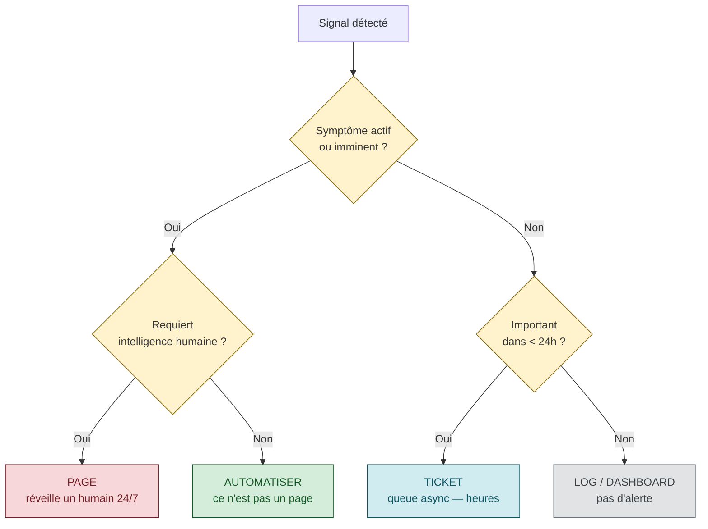
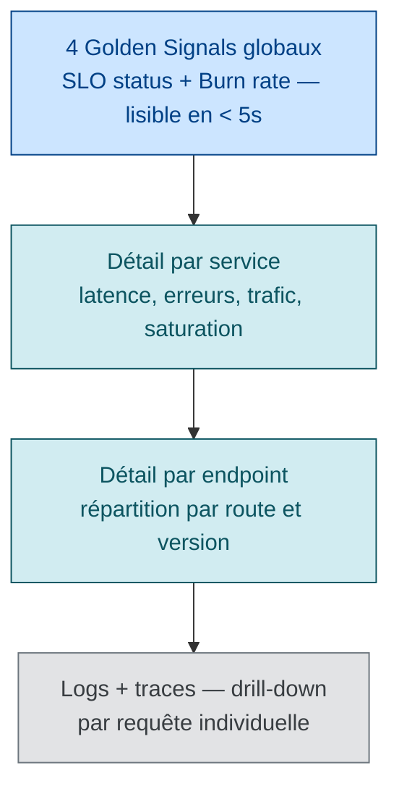

# Monitoring + Alerting — philosophie SRE

> **Sources primaires** :
> - Google SRE book ch. 6, [*Monitoring Distributed Systems*](https://sre.google/sre-book/monitoring-distributed-systems/ "Google SRE book ch. 6 — Monitoring Distributed Systems")
> - Google SRE book ch. 10, [*Practical Alerting from Time-Series Data*](https://sre.google/sre-book/practical-alerting/ "Google SRE book ch. 10 — Practical Alerting from Time-Series Data")
> - Google SRE workbook, [*Alerting on SLOs*](https://sre.google/workbook/alerting-on-slos/ "Google SRE workbook — Alerting on SLOs (burn rate alerting)")
> - AWS Builders' Library, [*Implementing health checks*](https://aws.amazon.com/builders-library/implementing-health-checks/ "AWS Builders Library — Implementing health checks (David Yanacek)")
> - Microsoft Azure WAF, [*Operational Excellence — Health monitoring*](https://learn.microsoft.com/en-us/azure/well-architected/operational-excellence/observability)

## Whitebox vs Blackbox monitoring

> *"White-box monitoring depends on the ability to inspect the innards of the system, such as logs or HTTP endpoints, with instrumentation."* [📖¹](https://sre.google/sre-book/monitoring-distributed-systems/#xref_monitoring_white-box "Google SRE book ch. 6 — Monitoring, section Black-Box vs White-Box")
>
> *En français* : le **whitebox monitoring** repose sur la capacité à inspecter les **entrailles** du système (logs, endpoints HTTP internes) via de l'instrumentation.

| Type | Mesure depuis | Ce qu'il voit | Ce qu'il rate |
|------|--------------|---------------|---------------|
| **Whitebox** | L'intérieur (instrumentation, logs, varz, traces) | Détails fins, pré-symptômes (queue depth, retry counts, GC pauses) | Pannes en amont (DNS, LB, network) |
| **Blackbox** | L'extérieur (probes, canaries, prober Google) | Vue utilisateur réelle, isole où la panne se manifeste | Détails internes du *pourquoi* |

### La citation qui justifie le blackbox

> *"You only see the queries that arrive at the target; the queries that never make it due to a DNS error are invisible, while queries lost due to a server crash never make a sound."* [📖²](https://sre.google/sre-book/practical-alerting/ "Google SRE book ch. 10 — Practical Alerting from Time-Series Data")
>
> *En français* : vous ne voyez que les requêtes qui **arrivent** au serveur. Celles tuées par un DNS en rade sont invisibles, et celles perdues quand un serveur crashe ne font aucun bruit.

C'est l'argument béton pour ne **pas** se contenter du whitebox.

### Règle de combinaison

- **Whitebox** = pour le **diagnostic** (pourquoi ça va mal)
- **Blackbox** = pour la **détection** (savoir que ça va mal)

Et idéalement **les deux mesurent le même CUJ** (cf. [`critical-user-journeys.md`](critical-user-journeys.md)).

### L'outil Google Prober (ch. 10)

Le SRE book ch. 10 décrit *Prober*, l'outil interne Google de blackbox monitoring [📖²](https://sre.google/sre-book/practical-alerting/ "Google SRE book ch. 10 — Practical Alerting from Time-Series Data") :

> *"Prober, which runs a protocol check against a target and reports success or failure."*
>
> *En français* : **Prober** exécute un check protocolaire sur une cible et reporte **succès ou échec**.

Capacités décrites dans la section Prober :
1. **Validation de protocole** : pas juste un HTTP 200, mais validation du payload
2. **Validation de payload** : vérification des contenus HTML / réponses attendues
3. **Mesures de performance** : histogrammes par opération + taille de payload
4. **Isolation de panne** : sondes à plusieurs niveaux (frontend, derrière le LB, sur le backend) pour localiser

> ⚠️ **Les 4 capacités listées** sont cohérentes avec ce que décrit la section *Prober* du SRE book mais formulées en synthèse. À relire pour la formulation exacte.

C'est le pattern de référence pour le synthetic monitoring (cf. [`synthetic-monitoring.md`](synthetic-monitoring.md)).

## Philosophie d'alerting Google

### Les règles d'or

1. **Every page should be actionable** [📖³](https://sre.google/sre-book/monitoring-distributed-systems/#id-a82udF8IBfx "Google SRE book ch. 6 — Monitoring, section Tying These Principles Together").
   > *"Every time the pager goes off, I should be able to react with a sense of urgency."*

2. **Every page response should require intelligence** [📖³](https://sre.google/sre-book/monitoring-distributed-systems/#id-a82udF8IBfx "Google SRE book ch. 6 — Monitoring, section Tying These Principles Together").
   > *"If a page merely merits a robotic response, it shouldn't be a page."*

3. **Pages should be about a novel problem or an event that hasn't been seen before.**

   > ⚠️ **Cette règle** est implicite dans les recommandations Google (les pages automatisables ne doivent pas rester des pages). La formulation synthétique n'est pas un verbatim direct du SRE book.

4. **Page on symptoms, not causes** [📖³](https://sre.google/sre-book/monitoring-distributed-systems/#id-a82udF8IBfx "Google SRE book ch. 6 — Monitoring, section Tying These Principles Together").
   > *"It's better to spend much more effort on catching symptoms than causes; when it comes to causes, only worry about very definite, very imminent causes."*

### Pourquoi page on symptoms ?

- **Causes** sont multiples, leur monitoring est combinatoire et fragile
- **Symptoms** sont peu nombreux et stables (l'utilisateur ne peut pas se connecter — quelle que soit la cause)
- Page sur cause = bruit (la cause peut exister sans impact utilisateur)
- Page sur symptôme = signal (si l'utilisateur souffre, on doit savoir, peu importe pourquoi)

> ⚠️ **Ces 4 arguments** sont une synthèse pédagogique du principe « page on symptoms ». Cohérent avec le SRE book ch. 6 mais pas un verbatim — considérer comme reformulation didactique.

### Routage des alertes

| Niveau | Destination | Critères |
|--------|-------------|----------|
| **Page** | Pager (réveille un humain 24/7) | Symptôme actif ou imminent, requiert intelligence |
| **Ticket** | Queue à traiter sous quelques heures | Important mais pas urgent, ex: certificate expire dans 7 jours |
| **Log / dashboard** | Pas d'alerte, trace disponible | Information de fond, contexte de débogage |



## Anti-patterns d'alerting

| Anti-pattern | Symptôme | Conséquence |
|-------------|----------|-------------|
| **Alert fatigue** | > 10 pages / shift | Les vraies alertes sont noyées dans le bruit |
| **Pages with rote, algorithmic responses** | "Restart service X" sans diagnostic | Devrait être automatisé, pas humanisé |
| **Cause-based pages** | Page sur "CPU > 90%" | Faux positif si pas d'impact utilisateur |
| **Pages without runbook** | Page reçue, on-call ne sait pas quoi faire | Investigation longue, outage prolongé |
| **Pages without acknowledgment SLA** | "Page envoyée, qui répond ?" | Temps de réponse imprévisible |
| **Self-resolving pages** | Alerte qui s'auto-résout en 30s | Devrait être un ticket, pas une page |
| **Pages on test environments** | Bruits constants des envs non-prod | L'opérateur ignore ces canaux |

> ⚠️ **Tableau d'anti-patterns** — 3 entrées dérivées directement du SRE book ch. 6 (*alert fatigue*, *rote algorithmic responses*, *cause-based pages* via la règle *page on symptoms*). Les 4 autres (runbook, SLA ack, self-resolving, test envs) sont des patterns communautaires cohérents mais non littéralement dans le SRE book.

## Le pattern Borgmon → Prometheus

Borgmon (Google interne) a inspiré Prometheus (open source). Le SRE book ch. 10 détaille Borgmon et les 2 systèmes partagent le même modèle de données [📖²](https://sre.google/sre-book/practical-alerting/ "Google SRE book ch. 10 — Practical Alerting from Time-Series Data") :

- **Time series** stockées sous forme `metric_name{label1="v1",label2="v2"}` [📖⁴](https://prometheus.io/docs/concepts/data_model/ "Prometheus — Data Model (time series, labels)")
- **Pull model** : le collecteur scrape les targets, pas l'inverse [📖⁵](https://prometheus.io/docs/introduction/overview/ "Prometheus — Overview (pull model)")
- **PromQL** : langage d'expression pour évaluer les alertes [📖⁶](https://prometheus.io/docs/prometheus/latest/querying/basics/ "Prometheus — PromQL querying basics")
- **Recording rules** : pré-calculer les agrégations utilisées par les alertes (perfs) [📖⁷](https://prometheus.io/docs/prometheus/latest/configuration/recording_rules/ "Prometheus — Recording rules")
- **Alertmanager** : routage et déduplication [📖⁸](https://prometheus.io/docs/alerting/latest/alertmanager/ "Prometheus — Alertmanager (routing, deduplication)")

### Exemple PromQL pour une alerte SLO

```promql
# Burn rate alerts pour SLO 99.9% (cf. error-budget.md)
# Page si burn rate > 14.4 sur 1h ET sur 5min (multi-window)

- alert: HighErrorBudgetBurn1h5m
  expr: |
    (
      sum(rate(http_requests_total{status=~"5.."}[1h])) /
      sum(rate(http_requests_total[1h]))
    ) > (14.4 * 0.001)
    AND
    (
      sum(rate(http_requests_total{status=~"5.."}[5m])) /
      sum(rate(http_requests_total[5m]))
    ) > (14.4 * 0.001)
  for: 0m
  labels:
    severity: page
  annotations:
    summary: "Service consuming error budget at 14.4× normal rate"
    runbook: "https://wiki/runbooks/slo-burn-rate"
```

*Pattern multi-window basé sur la Table 5-8 du Workbook [📖⁹](https://sre.google/workbook/alerting-on-slos/ "Google SRE workbook — Alerting on SLOs (burn rate alerting)").*

## Burn rate alerts — référence rapide

Cf. [`error-budget.md`](error-budget.md) pour le détail. Table 5-8 du Workbook *Alerting on SLOs* pour un SLO 99.9% [📖⁹](https://sre.google/workbook/alerting-on-slos/ "Google SRE workbook — Alerting on SLOs (burn rate alerting)") :

| Severity | Long window | Short window | Burn rate | % budget consommé |
|----------|-------------|--------------|-----------|-------------------|
| Page | 1h | 5min | 14.4 | 2% |
| Page | 6h | 30min | 6 | 5% |
| Ticket | 3 jours | 6h | 1 | 10% |

## Health checks — patterns AWS Builders' Library

### 3 niveaux de health check

| Type | Vérifie | Action en cas de KO |
|------|---------|---------------------|
| **Liveness check** | Le process tourne | Restart |
| **Local health check** | Les dépendances *locales* OK (disque, threads, mémoire) | Marquer instance unhealthy |
| **Dependency health check** | Les dépendances *externes* OK (DB, autres services) | **Attention** — peut causer cascading failure |

> ⚠️ **Cette typologie à 3 niveaux** (liveness / local / dependency) est une **synthèse pédagogique** inspirée de l'article AWS. L'article lui-même ne la présente pas sous cette forme exacte mais discute chacune des 3 formes de manière diffuse. Typologie largement partagée dans la communauté mais pas un standard AWS officiel.

### L'erreur classique : dependency health check qui amplifie les pannes

L'article AWS décrit le pattern de cascading failure : lorsque les dépendances deviennent lentes ou indisponibles, les dependency health checks propagent la panne en retirant trop d'instances du service [📖¹⁰](https://aws.amazon.com/builders-library/implementing-health-checks/ "AWS Builders Library — Implementing health checks (David Yanacek)").

### Le pattern "fail open"

Amazon utilise le pattern *fail open* comme garde-fou pour éviter les cascading failures [📖¹⁰](https://aws.amazon.com/builders-library/implementing-health-checks/ "AWS Builders Library — Implementing health checks (David Yanacek)") :

> *"When an individual server fails a health check, the load balancer stops sending it traffic. But when all servers fail health checks at the same time, the load balancer fails open, allowing traffic to all servers."*
>
> *En français* : quand **un** serveur rate son health check, le LB coupe son trafic. Quand **tous** les serveurs ratent en même temps, le LB bascule en **fail open** et continue de router vers tout le monde (pour éviter la panne totale).

Mais l'article met aussi en garde contre son usage aveugle :

> *"While fail open is a helpful behavior, at Amazon we tend to be skeptical of things that we can't fully reason about or test in all situations."*
>
> *En français* : le *fail open* est utile, mais chez Amazon on reste **sceptiques** des mécanismes qu'on ne peut pas raisonner ni tester exhaustivement.

> ⚠️ **Reformulation précédente** — ce guide citait *"Fail open is a reasonable default"* — cette formulation n'est **pas** dans l'article AWS. La nuance AWS est plus fine : fail open est *utile* mais Amazon reste *skeptique* de son usage par défaut. Formulation corrigée ci-dessus.

### Fréquence

- Trop fréquent : surcharge réseau et CPU sur le service vérifié
- Trop espacé : détection lente

Les valeurs par défaut Kubernetes (`periodSeconds: 10` pour liveness / readiness probes — cf. [Kubernetes liveness/readiness probe defaults](https://kubernetes.io/docs/tasks/configure-pod-container/configure-liveness-readiness-startup-probes/ "Kubernetes — Liveness, Readiness, Startup probes")) sont un bon point de départ ; ajuster selon le profil de charge et la criticité.

## Dashboards — bonnes pratiques

### 1 dashboard = 1 audience

| Audience | Ce qu'elle veut voir |
|----------|----------------------|
| **SRE on-call** | 4 golden signals globaux + statut SLO + burn rate |
| **Service team** | Detail par endpoint, latence, erreurs par version |
| **Dev débuggant** | Logs, traces, dépendances par requête |
| **Exec / business** | Statut services majeurs (vert/orange/rouge), tendance dispo mensuelle |

### Pyramidal



Cliquer sur un panel monte d'un niveau. Le dashboard top reste lisible en moins de 5 secondes.

> ⚠️ **Pattern pyramidal des dashboards** — bonne pratique observability cohérente avec le principe « top-down drill-down » ([Grafana dashboard best practices](https://grafana.com/docs/grafana/latest/dashboards/build-dashboards/best-practices/)) mais pas un standard SRE book. Pattern largement partagé.

### Annotations sur déploiements

Mettre une **ligne verticale** sur les graphes de chaque déploiement. Rien ne ressemble plus à une dégradation post-déploiement qu'une dégradation post-déploiement. C'est gratuit et ça économise des minutes en investigation.

*Pattern supporté nativement par Grafana [📖¹¹](https://grafana.com/docs/grafana/latest/dashboards/build-dashboards/annotate-visualizations/ "Grafana — Annotate visualizations") et Datadog.*

## Runbooks — obligatoires pour chaque alerte

**Le principe** reste valide et largement documenté : chaque alerte doit pointer vers un runbook actionnable. Cf. [Prometheus — Alerting best practices](https://prometheus.io/docs/practices/alerting/ "Prometheus — Practices: Alerting").

Structure type d'un runbook :

```markdown
# Runbook : <Nom de l'alerte>

## Context
<Service, dependencies, why this matters>

## Symptoms
- Alerte reçue
- User impact attendu

## Diagnostic steps
1. <commande à lancer>
2. <log à consulter>
3. <metric à vérifier>

## Mitigation
- <action immédiate pour réduire l'impact>

## Resolution
- <fix definitif>
- <quand on peut considérer l'incident clos>

## Escalation
- Si après X minutes ou Y conditions, escalader à <équipe>

## Postmortem
- <lien vers le template de postmortem>
```

Chaque alerte qui réveille un humain **doit** pointer vers un runbook (champ `annotations.runbook` dans l'alert rule).

## Lien avec les pratiques observabilité moderne

Le monitoring "classique" (metrics + alerts) suffit pour les pannes connues. Pour les pannes nouvelles (*"unknown unknowns"* — terme popularisé par [Charity Majors / Honeycomb](https://www.honeycomb.io/blog/so-you-want-to-build-an-observability-tool)), il faut de l'**observabilité** :
- Wide events / structured logs [📖¹²](https://opentelemetry.io/docs/concepts/signals/logs/ "OpenTelemetry — Logs signal")
- Distributed tracing avec context propagation [📖¹³](https://opentelemetry.io/docs/concepts/signals/traces/ "OpenTelemetry — Traces signal")
- Cardinality élevée (UserID, requestID, deployVersion)

Cf. [`observability-vs-monitoring.md`](observability-vs-monitoring.md).

## Alerting à l'échelle organisationnelle

Les principes ci-dessus (page on symptoms, every page actionable, blackbox vs whitebox, runbook obligatoire) restent valides à toute échelle. Mais à l'échelle d'une grande DSI (centaines d'équipes, milliers de services), un problème supplémentaire surgit : le **paysage d'alerting devient un patchwork** de 10 à 30 sources hétérogènes héritées de différentes époques et différentes équipes. Les chiffres documentés en 2025 :

- ≈ **2 000 alertes/semaine** par équipe, dont **3 % seulement** méritent une action immédiate
- **67 %** d'alertes ignorées quotidiennement
- **85 %** de faux positifs
- **74 %** des équipes en surcharge d'alertes

(*sources et chiffres détaillés dans le guide* [`alerting-consolidation-strategy.md`](alerting-consolidation-strategy.md))

La consolidation de ce paysage n'est pas une question d'outil mais de **stratégie de transition** : audit du paysage existant, classification par tier × public, mode dual-run, bascule consensuelle, dépréciation graduée. Le pattern technique cible est un **pipeline en 4 étages** :

```
sources → aggregator (déduplication, corrélation, inhibition, enrichissement) → router (par tier × public) → notification (pager / ticket / chat / dashboard)
```

L'aggregator (typiquement [Alertmanager](https://prometheus.io/docs/alerting/latest/alertmanager/) en cloud-native) **absorbe** les sources existantes plutôt que de les remplacer — point clé pour gagner l'adoption sans casser les contrats implicites.

Anti-patterns à proscrire à cette échelle : *big-bang* (« le 1er du mois on bascule tout »), *one-tool-to-rule-them-all*, migration forcée, public unique. Cf. [`alerting-consolidation-strategy.md`](alerting-consolidation-strategy.md) pour les 4 phases de transition, les patterns de l'aggregator, la différenciation par 4 publics typiques (astreinte 24/7 / ops journée / équipe métier / management) et les métriques de succès.

## Ressources

Sources primaires vérifiées :

1. [SRE book ch. 6 — Black-Box Versus White-Box](https://sre.google/sre-book/monitoring-distributed-systems/#xref_monitoring_white-box "Google SRE book ch. 6 — Monitoring, section Black-Box vs White-Box") — whitebox = inspect innards
2. [SRE book ch. 10 — Practical Alerting](https://sre.google/sre-book/practical-alerting/ "Google SRE book ch. 10 — Practical Alerting from Time-Series Data") — blackbox DNS quote, Prober description
3. [SRE book ch. 6 — Tying These Principles Together](https://sre.google/sre-book/monitoring-distributed-systems/#id-a82udF8IBfx "Google SRE book ch. 6 — Monitoring, section Tying These Principles Together") — 3 règles d'or verbatim confirmées
4. [Prometheus — Data Model](https://prometheus.io/docs/concepts/data_model/ "Prometheus — Data Model (time series, labels)") — time series label model
5. [Prometheus — Overview (pull model)](https://prometheus.io/docs/introduction/overview/ "Prometheus — Overview (pull model)") — scrape targets
6. [Prometheus — Querying Basics (PromQL)](https://prometheus.io/docs/prometheus/latest/querying/basics/ "Prometheus — PromQL querying basics")
7. [Prometheus — Recording Rules](https://prometheus.io/docs/prometheus/latest/configuration/recording_rules/ "Prometheus — Recording rules")
8. [Prometheus — Alertmanager](https://prometheus.io/docs/alerting/latest/alertmanager/ "Prometheus — Alertmanager (routing, deduplication)")
9. [SRE workbook — Alerting on SLOs](https://sre.google/workbook/alerting-on-slos/ "Google SRE workbook — Alerting on SLOs (burn rate alerting)") — Table 5-8 multi-window burn rate
10. [AWS Builders' Library — Implementing Health Checks](https://aws.amazon.com/builders-library/implementing-health-checks/ "AWS Builders Library — Implementing health checks (David Yanacek)") — fail open pattern
11. [Grafana — Annotate visualizations](https://grafana.com/docs/grafana/latest/dashboards/build-dashboards/annotate-visualizations/ "Grafana — Annotate visualizations")
12. [OpenTelemetry — Logs signal](https://opentelemetry.io/docs/concepts/signals/logs/ "OpenTelemetry — Logs signal")
13. [OpenTelemetry — Traces signal](https://opentelemetry.io/docs/concepts/signals/traces/ "OpenTelemetry — Traces signal")

Ressources complémentaires :
- [Microsoft Azure WAF — Health monitoring](https://learn.microsoft.com/en-us/azure/well-architected/operational-excellence/observability)
- [Prometheus — Alerting best practices](https://prometheus.io/docs/practices/alerting/ "Prometheus — Practices: Alerting")
- [Grafana dashboard best practices](https://grafana.com/docs/grafana/latest/dashboards/build-dashboards/best-practices/)
- [Honeycomb — Unknown unknowns / observability](https://www.honeycomb.io/blog/so-you-want-to-build-an-observability-tool)
- [Kubernetes — Liveness/Readiness probes](https://kubernetes.io/docs/tasks/configure-pod-container/configure-liveness-readiness-startup-probes/)
