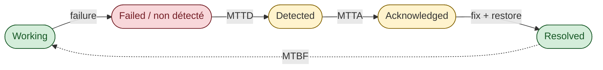

# MTBF / MTTR / MTTD / MTTA — vocabulaire des temps d'incident

> **Sources** :
> - Atlassian, [*MTBF, MTTR, MTTA, and MTTF*](https://www.atlassian.com/incident-management/kpis/common-metrics "Atlassian — Common incident metrics (MTBF/MTTR/MTTA/MTTF)")
> - PagerDuty, [*Incident metrics*](https://www.pagerduty.com/resources/learn/incident-management-metrics/)
> - Google SRE book ch. 3, [*Embracing Risk*](https://sre.google/sre-book/embracing-risk/ "Google SRE book ch. 3 — Embracing Risk") — section "Measuring Service Risk"
> - AWS Well-Architected, [*Reliability Pillar*](https://docs.aws.amazon.com/wellarchitected/latest/reliability-pillar/welcome.html "AWS Well-Architected — Reliability Pillar")
> - ISO/IEC/IEEE 24765 (vocabulary)

## Vue d'ensemble



## Définitions

### MTBF — Mean Time Between Failures

**Définition** : temps moyen entre deux pannes consécutives.

```
MTBF = total_uptime / number_of_failures
```

**Exemple** : un service tombe 4 fois en 30 jours, avec un total uptime de 720h - 2h d'indispo cumulée = 718h.
```
MTBF = 718h / 4 = 179.5h ≈ 7.5 jours
```

**Quand l'utiliser** : pour comparer la fiabilité de deux systèmes, ou pour planifier la maintenance préventive.

**Limite** : c'est une moyenne — masque les bursts de pannes (3 pannes en 1 jour puis silence pendant 6 mois).

### MTTR — Mean Time To Recovery (ou Repair, ou Restore)

**Définition** : temps moyen entre l'apparition d'une panne et sa résolution complète.

```
MTTR = total_downtime / number_of_failures
```

**Exemple** : 4 pannes totalisant 2h d'indispo → MTTR = 30 min.

> ⚠️ **MTTR a 3 sens différents** selon les sources :
> - **Mean Time To Recovery** : panne → service restauré côté utilisateur (le plus utilisé en SRE)
> - **Mean Time To Repair** : panne → fix technique appliqué (peut être > Recovery si on a mitigé sans fix)
> - **Mean Time To Restore** : synonyme de Recovery

Dans le SRE moderne, **Recovery** est le sens dominant.

**Cible typique** :
- Service critique : MTTR < 15 min
- Service important : MTTR < 1h
- Service standard : MTTR < 4h

### MTTD — Mean Time To Detect

**Définition** : temps moyen entre l'apparition d'une panne et sa détection (par alerte ou par humain).

```
MTTD = total(t_detection - t_failure) / number_of_failures
```

**Pourquoi c'est crucial** : pendant le MTTD, le service est cassé **et personne ne le sait**. C'est la fenêtre la plus dangereuse.

**Cible typique** :
- Avec synthetic monitoring 5 min : MTTD < 5 min
- Avec burn rate alerts : MTTD < 10 min
- Sans observabilité : MTTD = quand le 1er ticket client arrive (heures)

> Le **synthetic monitoring** est la meilleure arme pour réduire le MTTD (cf. [`synthetic-monitoring.md`](synthetic-monitoring.md)).

### MTTA — Mean Time To Acknowledge

**Définition** : temps moyen entre l'envoi d'une alerte et son acknowledgement par un humain on-call.

```
MTTA = total(t_ack - t_alert) / number_of_alerts
```

**Pourquoi c'est important** : c'est la santé du système on-call. Un MTTA > 15 min sur des SEV1 = problème de rotation, fatigue ou pages non actionnables.

**Cible typique** :
- SEV1 (page) : MTTA < 5 min
- SEV2 : MTTA < 15 min
- SEV3 (ticket) : MTTA < 1h ou plus

### MTTF — Mean Time To Failure

**Définition** : temps moyen jusqu'à la première panne (utilisé pour les composants non-réparables : disques, cartes réseau).

**En SRE software** : peu utilisé car le software est par nature réparable.

## La formule reine du SRE : Availability

```
Availability = MTBF / (MTBF + MTTR)
```

Exemple : MTBF = 720h, MTTR = 30 min = 0.5h
```
Availability = 720 / (720 + 0.5) = 720 / 720.5 = 99.93%
```

### Conséquence : 2 leviers pour améliorer la disponibilité

| Levier | Stratégie | Coût relatif |
|--------|-----------|--------------|
| **Augmenter MTBF** (moins de pannes) | Tests, qualité, code review, canary, bake time | $$$ — chaque "neuf" coûte 10× plus cher |
| **Réduire MTTR** (récupération plus vite) | Auto-rollback, GitOps revert, observabilité, runbooks | $ — gain proportionnel direct |

> **Insight SRE** : il est généralement **plus rentable** d'investir dans la réduction du MTTR que dans l'augmentation du MTBF. Vous ne pouvez pas empêcher toutes les pannes, mais vous pouvez **récupérer en 2 minutes** au lieu de 30.

## RTO / RPO — niveau Disaster Recovery

**RTO** (Recovery Time Objective) : temps maximum tolérable pour restaurer le service après un désastre majeur.
**RPO** (Recovery Point Objective) : perte de données maximum tolérable (en minutes ou transactions).


**Différence avec MTTR** : MTTR concerne les pannes "normales" (bug, OOM, deploy raté). RTO concerne les **désastres** (region down, datacenter perdu, ransomware).

**Strategies AWS** :

| Stratégie | RTO typique | RPO typique | Coût |
|-----------|-------------|-------------|------|
| Backup & Restore | heures | heures | $ |
| Pilot Light | 10 min - 1h | minutes | $$ |
| Warm Standby | minutes | secondes | $$$ |
| Multi-site Active/Active | secondes | ~0 | $$$$ |

Détail : [AWS — Disaster Recovery options in the cloud](https://docs.aws.amazon.com/whitepapers/latest/disaster-recovery-workloads-on-aws/disaster-recovery-options-in-the-cloud.html "AWS Whitepaper — Disaster Recovery Options in the Cloud (4 stratégies)")

## Lien avec les SLI/SLO

Le SRE moderne **n'utilise pas** MTTR/MTBF comme objectifs primaires. Le SRE book ch. 3 *Embracing Risk* [📖¹](https://sre.google/sre-book/embracing-risk/ "Google SRE book ch. 3 — Embracing Risk") privilégie les **ratios de requêtes** (good/total) sur les métriques basées sur le temps, parce qu'un ratio capture mieux l'**expérience utilisateur** qu'un MTBF moyen.

Le primary objective est le **SLO** (un ratio de bonnes requêtes), pas un temps moyen. MTTR/MTBF sont **dérivés** :
- Un SLO 99.9% sur 4 semaines = 40 min d'indispo permis
- Si MTBF = 7 jours et MTTR = 5 min, vous avez 4 pannes × 5 min = 20 min, soit 0.5× le budget → OK
- Si MTBF = 7 jours et MTTR = 30 min, vous avez 4 × 30 = 120 min, soit 3× le budget → KO

**Conséquence** : améliorer MTTR a un effet linéaire sur le SLO. C'est pour ça que le SRE moderne **concentre ses efforts sur la réduction du MTTR** (auto-rollback, GitOps, observabilité) plutôt que sur l'augmentation du MTBF.

## DORA metrics — extension MTTR + autres

DORA (DevOps Research and Assessment) a établi 4 metrics standardisés pour mesurer la performance d'une organisation CI/CD :

| Metric | Quoi |
|--------|------|
| **Deployment Frequency** | À quelle fréquence on déploie en prod |
| **Lead Time for Changes** | Du commit au prod (heures) |
| **Change Failure Rate** | % de déploiements qui causent un incident |
| **Time to Restore Service** (= MTTR DORA) | Temps moyen de récupération après incident |

### Niveaux DORA (rapport 2024) [📖²](https://dora.dev/research/ "DORA research (Google Cloud) — 4 key DevOps metrics")

> ⚠️ **Tableau des niveaux** — valeurs synthétisées à partir des rapports DORA annuels (2021-2024). Les seuils exacts varient légèrement d'une année sur l'autre ; à vérifier dans le rapport en cours si précision nécessaire.

| Niveau | Deploy freq | Lead time | CFR | MTTR |
|--------|-------------|-----------|-----|------|
| **Elite** | On demand (multi/jour) | < 1 jour | 0-15% | < 1 jour |
| **High** | Hebdo - mensuel | 1 jour - 1 semaine | 16-30% | < 1 jour |
| **Medium** | Mensuel - 6 mois | 1 sem - 1 mois | 16-30% | 1 jour - 1 semaine |
| **Low** | < tous les 6 mois | > 6 mois | 16-30% | > 6 mois |

DORA ajoute parfois un 5e metric : **Reliability** (mesuré via SLO/error budget).

## Formules récapitulatives

```
MTBF = total_uptime / number_of_failures
MTTR = total_downtime / number_of_failures
Availability = MTBF / (MTBF + MTTR)
Availability = uptime / (uptime + downtime)

SLO availability = (good_requests / total_requests) × 100
Error budget = (1 - SLO) × time_window
Burn rate = current_error_rate / allowed_error_rate
Time to budget exhaustion = error_budget / current_error_rate
```

## Anti-patterns

| Anti-pattern | Conséquence |
|--------------|-------------|
| **MTTR comme objectif unique** | Vous optimisez pour la récupération, vous oubliez d'éviter les pannes |
| **MTBF comme objectif unique** | Vous figeze tout, vous tuez la vélocité |
| **Confondre les 3 sens de MTTR** | Comparaisons impossibles entre équipes |
| **MTTR moyenne sans p95/p99** | Une panne de 8h cachée par 99 pannes de 5 min |
| **Pas de MTTD mesuré** | Vous ne savez pas combien de temps vous avez ignoré la panne |
| **MTTA ignoré** | Vous découvrez que les pages restent 1h sans réponse |
| **DORA metrics non mesurés** | Pas de baseline pour mesurer l'amélioration |

## Lien avec les autres piliers SRE

- **SLO/SLI** : MTTR/MTBF sont dérivés du SLO, pas l'inverse
- **Postmortem** : la timeline d'un postmortem permet de calculer MTTD/MTTA/MTTR
- **Synthetic monitoring** : réduit drastiquement le MTTD
- **GitOps** : réduit le MTTR (rollback = `git revert` ~1 min)
- **Auto-rollback** : réduit le MTTR à quasi-zéro pour les bugs détectables par metrics

## 📐 À l'échelle d'une grande organisation

MTBF et MTTR sont définis sur un service. À l'échelle, ce qui importe est le **MTTR de chaîne** vu par l'utilisateur — typiquement supérieur au MTTR du maillon défaillant à cause des temps de coordination cross-team.

- **MTTR de chaîne = MTTR maillon + temps de détection cross-team + coordination** — souvent un facteur 2-3 sur le MTTR brut. Voir [`journey-slos-cross-service.md`](journey-slos-cross-service.md).
- **MTBF de chaîne** — composition multiplicative des MTBF des maillons critiques (les défaillances corrélées d'une infra partagée comptent une seule fois). Voir [`journey-slos-cross-service.md`](journey-slos-cross-service.md) §*Indépendance présumée*.
- **Bench par tier** — comparer le MTTR d'une chaîne T1 et d'une chaîne T4 sans pondération est faux. Voir [`sre-at-scale.md`](sre-at-scale.md).

## Ressources

Sources primaires :

1. [Google SRE book ch. 3 — Embracing Risk](https://sre.google/sre-book/embracing-risk/ "Google SRE book ch. 3 — Embracing Risk") — principe SRE sur métriques basées ratios
2. [DORA research — Google Cloud](https://dora.dev/research/ "DORA research (Google Cloud) — 4 key DevOps metrics") — 4 metrics + niveaux Elite/High/Medium/Low
3. [Atlassian — Common incident metrics](https://www.atlassian.com/incident-management/kpis/common-metrics "Atlassian — Common incident metrics (MTBF/MTTR/MTTA/MTTF)") — définitions MTBF/MTTR/MTTA/MTTF

Ressources complémentaires :
- [PagerDuty — Incident metrics](https://www.pagerduty.com/resources/learn/incident-management-metrics/)
- [AWS Disaster Recovery whitepaper](https://docs.aws.amazon.com/whitepapers/latest/disaster-recovery-workloads-on-aws/disaster-recovery-options-in-the-cloud.html "AWS Whitepaper — Disaster Recovery Options in the Cloud (4 stratégies)")
- [ISO/IEC/IEEE 24765 — Systems and software engineering vocabulary](https://www.iso.org/standard/71952.html)
- [Nicole Forsgren et al. — Accelerate (DORA book)](https://itrevolution.com/product/accelerate/)
