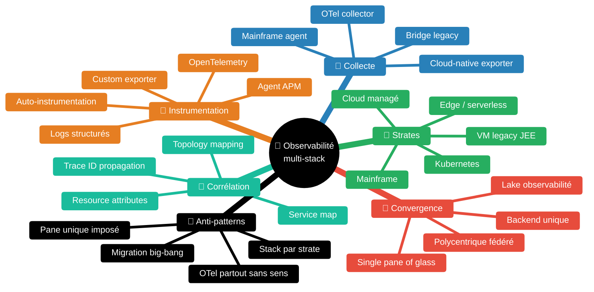
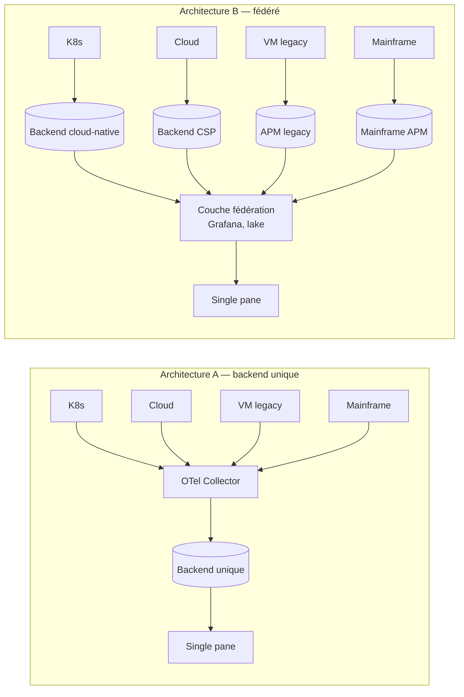

# Observabilité multi-stack — un seul point de vue sur K8s, cloud, VM legacy et mainframe

> *"For most organizations, multicloud and hybrid environments will be the norm, not the exception."* [📖¹](https://cloud.google.com/architecture/hybrid-multicloud-patterns "Google Cloud Architecture Center — Hybrid and multicloud patterns and practices")
>
> *En français* : pour la plupart des organisations, l'**hybride et le multicloud sont la norme**, pas l'exception. Une grande DSI exploite typiquement plusieurs familles de runtime en parallèle — un patrimoine ne se transforme pas d'un bloc.

Skill construite à partir de sources officielles : Google Cloud Architecture Center (hybrid & multicloud monitoring), spécification OpenTelemetry, CNCF Observability Whitepaper, AWS Well-Architected (Operational Excellence pillar), Microsoft Azure Monitor pour environnements hybrides, IBM Z Observability, avec citations vérifiées verbatim.

## Le problème — un patrimoine en plusieurs strates

Une grande DSI construite par couches successives héberge typiquement, en même temps :

1. **Kubernetes** sur cluster managé (EKS, GKE, AKS) ou on-prem (OpenShift, Rancher) — runtime cible des nouveaux services depuis 2018–2020 ;
2. **Cloud public managé** hors Kubernetes — fonctions serverless, services managés (RDS, Cloud SQL, Redis managé), CDN, queues managées, etc. ;
3. **Serveurs d'applications classiques** sur VM internes — JBoss, WebLogic, Tomcat, IBM WebSphere — applications Java EE / Jakarta EE déployées en EAR/WAR depuis 10–20 ans, sur des VM hyperviseur (vSphere/Broadcom, KVM, Hyper-V) ;
4. **Strate spécifique** selon l'entreprise — mainframe (z/OS, COBOL), bare metal (HPC, calcul scientifique), edge (équipement déployé hors datacenter), serverless event-driven (Lambda, Cloud Functions).

Chaque famille a son **observabilité native** : Prometheus + Grafana + OpenTelemetry pour K8s, CloudWatch / Cloud Monitoring / Azure Monitor pour le cloud, agent APM (Dynatrace, AppDynamics, New Relic, Datadog) pour les VM, IBM Tivoli ou agents propriétaires pour le mainframe. Si on laisse chaque équipe outiller indépendamment, on aboutit à 4 stacks d'observabilité, 4 langages de requête, 4 contrats de support, et **aucune lecture transverse possible** quand un parcours utilisateur traverse plusieurs strates.

## Carte des concepts

| Concept | Source |
|---|---|
| Hybride et multicloud comme norme, pas exception | Google Cloud — Hybrid and multicloud patterns |
| OpenTelemetry comme standard vendor-neutral d'instrumentation | OpenTelemetry — *Mission and Vision* |
| Trois piliers : traces, metrics, logs corrélés | CNCF Observability Whitepaper |
| Single pane of glass : objectif, pas dogme | Google Cloud — Hybrid monitoring patterns |
| Anti-Corruption Layer pour bridger strates incompatibles | DDD — pattern transposé à l'observabilité |

## Les familles de stack — différences pratiques

> **⚠️ Synthèse expérientielle** — La typologie en 4 familles (K8s / cloud managé / VM legacy JEE / mainframe-edge-serverless) consolide les chapitres « hybrid and multicloud » de Google Cloud, AWS Well-Architected et Azure Well-Architected. Les leviers d'instrumentation par strate (OTel auto-instrumentation, agent APM, JMX exporter, OMEGAMON bridge, ADOT Lambda layer) sont des patterns publics documentés dans la doc des fournisseurs respectifs, mais leur découpage en grille n'est pas un standard publié verbatim. Confiance : 🟡 6/10.

### Famille 1 — Kubernetes (cloud-native)

L'observabilité y est **bien outillée par construction**. Patterns standards :

- **Métriques** — endpoints `/metrics` Prometheus exposés par le service, scraping par Prometheus (managé ou self-hosted), agrégation côté collecteur.
- **Traces** — instrumentation OpenTelemetry (auto-instrumentation par agent SDK ou manuelle), export via OTLP (gRPC ou HTTP) vers un OTel Collector, puis vers le backend.
- **Logs** — sortie stdout/stderr capturée par le runtime conteneur, transmise par Fluent Bit / Vector / Filebeat à un agrégateur (Loki, Elasticsearch, Cloud Logging).
- **Topology** — `kubectl` + service mesh (Istio, Linkerd) pour reconstituer la topologie ; complétée par les *resource attributes* OTel (namespace, pod, deployment).

Cible naturelle : un OTel Collector déployé en DaemonSet pour les logs/métriques infra, et en Sidecar ou Deployment central pour les traces applicatives. Les *resource attributes* `k8s.namespace.name`, `k8s.pod.name`, `k8s.container.name`, `k8s.deployment.name` permettent une corrélation sans ambiguïté.

### Famille 2 — Cloud public managé (hors Kubernetes)

Services managés (bases, files, fonctions serverless, CDN, load balancers managés) — **le service managé pousse sa propre télémétrie** dans le service de monitoring du fournisseur (CloudWatch, Cloud Monitoring, Azure Monitor). On n'a pas accès au runtime, on consomme des métriques exposées par le fournisseur.

Deux patterns d'unification :

- **Export vendor → OTel** — la plupart des fournisseurs offrent un exporter OTLP (CloudWatch Metric Streams + ADOT pour AWS, Cloud Monitoring API pour GCP, Azure Monitor exporter for OpenTelemetry pour Azure). On rapatrie ces métriques chez le backend cible.
- **Fédération côté backend** — au lieu d'aspirer toutes les données, on laisse les métriques chez le fournisseur et on les requête à la demande depuis le backend central (pattern *query federation*, ex. Grafana data source par cloud).

Le choix se fait selon le volume, la fréquence d'accès et les coûts d'egress.

### Famille 3 — Serveurs d'applications sur VM (JBoss, WebLogic, Tomcat, WebSphere)

Patrimoine Java EE / Jakarta EE classique. Trois leviers d'instrumentation :

| Levier | Quand l'utiliser | Limite |
|---|---|---|
| Agent APM (Dynatrace, AppDynamics, New Relic, Datadog) installé sur la VM | Application non instrumentable au code, équipe d'exploitation outillée APM, contrat éditeur en place | Vendor lock-in, coût licence, schéma propriétaire — voir `multi-vendor-abstraction.md` |
| OpenTelemetry Java agent (auto-instrumentation) | Application JEE moderne (Servlet 3.0+, Jakarta EE 9+), équipe à l'aise avec OTel, libre de redéploiement | Couverture limitée des serveurs anciens (WebLogic <12c, JBoss <EAP 7.x) |
| Logs JMX + métriques JMX exporter | Application impossible à instrumenter au code (binaires fournisseur), métriques JMX exposées | Pas de traces distribuées, observabilité partielle |

La règle de chemin : si l'application **peut** être auto-instrumentée OTel, on le fait — c'est la voie standard, vendor-neutral, alignée avec K8s. Sinon on garde l'agent APM existant, et on **bridge** vers le backend central par export OTel.

### Famille 4 — Mainframe / serverless / edge

**Mainframe (z/OS, COBOL, CICS, IMS)** — IBM expose des agents (IBM Z Monitoring Suite, OMEGAMON) qui produisent une télémétrie au format SMF/RMF, exportable vers Prometheus ou OTel via passerelle. Les SLI typiques : transaction completion rate par CICS region, response time, channel utilization. À ne pas vouloir migrer vers OTel natif — le coût/risque est sans rapport avec le bénéfice.

**Serverless (Lambda, Cloud Functions, Cloud Run jobs)** — l'instrumentation se fait par layer/extension : ADOT Lambda layer (AWS), OpenTelemetry Cloud Functions (GCP). Trace ID propagation via header HTTP/event source. Limitation : cold start, durée d'exécution courte, pas de side-car possible.

**Edge (caisse, automate industriel, équipement réseau distant)** — connectivité intermittente, peu de ressources locales. Pattern : agent léger (Vector, Fluent Bit en mode buffer) + envoi par lots vers un collecteur central. La télémétrie peut arriver avec **plusieurs minutes de retard** — le SLO doit en tenir compte.

## OpenTelemetry — la couche commune

OpenTelemetry pose l'objectif explicite d'une instrumentation **vendor-neutral** :

> *"OpenTelemetry's mission is to enable effective observability by making high-quality, portable telemetry ubiquitous. […] OpenTelemetry provides vendor-agnostic APIs, libraries, agents, and instrumentation to collect distributed traces and metrics from your application."* [📖²](https://opentelemetry.io/docs/what-is-opentelemetry/ "OpenTelemetry — What is OpenTelemetry: Mission and Vision")
>
> *En français* : la mission d'OTel est de rendre une **télémétrie de qualité, portable et ubiquitaire**. OTel fournit des APIs, librairies, agents et instrumentation **vendor-agnostic** pour collecter traces distribuées et métriques.

Conséquence pour un patrimoine multi-stack :

- **Format commun** — protocole OTLP (OpenTelemetry Protocol), schéma sémantique commun (`service.name`, `service.version`, `deployment.environment`, `k8s.*`, `host.*`, `cloud.*`).
- **Langue commune** — un trace ID se propage de bout en bout (W3C Trace Context), un développeur K8s et un développeur JBoss parlent la même grammaire.
- **Backend interchangeable** — la même instrumentation peut alimenter Tempo, Jaeger, Honeycomb, Dynatrace, Datadog, New Relic. Le choix de backend devient une décision **opérationnelle**, pas architecturale.

Limite réaliste : OTel ne couvre **pas tout**. Un mainframe z/OS, un appliance réseau propriétaire, un legacy WebSphere 6.1 ne s'auto-instrumentent pas en OTel. La stratégie multi-stack admet **plusieurs chemins de collecte** convergeant vers un format pivot — ce n'est pas « OTel partout », c'est « OTel quand c'est possible, bridge sinon ».

## Single pane of glass — objectif, pas dogme

Le terme apparaît dans la documentation hybride/multicloud des grands fournisseurs comme **objectif souhaitable**. Google Cloud, dans son guide *Hybrid and multicloud patterns and practices* :

> *"Use a single pane of glass to monitor and operate hybrid and multicloud environments. Centralizing your operational view reduces the cognitive load on teams and helps detect cross-environment issues earlier."* [📖³](https://cloud.google.com/architecture/hybrid-multicloud-patterns/operational-excellence "Google Cloud — Hybrid and multicloud operational excellence: single pane of glass")
>
> *En français* : utilisez un **single pane of glass** pour superviser et opérer les environnements hybrides et multicloud. Centraliser la vue opérationnelle réduit la charge cognitive et aide à détecter plus tôt les problèmes transverses.

Pattern correct : **un seul écran de référence** pour la supervision globale (vue de chaîne, vue SLO de tous les services critiques, vue incident). Mais **plusieurs outils spécialisés** en dessous — chaque équipe garde son outil de troubleshooting fin (kubectl, profiler JBoss, console mainframe), parce que descendre dans le détail d'un runtime exige les outils natifs.

Le piège opposé est le **single pane of glass dogmatique** : « tout passe par cet outil unique, plus aucun outil natif autorisé ». Conséquences :
- les équipes spécialistes perdent leurs outils efficaces ;
- l'outil unique devient un goulot d'étranglement (licences, ingestion, latence) ;
- la résolution d'un incident profond exige quand même l'outil natif, qu'on a interdit.

La règle praticable : **single pane of glass pour la lecture transverse** (SLO, alerting, incident bridge), **outils natifs préservés pour le diagnostic profond**.

## Convergence — backend unique vs fédéré

> **⚠️ Synthèse expérientielle** — Le tableau comparatif (lecture transverse / coût / lock-in / dette migration / latence / complexité) ci-dessous est une **consolidation** des considérations exposées dans les guides de design de Google Cloud Operations Suite, AWS CloudWatch hybrid, Azure Monitor hybrid, et Grafana data-source federation. Les arbitrages exacts dépendent du volume, du budget et de la maturité opérationnelle de l'organisation — à tester en pilote avant généralisation. Confiance : 🟡 6/10.

Deux architectures possibles pour le backend :

| Critère | Backend unique (A) | Fédéré (B) |
|---|---|---|
| Lecture transverse | Native, requête unique | Synthèse via couche fédération |
| Coût ingestion | Concentré, licences au volume | Réparti, multiples contrats |
| Lock-in | Fort sur le backend | Réparti (chaque famille garde son outil) |
| Dette migration | Migration big-bang ou progressive lourde | Migration progressive sans rupture |
| Latence requête | Faible | Variable (somme des sources) |
| Complexité opérationnelle | Centralisée (1 stack à exploiter) | Distribuée (gouvernance multi-outils) |

Aucune des deux n'est universellement supérieure. La fédération (B) est souvent plus **réaliste** dans une grande DSI au patrimoine hétérogène — elle accepte que les outils existants restent en place et investit dans la couche de fédération. La convergence (A) est plus puissante mais exige un investissement de migration et une volonté politique de retirer les outils existants.

## Trace ID propagation — le fil rouge transverse

L'élément technique le plus important d'une observabilité multi-stack est la **propagation du trace ID** de bout en bout. La norme W3C Trace Context [📖⁴](https://www.w3.org/TR/trace-context/ "W3C Trace Context — Recommendation") définit deux headers HTTP standards (`traceparent` et `tracestate`) que **chaque maillon doit propager**.

Quand un appel traverse `Portail (K8s) → API Gateway (cloud managé) → Service métier (K8s) → JMS Bridge (VM JBoss) → Service mainframe (CICS) → réponse`, chaque maillon doit :

1. **Lire** le header `traceparent` entrant (s'il existe) ;
2. **Créer** un span enfant (avec parent = trace ID reçu) ;
3. **Propager** le `traceparent` mis à jour dans l'appel sortant.

C'est la propagation qui rend l'observabilité multi-stack **utilisable** — sans elle, on a 5 logs isolés au lieu d'une trace cohérente. La propagation doit être **vérifiée à chaque frontière** (point de bascule entre deux strates), parce que c'est là qu'elle casse le plus souvent.

## Anti-patterns

> **⚠️ Synthèse expérientielle** — Les 5 anti-patterns ci-dessous consolident des constats récurrents en transformation d'observabilité hybride (cf. guides Google Cloud hybrid, AWS observability best practices, retours d'expérience CNCF Observability TAG). Ce ne sont pas des dénominations publiées verbatim — chacun est défendable depuis les sources mais leur formulation en grille est une consolidation. Confiance : 🟡 6/10.

### Anti-pattern 1 — une stack d'observabilité par strate

Symptôme : Prometheus pour K8s, CloudWatch pour AWS, Dynatrace pour les VM, OMEGAMON pour le mainframe — sans aucun pont entre les 4. Conséquence : impossible de suivre un trace ID de bout en bout, lecture d'incident en sautant d'écran en écran.

Correction : poser au moins **un fil rouge** (trace ID propagé W3C Trace Context) qui traverse les 4 strates, et un point de visualisation transverse (single pane sur SLO et chaînes).

### Anti-pattern 2 — « OTel partout » sans tenir compte de la réalité

Symptôme : on décrète que toute télémétrie doit passer par OTel, y compris depuis le mainframe et les appliances. Le coût d'instrumentation explose, certaines couches ne s'instrumentent pas (matériel propriétaire), le projet n'aboutit pas.

Correction : **OTel quand c'est possible**, **bridge** sinon. Un mainframe garde son OMEGAMON et expose une métrique synthétique (transaction success rate) au pivot — pas besoin d'instrumenter le COBOL.

### Anti-pattern 3 — pane unique imposé qui retire les outils natifs

Symptôme : la DSI impose un seul outil et interdit les autres. Les équipes K8s perdent Prometheus, les équipes legacy perdent leur APM. La résolution d'un incident profond ralentit, parce que l'outil pivot ne descend pas au niveau de détail nécessaire.

Correction : **single pane pour la lecture transverse**, outils natifs **préservés** pour le diagnostic. Le pane est un *sommet*, pas un *substitut*.

### Anti-pattern 4 — migration big-bang « fin du legacy au 31/12 »

Symptôme : on prévoit de retirer toutes les VM legacy d'ici la fin de l'année et on bâtit l'observabilité cible **uniquement** pour le runtime cible. À l'échéance, une fraction non négligeable du legacy n'a pas migré (cas fréquent), et l'observabilité ne le couvre plus.

Correction : prévoir l'observabilité multi-stack comme un **état durable** (3–5 ans minimum), pas une transition courte. Investir dans le bridge legacy sans honte — il restera utile longtemps.

### Anti-pattern 5 — pas de propagation de trace ID aux frontières legacy

Symptôme : le trace ID se propage bien dans K8s, mais une fois passé dans un appel SOAP vers le legacy WebSphere, il est perdu. Du coup, toute la chaîne observable s'arrête à la frontière.

Correction : poser explicitement la propagation aux **frontières** (gateways, JMS bridges, ESB, ACL DDD). Un identifiant doit traverser chaque saut, fût-ce sous forme dégradée (ex. injecté dans un header SOAP custom, lu à la sortie).

## Articulation avec les autres patterns SRE de la KB

- **Multi-vendor abstraction** : quand plusieurs APM coexistent (Dynatrace, AppDynamics, OTel), le pattern d'isolation est dans `multi-vendor-abstraction.md`.
- **Knowledge indexing** : la fédération de la documentation d'observabilité (catalog des dashboards, des alerting rules) est dans `knowledge-indexing-strategy.md`.
- **Alerting consolidation** : la consolidation des alertes issues de plusieurs sources est dans `alerting-consolidation-strategy.md`.
- **À l'échelle** : la stratégie de centre d'expertise observabilité, le Consume vs Build, l'industrialisation sont dans `sre-at-scale.md`.
- **CUJ transverses** : le calcul de SLO de chaîne quand celle-ci traverse plusieurs strates est dans `journey-slos-cross-service.md`.
- **Service taxonomy** : qui porte le SLO d'un bridge legacy, d'un service shared, d'une plateforme transverse — voir `service-taxonomy-slo-ownership.md`.
- **Golden signals** : la définition canonique des 4 signaux dorés (latence, traffic, erreurs, saturation) est dans `golden-signals.md`.
- **Observabilité vs monitoring** : distinction conceptuelle dans `observability-vs-monitoring.md`.

## Ressources

| # | Source | URL | Pourquoi cette source ici |
|---|---|---|---|
| 1 | Google Cloud — Hybrid and multicloud patterns and practices | https://cloud.google.com/architecture/hybrid-multicloud-patterns | Pose hybride+multicloud comme norme et donne les patterns d'unification |
| 2 | OpenTelemetry — What is OpenTelemetry | https://opentelemetry.io/docs/what-is-opentelemetry/ | Mission vendor-neutral, fonde le pivot d'instrumentation commun |
| 3 | Google Cloud — Operational excellence pour hybride/multicloud | https://cloud.google.com/architecture/hybrid-multicloud-patterns/operational-excellence | Verbatim sur le single pane of glass et la charge cognitive |
| 4 | W3C Trace Context Recommendation | https://www.w3.org/TR/trace-context/ | Norme de propagation du trace ID — le fil rouge inter-strates |
| 5 | CNCF Observability Whitepaper | https://github.com/cncf/tag-observability/blob/main/whitepaper.md | Définit traces/metrics/logs corrélés, et la composition multi-source |
| 6 | OpenTelemetry — Semantic Conventions | https://opentelemetry.io/docs/specs/semconv/ | Schéma commun (`service.*`, `k8s.*`, `cloud.*`, `host.*`) — base de la corrélation transverse |
| 7 | AWS Well-Architected — Operational Excellence | https://docs.aws.amazon.com/wellarchitected/latest/operational-excellence-pillar/ | Bonnes pratiques de centralisation des logs et métriques sur AWS, applicables à l'hybride |
| 8 | Microsoft Azure Monitor — Hybrid environments | https://learn.microsoft.com/en-us/azure/azure-monitor/best-practices | Patterns de monitoring hybride côté Microsoft, complément à Google Cloud |
| 9 | IBM Z Monitoring Suite — z/OS observability | https://www.ibm.com/products/z-monitoring-suite | Couverture mainframe — point d'entrée pour bridge OMEGAMON → pivot |
| 10 | OpenTelemetry Collector | https://opentelemetry.io/docs/collector/ | Pivot logiciel pour la collecte multi-source et la transformation au format OTLP |
