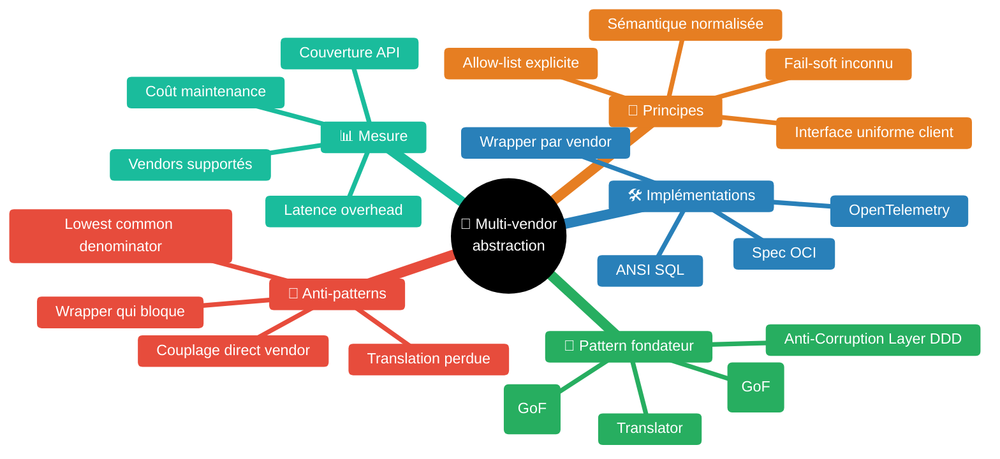
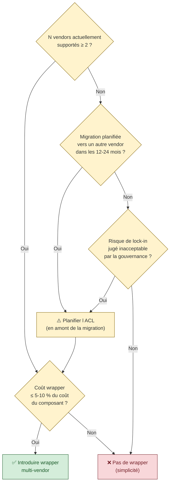

# Multi-vendor abstraction — interface uniforme face à plusieurs vendors

> *"Implement a façade or adapter layer between different subsystems that don't share the same semantics. This layer translates requests that one subsystem makes to the other subsystem. Use this pattern to ensure that an application's design isn't limited by dependencies on outside subsystems."* [📖¹](https://learn.microsoft.com/en-us/azure/architecture/patterns/anti-corruption-layer "Microsoft Azure Architecture Center — Anti-corruption Layer pattern (Eric Evans, DDD)")
>
> *En français* : on insère une **couche façade ou adapter** entre des sous-systèmes qui ne partagent pas les mêmes sémantiques. Cette couche traduit les requêtes d'un sous-système vers l'autre, et garantit que la conception de l'application **n'est pas contrainte** par les dépendances aux sous-systèmes externes. Pattern d'abord décrit par Eric Evans dans *Domain-Driven Design*.

À l'échelle d'une grande organisation tech, **aucun choix d'outil n'est universel** : APM hétérogène (Dynatrace + Datadog + AppDynamics), CI/CD hétérogène (GitHub Actions + GitLab CI + Jenkins + Tekton), cloud hétérogène (AWS + Azure + GCP), DB hétérogène. Une plateforme SRE ou DevOps qui ne supporte qu'un seul vendor ne sert qu'une fraction de la DSI. L'inverse — laisser chaque équipe consommer son vendor directement — couple chaque outil à un vendor et bloque la migration future.

Le pattern **multi-vendor abstraction** résout cette tension : exposer une **interface uniforme côté client** (mêmes outils, même sémantique) tout en supportant plusieurs **wrappers vendor-specific côté serveur**. Le client code une seule fois ; on ajoute un wrapper pour chaque nouveau vendor.

Skill construite à partir de sources canoniques (Microsoft Azure Architecture Center, AWS Prescriptive Guidance, OpenTelemetry CNCF, Eric Evans DDD).

## Pourquoi le multi-vendor est inévitable à l'échelle

Trois forces structurelles imposent le multi-vendor dans une grande DSI :

1. **Hétérogénéité historique** — chaque génération de stack a apporté son outil. Aucun n'a été retiré quand le suivant est arrivé. Le résultat : dette de coexistence permanente.
2. **Spécificités métier** — certaines équipes ont des besoins qui justifient un vendor spécifique (ex : équipe sécurité avec un SIEM particulier ; équipe data avec un APM dédié au streaming). Imposer un vendor unique = contournements.
3. **Évolution du marché** — un vendor leader aujourd'hui peut être déprécié dans 5 ans. Coupler son code à un vendor unique = rendez-vous avec une migration douloureuse.

Le pattern multi-vendor abstraction **anticipe** ces 3 forces dès la conception.

## Carte des concepts



## Pattern fondateur — Anti-Corruption Layer (DDD)

> *"Isolate the different subsystems by placing an anti-corruption layer between them. This layer translates communications between the two systems, allowing one system to remain unchanged while the other can avoid compromising its design and technological approach."* [📖²](https://learn.microsoft.com/en-us/azure/architecture/patterns/anti-corruption-layer "Microsoft Azure — Anti-corruption Layer pattern, section Solution")
>
> *En français* : on **isole** les sous-systèmes en plaçant une couche anti-corruption entre eux. Cette couche **traduit** les communications, permettant à un système de rester inchangé pendant que l'autre **évite de compromettre** sa propre conception.

L'ACL est composé de **3 sous-patterns** standards (Gang of Four + DDD) :

| Sous-pattern | Rôle |
|---|---|
| **Adapter** | Adapte l'interface technique du vendor (HTTP, gRPC, SDK propriétaire) à l'interface technique uniforme côté client |
| **Translator** | Traduit le **modèle de données** vendor en modèle de données uniforme (timestamps, IDs, statuts, formats) |
| **Façade** | Présente une **API simplifiée** côté client, masquant la complexité de l'API vendor |

Souvent les 3 sont fusionnés dans un seul composant *« wrapper »* — pour les cas simples. Les cas complexes les distinguent.

### Quand utiliser le pattern

> *"Use this pattern when: A migration is planned to happen over multiple stages, but integration between new and legacy systems needs to be maintained. Two or more subsystems have different semantics, but still need to communicate."* [📖³](https://learn.microsoft.com/en-us/azure/architecture/patterns/anti-corruption-layer "Microsoft Azure — Anti-corruption Layer pattern, section When to use this pattern")
>
> *En français* : ce pattern s'utilise quand une **migration progressive** est planifiée mais que l'intégration des deux systèmes doit perdurer, **ou** quand deux sous-systèmes ont des **sémantiques différentes** mais doivent communiquer.

Pour le cas multi-vendor, c'est exactement l'usage : la « migration » est plutôt un **support concurrent** de plusieurs vendors, mais le pattern ACL est identique.

### Considérations à anticiper

> *"The anti-corruption layer might add latency to calls made between the two systems. The anti-corruption layer adds an additional service that must be managed and maintained. Consider how your anti-corruption layer will scale. Consider whether you need more than one anti-corruption layer."* [📖⁴](https://learn.microsoft.com/en-us/azure/architecture/patterns/anti-corruption-layer "Microsoft Azure — Anti-corruption Layer pattern, section Issues and considerations")
>
> *En français* : la couche ACL **ajoute de la latence**, c'est un service supplémentaire à maintenir, son scaling est à penser, et selon les cas il peut y avoir plusieurs ACL (une par sous-système ou domaine).

Implications pratiques :

- **Latence** : un appel client → ACL → vendor coûte typiquement 5-50 ms supplémentaires. Acceptable pour la plupart des cas, à mesurer pour les cas critiques (latence p95 < 100 ms requise par exemple).
- **Maintenance** : chaque vendor wrapper a son cycle de mise à jour (rebase upstream, suivi de breaking changes). Effort à budgéter.
- **Scaling** : ACL stateless = scaling horizontal facile. ACL avec cache = penser invalidation.
- **Plusieurs ACL** : si plusieurs domaines ont des wrappers différents (APM, CI/CD, DB), prévoir une architecture en *« mesh d'ACL »* plutôt qu'un monolithe.

## Cas canonique 2025 — OpenTelemetry

OpenTelemetry est le **cas industriel de référence** du pattern multi-vendor abstraction. CNCF Graduated, adoption massive 2024-2026.

> *"An observability framework and toolkit designed to facilitate the Generation, Export, Collection of telemetry data such as traces, metrics, and logs."* [📖⁵](https://opentelemetry.io/docs/what-is-opentelemetry/ "OpenTelemetry — What is OpenTelemetry")
>
> *En français* : OpenTelemetry est un **framework d'observabilité** qui facilite la génération, l'exportation et la collecte de télémétrie (traces, métriques, logs).

> *"Open source, as well as vendor- and tool-agnostic, meaning that it can be used with a broad variety of observability backends."* [📖⁶](https://opentelemetry.io/docs/what-is-opentelemetry/ "OpenTelemetry — Vendor- and tool-agnostic")
>
> *En français* : open source, **vendor-agnostic et tool-agnostic** — utilisable avec n'importe quel backend d'observabilité.

> *"You own the data that you generate. There's no vendor lock-in."* [📖⁷](https://opentelemetry.io/docs/what-is-opentelemetry/ "OpenTelemetry — Why OpenTelemetry?")
>
> *En français* : **vous possédez** les données que vous générez. Pas de vendor lock-in.

### Architecture OpenTelemetry — séparation des préoccupations

OpenTelemetry sépare 3 préoccupations en 3 couches indépendantes :

| Couche | Rôle | Vendor-neutral ? |
|---|---|---|
| **Instrumentation** (génération) | Code applicatif qui produit la télémétrie via des SDK OTel | ✅ Oui — SDK standard, mêmes APIs partout |
| **Export / Processing** (collecte) | OpenTelemetry Collector qui reçoit, transforme, redirige | ✅ Oui — un seul collector pour N backends |
| **Backend** (stockage + visualisation) | Vendor spécifique : Datadog, Dynatrace, Grafana, Splunk, Honeycomb… | ❌ Non — c'est ici que vit le lock-in éventuel |

Selon OpenTelemetry : *« The backend (storage) and the frontend (visualization) of telemetry data are intentionally left to other tools. »*

**Conséquence pratique** : on peut **changer de backend** en reconfigurant le Collector, **sans toucher au code applicatif**. C'est exactement la promesse multi-vendor abstraction.

> ⚠️ Le lock-in se déplace simplement vers le backend choisi. Si Datadog devient le backend de référence, on dépend toujours de Datadog. Mais on peut **migrer** vers un autre backend en re-configurant le Collector — coût d'instrumentation = 0.

## Spec uniforme côté client — règles de conception

Pour qu'une famille de wrappers multi-vendor soit utilisable, la **spec côté client** doit respecter 5 règles :

### Règle 1 — Allow-list, pas deny-list

L'interface uniforme **liste explicitement les opérations supportées** : `search_traces`, `get_problem`, `list_services`, `execute_query`. Pas *« tout ce que le vendor supporte sauf X »*. L'inverse rend l'ajout d'un nouveau vendor risqué (chaque ajout de fonctionnalité upstream peut casser la spec).

### Règle 2 — Sémantique normalisée

Les **outputs** ont un format commun, indépendant du vendor : timestamps ISO 8601, statuts en string normalisée (`ok | degraded | down`), IDs anonymisés selon des règles publiques.

Exemple problématique : un wrapper Vendor A retourne `{status: "OK"}`, un wrapper Vendor B retourne `{status: 200}`. Le client doit savoir interpréter les deux → couplage du client à chaque vendor. **Mauvais.**

Exemple correct : les 2 wrappers normalisent en `{status: "ok"}`. Le client ne voit que la spec commune. **Bon.**

### Règle 3 — Fail-soft sur fonctionnalité inconnue

Si un vendor ne supporte pas une opération de la spec (ex : Vendor A n'a pas d'équivalent à `list_problems`), le wrapper retourne **un statut explicite** plutôt qu'un erreur fatale :

```
{status: "not_supported", vendor: "<vendor>", alternative: "<suggestion>"}
```

Le client peut décider de dégrader gracieusement plutôt que crasher.

### Règle 4 — Versionnage de la spec

La spec uniforme **évolue dans le temps** (ajout d'opérations, modifications de format). Versionner explicitement (`api/v1`, `api/v2`) et garantir une compatibilité ascendante sur N versions précédentes (typiquement N=2).

### Règle 5 — Test de conformité commun

Une **suite de tests** identique applicable à chaque wrapper vérifie qu'il respecte la spec. Quand on ajoute un nouveau wrapper Vendor C, on lance la suite de conformité — pas de wrapper non conforme en prod.

## Domaines d'application

Cas concrets à grande échelle où le pattern multi-vendor abstraction s'applique :

| Domaine | Vendors typiques | Spec uniforme |
|---|---|---|
| **APM / Observabilité** | Dynatrace, Datadog, AppDynamics, New Relic, Splunk | OpenTelemetry (instrumentation) + spec wrapper côté requête (logs/traces/métriques) |
| **CI/CD orchestration** | Argo Workflows, GitHub Actions, GitLab CI, Jenkins, Tekton | CLI portable + wrappers natifs par orchestrateur (cf. `journey-slos-cross-service.md` §gate multi-CI/CD) |
| **Cloud** | AWS, Azure, GCP, OVH, OnPrem | Crossplane, Pulumi, Terraform abstractions |
| **Base de données** | PostgreSQL, MySQL, Oracle, SQLServer | ANSI SQL + ORM (Hibernate, SQLAlchemy) |
| **Messaging** | Kafka, RabbitMQ, ActiveMQ, AWS SQS | Spring Cloud Stream, AsyncAPI |
| **Container runtime** | Docker, containerd, CRI-O, Podman | OCI spec |
| **Service mesh** | Istio, Linkerd, Consul Connect | SMI (Service Mesh Interface) |

## Anti-patterns à proscrire

| Anti-pattern | Symptôme | Conséquence | Pattern correct |
|---|---|---|---|
| **Couplage direct vendor** | Le code applicatif appelle directement les SDK Datadog / Dynatrace / autre | Migration impossible sans réécriture | ACL + spec uniforme côté client |
| **Lowest common denominator** | Spec réduite aux fonctionnalités communes à tous les vendors | Perte des capacités avancées qui justifiaient le choix vendor | Spec riche + Règle 3 (fail-soft sur fonctionnalité non supportée) |
| **Translation perdue** | Wrapper qui appauvrit silencieusement les données vendor (ex : tronque les labels custom) | Diagnostic incomplet côté client | Documenter explicitement ce qui est traduit vs perdu |
| **Wrapper qui bloque** | Wrapper synchrone qui ajoute > 100 ms de latence | Performance dégradée | Cache, batching, async où possible |
| **Wrapper qui maintient son propre état** | Wrapper qui stocke des données métier au lieu de relayer | Source de vérité confuse | Wrapper stateless ou état clairement délimité (cache TTL) |
| **Spec figée** | Pas de versionnage, modifications non backward-compatible | Casse les clients en cascade | Versionner explicitement, garantir N versions ascendantes |
| **Pas de test de conformité** | Chaque wrapper « passe » sans validation commune | Régression silencieuse à l'ajout d'un wrapper | Suite de tests applicable à tous les wrappers |
| **Wrapper inutile** (1 seul vendor à supporter durablement) | Surcoût d'infrastructure et de maintenance pour rien | Complexité gratuite | Skipper l'ACL si N=1 et garantie de stabilité ; ajouter quand N≥2 ou risque de migration |

> **🟢 Confiance 8/10** — Tableau d'anti-patterns dont 5 sont sourcés directement (Microsoft Azure ACL, OpenTelemetry, GoF), 3 sont des consensus communautaires de plateformes mesh.

## Méthode — quand introduire un wrapper multi-vendor

Décision en 4 questions, dans l'ordre :



**Lecture** : on **n'introduit pas** de wrapper *« au cas où »*. On l'introduit quand soit (a) on a déjà ≥ 2 vendors, soit (b) une migration est planifiée, soit (c) la gouvernance interdit le lock-in. Et toujours sous condition de coût raisonnable au regard du périmètre couvert — une heuristique consultative est de viser un surcoût d'abstraction faible devant le coût total du composant abstrait.

## Cheatsheet — concevoir une famille de wrappers multi-vendor

- [ ] **Spec uniforme** documentée (allow-list explicite des opérations supportées)
- [ ] **Sémantique normalisée** des outputs (timestamps, statuts, IDs)
- [ ] **Fail-soft** sur opération non supportée par un vendor
- [ ] **Versionnage explicite** de la spec (`api/v1`, `api/v2`)
- [ ] **Test de conformité** applicable à chaque wrapper
- [ ] **Wrappers vendor stateless** (ou cache TTL clairement délimité)
- [ ] **Filtrage commun** appliqué uniformément (ex : PII pour APM)
- [ ] **Spec d'ajout d'un nouveau wrapper** documentée (template, exemple, tests)
- [ ] **Métriques par wrapper** : latence overhead, taux d'erreur, opérations non supportées
- [ ] **Plan de retrait d'un wrapper** documenté (que faire si un vendor est déprécié ?)
- [ ] **Communication client** sur les opérations non supportées par certains vendors (matrice publique)

## Glossaire

| Terme | Définition |
|---|---|
| **Adapter** | Pattern Gang of Four — adapte l'interface technique d'un objet à une autre interface attendue |
| **Anti-Corruption Layer (ACL)** | Pattern DDD — couche défensive qui isole un domaine des modèles externes [📖²] |
| **Façade** | Pattern Gang of Four — interface simplifiée pour un sous-système complexe |
| **Translator** | Composant DDD — traduit les modèles de données entre bounded contexts |
| **Vendor lock-in** | Couplage fort à un vendor rendant la migration difficile/coûteuse |
| **Vendor-agnostic / vendor-neutral** | Conçu pour fonctionner avec n'importe quel vendor d'une catégorie [📖⁶] |
| **Spec uniforme** | Interface commune côté client, indépendante du vendor sous-jacent |
| **Wrapper** | Implémentation d'un ACL pour un vendor donné |

## Bibliothèque exhaustive des sources

### Pattern fondateur — Anti-Corruption Layer (DDD)
- [📖] *Microsoft Azure Architecture Center — Anti-corruption Layer pattern* — https://learn.microsoft.com/en-us/azure/architecture/patterns/anti-corruption-layer — Définition canonique, contexte/problème/solution, considérations, quand utiliser
- [📖] *AWS Prescriptive Guidance — Anti-corruption layer pattern* — https://docs.aws.amazon.com/prescriptive-guidance/latest/cloud-design-patterns/acl.html — Variante AWS
- [📖] Eric Evans (2003), *Domain-Driven Design: Tackling Complexity in the Heart of Software*, Addison-Wesley — Source historique du pattern
- [📖] *DevIQ — Anti-Corruption Layer* — https://deviq.com/domain-driven-design/anti-corruption-layer/ — Synthèse pédagogique

### OpenTelemetry — cas industriel multi-vendor
- [📖] *OpenTelemetry — What is OpenTelemetry?* — https://opentelemetry.io/docs/what-is-opentelemetry/ — Définition, vendor-neutral, séparation des préoccupations
- [📖] *OpenTelemetry — Documentation* — https://opentelemetry.io/docs/ — Documentation complète
- [📖] *Grafana Labs — OpenTelemetry and vendor neutrality* — https://grafana.com/blog/opentelemetry-and-vendor-neutrality-how-to-build-an-observability-strategy-with-maximum-flexibility/ — Stratégie multi-vendor en 2024-2025
- [📖] *CNCF — From chaos to clarity: OpenTelemetry unified observability* — https://www.cncf.io/blog/2025/11/27/from-chaos-to-clarity-how-opentelemetry-unified-observability-across-clouds/ — Adoption multi-cloud

### Patterns Gang of Four
- [📖] Erich Gamma, Richard Helm, Ralph Johnson, John Vlissides (1994), *Design Patterns: Elements of Reusable Object-Oriented Software*, Addison-Wesley — Adapter, Façade

### Patterns adjacents
- [📖] *Microsoft Azure — Strangler Fig pattern* — https://learn.microsoft.com/en-us/azure/architecture/patterns/strangler-fig — Pattern complémentaire pour migrations progressives
- [📖] *Microsoft Azure — Messaging Bridge pattern* — https://learn.microsoft.com/en-us/azure/architecture/patterns/messaging-bridge — Pattern pour bridges multi-messaging

## Conventions de sourcing

- `[📖n](url "tooltip")` — Citation **vérifiée verbatim** via WebFetch / lecture directe des sources
- ⚠️ — Reformulation pédagogique ou pattern consensuel non cité verbatim

Notes de confiance : 🟢 9-10 (verbatim) / 🟢 7-8 (reformulation fidèle) / 🟡 5-6 (choix défendable).

## Liens internes KB

- [`sre-at-scale.md`](sre-at-scale.md) — Modèles d'organisation SRE à l'échelle (où les wrappers multi-vendor s'inscrivent côté Platform team)
- [`knowledge-indexing-strategy.md`](knowledge-indexing-strategy.md) — Pattern voisin : indexation multi-source de KB (au lieu de migration)
- [`alerting-consolidation-strategy.md`](alerting-consolidation-strategy.md) — Cas particulier : consolidation alerting multi-source via aggregator central
- [`observability-vs-monitoring.md`](observability-vs-monitoring.md) — Stack OTel vendor-neutral
- [`monitoring-alerting.md`](monitoring-alerting.md) — Standards Prometheus / Alertmanager
