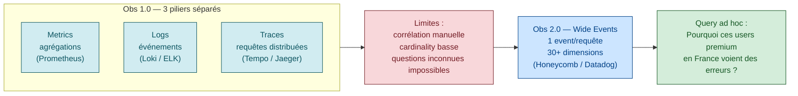
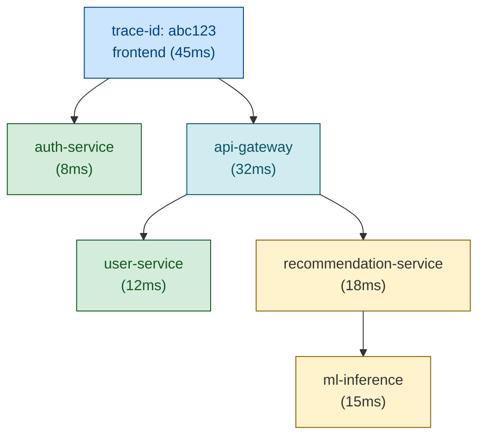

# Observability vs Monitoring

> **Sources** :
> - Charity Majors (Honeycomb), [*Observability — A 3-Year Retrospective*](https://www.honeycomb.io/blog/observability-3-year-retrospective "Honeycomb — Observability 3-Year Retrospective (Charity Majors)")
> - Honeycomb, [*What is Observability?*](https://www.honeycomb.io/what-is-observability "Honeycomb — What is Observability?")
> - OpenTelemetry, [*Observability primer*](https://opentelemetry.io/docs/concepts/observability-primer/ "OpenTelemetry — Observability primer (CNCF)")
> - OpenTelemetry, [*Signals*](https://opentelemetry.io/docs/concepts/signals/ "OpenTelemetry — Signals (metrics, logs, traces, baggage)")
> - AWS Well-Architected, [*Observability*](https://docs.aws.amazon.com/wellarchitected/latest/operational-excellence-pillar/observability.html "AWS Well-Architected — Operational Excellence, Observability")
> - Microsoft Azure WAF, [*Observability*](https://learn.microsoft.com/en-us/azure/well-architected/operational-excellence/observability "Microsoft Azure WAF — Operational Excellence, Observability")
> - Google SRE book ch. 6, [*Monitoring Distributed Systems*](https://sre.google/sre-book/monitoring-distributed-systems/ "Google SRE book ch. 6 — Monitoring Distributed Systems")

## La différence fondamentale

> *"Monitoring is about asking known questions about a system. Observability is about being able to ask any question about a system, including ones you didn't know to ask."* [📖¹](https://www.honeycomb.io/blog/observability-3-year-retrospective "Honeycomb — Observability 3-Year Retrospective (Charity Majors)")
>
> *En français* : le **monitoring** répond à des questions **qu'on a prévues à l'avance**. L'**observabilité** permet de poser **n'importe quelle question** sur le système, y compris celles qu'on ne savait pas qu'il fallait poser.

> ⚠️ **Citation attribuée à Charity Majors** — formulation largement répandue dans ses conférences et billets Honeycomb. À localiser précisément dans une source officielle pour attribution verbatim.



| Question | Type |
|----------|------|
| *"Le service est-il en panne ?"* | Monitoring (question prévue) |
| *"Mes p99 dépassent le seuil ?"* | Monitoring (question prévue) |
| *"Pourquoi ce user spécifique a une latency 10× plus haute, mais seulement entre 14h et 16h, et seulement sur l'endpoint X depuis le client mobile iOS v3.4 ?"* | Observability (question non-prévue) |

**Monitoring** = répondre à des questions **connues à l'avance**, généralement avec des metrics agrégées.
**Observability** = capacité à poser des questions **arbitraires** *a posteriori* sur le comportement du système, sans déployer du nouveau code.

## Les 3 piliers historiques (Metrics, Logs, Traces)

### Metrics

**Définition** : valeurs numériques agrégées dans le temps, indexées par labels (key-value).

```
http_requests_total{method="GET",route="/api/users",status="200"} 12483
http_request_duration_seconds_bucket{le="0.1"} 11200
```

| Force | Limite |
|-------|--------|
| Stockage très efficace | Pré-agrégé → impossible de drill-down sur des dimensions non prévues |
| Querying rapide | Limité par la cardinality (combinaisons de labels) |
| Standard mature (Prometheus, Datadog) | Perd la trace individuelle |

**Quand utiliser** : alerting, dashboards, SLI agrégés, capacity planning.

### Logs

**Définition** : événements textuels ou structurés, datés, émis par le code.

```json
{"ts":"2026-04-11T14:23:45Z","level":"ERROR","msg":"DB connection failed","service":"checkout","trace_id":"abc123","user_id":"u-456","db":"primary"}
```

| Force | Limite |
|-------|--------|
| Très expressif | Volume énorme, coût stockage explosif |
| Capture le contexte humain | Recherche full-text lente sans indexation |
| Universel (tous les langages) | Sans corrélation, illisible en distribué |

**Quand utiliser** : forensic, debug, audit, événements rares.

### Traces

**Définition** : suivi d'une requête à travers un système distribué, sous forme d'arbre de **spans**.



| Force | Limite |
|-------|--------|
| Vue distribuée complète | Sampling souvent obligatoire (volume) |
| Identifie le bottleneck d'une requête | Pas adapté à l'analyse statistique large |
| Lien causal entre services | Nécessite propagation context partout |

**Quand utiliser** : débogage de latence, comprendre le chemin d'une requête, identifier des bottlenecks.

## L'évolution Honeycomb : "wide events"

L'approche **wide events** (parfois appelée *observabilité 2.0* ou *3.0*) :

> *"Stop sending pre-aggregated metrics. Send a single, structured, high-cardinality event per request, with all the context, and let the storage engine compute the aggregations on-the-fly."*
>
> *En français* : **arrêtez** d'envoyer des métriques pré-agrégées. Émettez **un seul event** structuré à haute cardinalité **par requête**, avec tout le contexte, et laissez le moteur de stockage calculer les agrégations à la volée.

### Exemple d'un "wide event"

```json
{
  "ts": "2026-04-11T14:23:45.123Z",
  "service": "checkout",
  "endpoint": "/api/checkout",
  "method": "POST",
  "status": 500,
  "duration_ms": 1245,
  "user_id": "u-456",
  "user_tier": "premium",
  "user_country": "FR",
  "shopping_cart_value": 89.50,
  "shopping_cart_items": 3,
  "payment_method": "stripe_card",
  "feature_flag_new_checkout": true,
  "deploy_version": "v2.4.7",
  "host": "pod-checkout-7d8f-xz4",
  "region": "eu-west-3",
  "az": "eu-west-3b",
  "error_class": "PaymentDeclined",
  "stripe_error_code": "card_declined",
  "stripe_decline_code": "insufficient_funds",
  "trace_id": "abc-123",
  "span_id": "def-456"
}
```

C'est **un seul événement** mais avec **30 dimensions**. Avec ce type de stockage, vous pouvez répondre à *"Pourquoi seulement les premium users en France, sur des paniers > 50€ avec Stripe, qui ont la nouvelle feature flag activée, voient des PaymentDeclined ?"* en une seule query, **sans** avoir prévu cette question à l'avance.

### Pourquoi c'est révolutionnaire

| Approche classique (metrics + logs + traces séparés) | Wide events |
|------|-------------|
| 3 systèmes distincts à corréler manuellement | 1 système unifié |
| Cardinality limitée (label explosion = cher) | Cardinality élevée nativement |
| Pas de drill-down sur des dimensions non prévues | Toutes les dimensions sont queryables |
| Sampling difficile (perd des metrics) | Sampling intelligent par event |

**L'argument de Honeycomb** ([*Time to version observability*](https://www.honeycomb.io/blog/time-to-version-observability "Honeycomb — Time to version observability")) : *"Aggregations are the enemy of debugging."* — dès que vous moyennez, vous perdez l'information qui vous aurait permis de comprendre le bug.

## La cardinality : le nerf de la guerre

**Cardinality** = nombre de valeurs uniques d'une dimension.

| Dimension | Cardinality typique |
|-----------|---------------------|
| `http_method` | ~7 (GET, POST, PUT, DELETE, ...) |
| `region` | ~10 |
| `service` | ~50 |
| `endpoint` | ~200 |
| `pod_name` | ~1000 (varie avec autoscaling) |
| `user_id` | **millions** |
| `request_id` | **infini** |

### Le drame des metrics classiques

Prometheus stocke 1 time-series par combinaison de labels. Si vous ajoutez `user_id` à vos metrics :

```promql
http_requests_total{user_id="u-1"} 12
http_requests_total{user_id="u-2"} 8
http_requests_total{user_id="u-3"} 5
... × millions
```

→ **explosion de la cardinality** → coût stockage explosif → Prometheus crash.

**Solution classique** : ne **pas** mettre `user_id` en label, le mettre dans les logs/traces. Mais alors vous ne pouvez plus filtrer vos metrics par user.

**Solution wide events** : 1 event par requête contient `user_id`, et l'engine de stockage (Honeycomb, Datadog, Grafana Tempo) gère ça nativement.

## OpenTelemetry — l'unification

**[OpenTelemetry (OTel)](https://opentelemetry.io/docs/concepts/observability-primer/ "OpenTelemetry — Observability primer (CNCF)")** est un standard CNCF pour collecter et exporter de la donnée d'observabilité. Sa promesse :

1. **API unifiée** dans tous les langages (Go, Java, Python, JS, ...)
2. **Signaux unifiés** : metrics, logs, traces sous le même contexte
3. **Vendor-neutral** : exporter vers Prometheus, Datadog, Honeycomb, etc.

### Les signaux OTel

| Signal | Usage |
|--------|-------|
| **Traces** | Suivi distribué d'une requête (spans liés par trace_id) |
| **Metrics** | Valeurs numériques agrégées (counter, histogram, gauge) |
| **Logs** | Événements textuels structurés |
| **Baggage** | Métadonnées propagées dans le contexte (cross-service) |

### L'impact OTel sur l'observabilité

- **Avant OTel** : chaque vendor avait son SDK (Datadog SDK, New Relic SDK, ...) → vendor lock-in
- **Avec OTel** : 1 SDK universel, on change de vendor en changeant la config de l'exporter

C'est devenu le standard **de facto** pour l'instrumentation moderne.

## Sampling — le compromis nécessaire

À fort volume, on ne peut pas tout stocker. **Sampling** = ne garder qu'un sous-ensemble.

### Head-based sampling

Décision de sampling au début de la requête (souvent random %).

```
Pour chaque requête :
  if random() < 0.01: keep
  else: drop
```

| Avantage | Inconvénient |
|----------|--------------|
| Simple, peu coûteux | Vous loupez 99% des erreurs (qui sont par définition rares) |

### Tail-based sampling

Décision **après** la fin de la requête, basée sur le contenu (errors, slow, ...).

```
Pour chaque requête finie :
  if status >= 500: keep 100%
  if duration > 2s: keep 100%
  else: keep 1%
```

| Avantage | Inconvénient |
|----------|--------------|
| Garde les requêtes intéressantes | Plus coûteux (faut buffer la requête entière avant de décider) |

**Recommandation** : tail-based sampling pour la prod, head-based pour les envs de test.

## Distinction fine : observability vs APM vs RUM

| Type | Source | Usage |
|------|--------|-------|
| **Observability** | Wide events instrumentés dans le code | Comprendre tout le système |
| **APM** (Application Performance Monitoring) | Auto-instrumentation (agents type observabilité, AppDynamics, New Relic) | Detection de bottlenecks app |
| **RUM** (Real User Monitoring) | Code JavaScript dans le navigateur user | Mesurer la perf perçue côté client |
| **Synthetic** | Probes externes scénarisés | Détection proactive (cf. [`synthetic-monitoring.md`](synthetic-monitoring.md)) |

Tous se complètent.

## Lien observabilité ↔ SLI

L'approche wide events permet de calculer des SLI **plus précis** que les metrics agrégées :

```sql
-- Pseudo-SQL Honeycomb / Datadog Logs Query
SELECT
  COUNT(*) FILTER (WHERE status = 'success' AND duration_ms < 500)
  /
  COUNT(*) AS sli_value
FROM events
WHERE service = 'checkout'
  AND endpoint = '/api/checkout'
  AND ts >= now() - INTERVAL '4 weeks'
GROUP BY user_tier  -- on peut splitter par dimension !
```

→ vous obtenez le SLI par tier d'utilisateur, par région, par feature flag, sans avoir prévu ces splits à l'avance.

## L'évolution selon Charity Majors : observability 1.0 / 2.0 / 3.0

| Version | Caractéristique |
|---------|-----------------|
| **Obs 1.0** | 3 piliers séparés (metrics, logs, traces) |
| **Obs 2.0** | Wide events unifiés, haute cardinality |
| **Obs 3.0** | Intégration LLM/AI pour explorer les events automatiquement |

C'est le sens de l'évolution moderne.

## Anti-patterns observabilité

| Anti-pattern | Conséquence |
|--------------|-------------|
| **Tout est metric** | Pas de drill-down sur les anomalies |
| **Tout est log** | Coût stockage explosif, rien n'est queryable rapidement |
| **Pas de trace_id partout** | Impossible de corréler logs et traces |
| **Sampling trop agressif** | Vous loupez la requête qui pose problème |
| **Pas de cardinality élevée** | Vous ne pouvez pas filtrer par user / requestID / version |
| **Auto-instrumentation only** | Vous capturez ce que le SDK voit, pas ce qui compte business |
| **Pas de correlation deploy/incident** | Vous ne voyez pas que l'erreur a démarré au déploiement v2.4.7 |
| **Pas d'attributes business** | Vous savez "5% errors" mais pas "5% errors sur premium users" |
| **Dashboards bruyants** | 50 panels, aucun ne raconte d'histoire (cf. [`monitoring-alerting.md`](monitoring-alerting.md)) |

## Recommandations pratiques

### Pour démarrer

1. **Adopter OpenTelemetry** dès le début (vendor-neutral)
2. **Instrumenter les wide events** : 1 event par requête HTTP, avec ~20-30 attributs métier
3. **Trace_id partout** : propagation OTel automatique entre services
4. **Sampling tail-based** sur la prod, full sample sur dev/staging
5. **Dashboards top-down** : 4 golden signals au top, drill-down progressif

### Choisir un backend

| Backend | Force |
|---------|-------|
| **Prometheus + Grafana + Loki + Tempo** | Open source, écosystème CNCF, gratuit |
| **Datadog** | UI riche, "tout-en-un", cher |
| **Honeycomb** | Pionnier wide events, query intuitive |
| **observabilité** | APM auto-instrumentation, AI built-in |
| **New Relic** | APM mature, pricing par event ingéré |
| **Grafana Cloud** | Hosted Prom + Loki + Tempo + Grafana |
| **Elastic APM** | Bonne intégration ELK, on-premise possible |

## Lien avec les autres piliers SRE

- **SLI** : l'observabilité permet des SLI fins par dimension business
- **Monitoring + alerting** : l'observabilité est l'outil de **diagnostic** quand l'alerte sonne (cf. [`monitoring-alerting.md`](monitoring-alerting.md))
- **Postmortem** : wide events facilitent l'analyse forensic d'un incident
- **Golden signals** : reste la base, les wide events permettent de drill-down
- **Distributed tracing** : essentiel en architecture microservices

## Ressources

Sources primaires :

1. [Honeycomb — Observability 3-Year Retrospective (Charity Majors)](https://www.honeycomb.io/blog/observability-3-year-retrospective "Honeycomb — Observability 3-Year Retrospective (Charity Majors)") — évolution Obs 1.0 → 3.0
2. [OpenTelemetry — Observability primer](https://opentelemetry.io/docs/concepts/observability-primer/ "OpenTelemetry — Observability primer (CNCF)") — définitions signaux canoniques
3. [OpenTelemetry — Signals](https://opentelemetry.io/docs/concepts/signals/ "OpenTelemetry — Signals (metrics, logs, traces, baggage)") — traces, metrics, logs, baggage
4. [Google SRE book ch. 6 — Monitoring Distributed Systems](https://sre.google/sre-book/monitoring-distributed-systems/ "Google SRE book ch. 6 — Monitoring Distributed Systems") — golden signals, whitebox/blackbox

Ressources complémentaires :
- [Honeycomb — What is Observability?](https://www.honeycomb.io/what-is-observability "Honeycomb — What is Observability?")
- [AWS Well-Architected — Observability (Operational Excellence)](https://docs.aws.amazon.com/wellarchitected/latest/operational-excellence-pillar/welcome.html "AWS Well-Architected — Operational Excellence Pillar")
- [Microsoft Azure WAF — Observability](https://learn.microsoft.com/en-us/azure/well-architected/operational-excellence/observability "Microsoft Azure WAF — Operational Excellence, Observability")
- [Prometheus — Best practices](https://prometheus.io/docs/practices/instrumentation/)
- [Grafana Loki](https://grafana.com/oss/loki/)
- [Grafana Tempo (traces)](https://grafana.com/oss/tempo/)
- [Datadog APM](https://www.datadoghq.com/product/apm/)
- [*Distributed Systems Observability*](https://www.oreilly.com/library/view/distributed-systems-observability/9781492033431/ "Cindy Sridharan (O'Reilly, 2018)") — Cindy Sridharan
- [*Observability Engineering*](https://www.oreilly.com/library/view/observability-engineering/9781492076438/ "Majors, Fong-Jones, Miranda (O'Reilly, 2022)") — Charity Majors, Liz Fong-Jones, George Miranda
