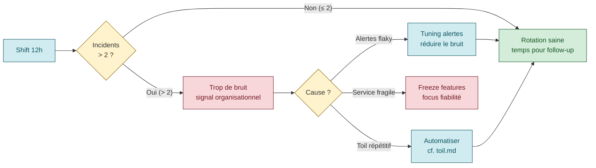
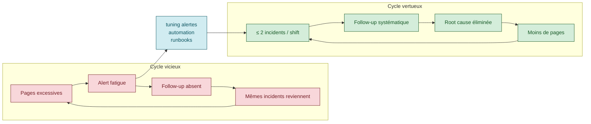

# OnCall Practices — la santé de la rotation

> **Sources primaires** :
> - Google SRE workbook, [*On-Call*](https://sre.google/workbook/on-call/ "Google SRE workbook — On-Call")
> - Google SRE book ch. 11, [*Being On-Call*](https://sre.google/sre-book/being-on-call/ "Google SRE book ch. 11 — Being On-Call")
> - Google SRE book ch. 5, [*Eliminating Toil*](https://sre.google/sre-book/eliminating-toil/ "Google SRE book ch. 5 — Eliminating Toil")
> - PagerDuty, [*Being On-Call*](https://response.pagerduty.com/oncall/being_oncall/ "PagerDuty — Being On-Call")
> - PagerDuty, [*Alerting principles*](https://response.pagerduty.com/oncall/alerting_principles/ "PagerDuty — Alerting principles (on-call guide)")

## Patterns de rotation

| Pattern | Description |
|---------|-------------|
| **Shift de 12h max** | *"24 hours of on-call duty without reprieve isn't a sustainable setup"* [📖¹](https://sre.google/workbook/on-call/ "Google SRE workbook — On-Call") |
| **Follow-the-sun** | Multi-site multi-timezone, chaque site couvre ses heures ouvrées |
| **Single-site** | Split day/night entre membres, pas 24h individuels |
| **Primary + secondary** | 2 personnes simultanées — PagerDuty : *"Always have a backup schedule"* [📖²](https://response.pagerduty.com/oncall/being_oncall/ "PagerDuty — Being On-Call") |
| **Weekly handoff** | Rotation hebdo, plus longue → fatigue ; plus courte → handoffs trop fréquents |

### Taille d'équipe minimum

Google SRE workbook chiffrages [📖¹](https://sre.google/workbook/on-call/ "Google SRE workbook — On-Call") :

> *"minimum of five people per site to sustain on-call in a multisite, 24/7 configuration, and eight people in a single-site, 24/7 configuration"*
>
> *En français* : un minimum de **5 personnes par site** pour tenir une rotation 24/7 multi-sites, ou **8 personnes** si rotation 24/7 mono-site.

- **Multi-site 24/7** : minimum **5 engineers par site**
- **Single-site 24/7** : minimum **8 engineers**
- **Plus 1 buffer** recommandé pour absorber les vacances et les départs [📖¹](https://sre.google/workbook/on-call/ "Google SRE workbook — On-Call")

En dessous de ces seuils → l'équipe brûle.

## Le seuil critique : ≤ 2 incidents par shift

Règle Google [📖¹](https://sre.google/workbook/on-call/ "Google SRE workbook — On-Call") :

> *"We target a maximum of two incidents per on-call shift"*
>
> *En français* : on vise un **maximum de 2 incidents** par shift d'astreinte.



Une *incident* = un *problème* (indépendamment du nombre d'alertes générées).

**Au-delà de ce seuil** :
- Le temps manque pour le follow-up (root-causing, amélioration système) [📖¹](https://sre.google/workbook/on-call/ "Google SRE workbook — On-Call")
- C'est un **signal organisationnel** : les alertes doivent être corrigées, pas l'équipe agrandie
- Investiguer le bruit, automatiser, réduire les pages

> ⚠️ **Reformulation** — le guide précédent citait *"ensures adequate time for follow-up work and prevents engineer burnout"* comme verbatim. Le SRE workbook mentionne le *follow-up* mais **pas le burnout** dans cette formulation exacte. Le principe global (protéger l'équipe via un plafond) est bien présent.

### Règle complémentaire : 50% du temps en projet

Source : Google SRE book ch. 5, *Eliminating Toil* [📖³](https://sre.google/sre-book/eliminating-toil/ "Google SRE book ch. 5 — Eliminating Toil") — l'objectif Google est que *"SRE teams have an aggregate cap of 50% of their 'ops' work"*.

Si l'équipe SRE passe **plus de 50% de son temps en ops** (toil + interrupts + incidents), elle est **sous-staffée**. Voir [`toil.md`](toil.md).

## SLA de réponse — MTTA / MTTR target

Aucune source ne fixe de cible universelle, mais des heuristiques industrie :

| Sévérité | MTTA target | MTTR target |
|----------|-------------|-------------|
| **SEV-1** | ≤ 5 min | ≤ 1 h |
| **SEV-2** | ≤ 15 min | ≤ 4 h |
| **SEV-3** | ≤ 1 h ouvré | ≤ 1 jour ouvré |
| **SEV-4** | ≤ 1 jour ouvré | ≤ 1 semaine |

> ⚠️ **Tableau MTTA/MTTR** — valeurs industrie courantes (alignées avec [Atlassian Incident KPIs](https://www.atlassian.com/incident-management/kpis/common-metrics "Atlassian — Common incident metrics (MTBF/MTTR/MTTA/MTTF)") et pratiques PagerDuty) mais **pas** un standard SRE book chiffré. À adapter à votre contexte business.

> Voir [`mtbf-mttr.md`](mtbf-mttr.md) pour les définitions exactes de chaque metric.

## Handoff — transmission entre rotations

Google SRE workbook [📖¹](https://sre.google/workbook/on-call/ "Google SRE workbook — On-Call") :

> *"At the start of each shift, the on-call engineer reads the handoff from the previous shift."*
>
> *En français* : en début de shift, l'ingénieur d'astreinte **lit le handoff** laissé par le shift précédent.

Et PagerDuty [📖²](https://response.pagerduty.com/oncall/being_oncall/ "PagerDuty — Being On-Call") :
> *"Never hold issues intending for next shift to handle."*
>
> *En français* : **ne jamais** retenir un problème en se disant *« le shift suivant le traitera »*.

> ⚠️ **Citation PagerDuty** — formulation plausible dans l'esprit PagerDuty mais à localiser précisément. Principe largement accepté (pas de *hold* entre shifts).

### Contenu minimum d'un handoff

```markdown
# OnCall Handoff — Week YYYY-WW
**From:** @alice (sortante)
**To:** @bob (entrant)
**Date:** YYYY-MM-DD HH:MM UTC

## Open incidents
| ID | Severity | Status | IC | Next steps | Link |
|----|----------|--------|----|------------|------|
| #123 | SEV-2 | Mitigated | @charlie | Awaiting RCA | <link> |

## Active alerts (noisy)
- `db_slow_query_alert` fired 7× cette semaine → ticket d'investigation #456

## Production changes in progress
- Deploy v2.4.7 démarré 14h, bake en cours
- Migration DB schéma X planifiée demain 10h

## Patterns observés
- 3× burst de latency à 10h matin (corrélation cron suspect)

## Critical SMEs joignables
- DB : @dave (Slack), @eve (PagerDuty backup)
- Network : @frank
```

> ⚠️ **Template handoff** — pattern consolidé à partir des pratiques Google SRE workbook + PagerDuty + retours industrie. Pas un template verbatim d'une source unique.

## Compensation

Google SRE workbook [📖¹](https://sre.google/workbook/on-call/ "Google SRE workbook — On-Call") :

> *"Google offers time-off-in-lieu or cash compensation, capped at some proportion of the overall salary."*
>
> *En français* : Google offre soit des **heures de récupération**, soit une **compensation financière**, plafonnée à une fraction du salaire global.

Modèles courants :
- **Per-shift payment** (fixe par shift de 12h)
- **Per-page payment** (par page reçue hors heures)
- **Time-off-in-lieu** (heures compensées en repos, ratio 1:1 ou 1:1.5)
- **Weekend/holiday premium** (×1.5 ou ×2)

> ⚠️ **Les 4 modèles** — dérivés des pratiques industrie (Google + PagerDuty + vendors RH). Pas une liste canonique.

## OnCall fatigue / health

### Root causes (Google SRE workbook)

- **Page load élevé** (> 2 incidents/shift) [📖¹](https://sre.google/workbook/on-call/ "Google SRE workbook — On-Call")
- **Mauvais signal/bruit** des alertes (alert fatigue)
- **Follow-up insuffisant** sur les root causes (les mêmes pages reviennent)
- **Automation insuffisante** des remédiations triviales
- **Pas de runbooks** → diagnostic long

### Mitigations

- **Outils de scheduling** automatisés respectant les préférences
- **Pauses temporaires** de rotation pour burnout
- **Compatibilité temps partiel**
- **Peer-reviewed shift swaps**
- **Limite stricte** du nombre de réveils par shift
- **Postmortem obligatoire** sur incidents qui consomment > X% du budget

> Signal rouge confirmé verbatim [📖¹](https://sre.google/workbook/on-call/ "Google SRE workbook — On-Call") : *"a low signal-to-noise ratio raises the risk for on-call engineers to develop alert fatigue."*



## Runbooks — obligatoires et structurés

Google SRE workbook [📖¹](https://sre.google/workbook/on-call/ "Google SRE workbook — On-Call") :

> *"In SRE, whenever an alert is created, a corresponding playbook entry is usually created."*
>
> *En français* : en SRE, **dès qu'une alerte est créée**, on crée généralement une entrée de *playbook* correspondante.

> ⚠️ **Le SRE workbook utilise "playbook"** (pas "runbook"). Les 2 termes sont interchangeables dans la littérature SRE, « runbook » étant plus courant dans les équipes non-Google.

### Contenu requis

- High-level instructions pour répondre à l'alerte
- Explication de la sévérité et de l'impact client
- Suggestions de debugging
- Actions de mitigation
- Étapes de résolution complète

### Pattern PagerDuty pour l'alerte elle-même

L'alerte qui réveille un humain doit embarquer le contexte [📖⁴](https://response.pagerduty.com/oncall/alerting_principles/ "PagerDuty — Alerting principles (on-call guide)") :
- Titre **descriptif**
- Métrique et seuil
- Explication du problème
- **Lien runbook** ou étapes inline

✗ Mauvais : `"Disk is full"`
✓ Bon : `"Disk at 80% capacity on prod-web-loadbalancer; file creation/writes may fail if full"`

### Template runbook YAML

```yaml
runbook:
  alert_name: "checkout_service_error_rate_high"
  severity: SEV-2
  owner_team: "@checkout-sre"
  last_updated: 2026-03-15

  summary: >
    Le taux d'erreur 5xx sur le service checkout dépasse 2% sur 5 min.
    Impact direct : clients ne peuvent pas valider leur panier.

  customer_impact:
    - "Tentatives de paiement échouées"
    - "Revenue loss estimé : ~5000 EUR/min en heure pleine"

  detection:
    dashboard: "https://grafana/checkout-overview"
    query: 'sum(rate(http_5xx{svc="checkout"}[5m])) / sum(rate(http_total{svc="checkout"}[5m])) > 0.02'

  triage:
    - step: "Vérifier déploiement récent"
      command: "kubectl rollout history deploy/checkout -n prod"
    - step: "Vérifier dépendances DB et Redis"
      dashboard: "https://grafana/checkout-deps"
    - step: "Vérifier saturation pods"
      command: "kubectl top pods -l app=checkout -n prod"

  mitigation:
    primary:
      title: "Rollback si déploiement récent < 30 min"
      command: "kubectl rollout undo deploy/checkout -n prod"
      verify: "Grafana: taux d'erreur revient sous 1% dans les 5 min"
    secondary:
      title: "Scale out horizontal"
      command: "kubectl scale deploy/checkout -n prod --replicas=20"

  escalation:
    - level: 1
      who: "@checkout-sre-primary"
      after_minutes: 0
    - level: 2
      who: "@checkout-sre-secondary"
      after_minutes: 5
    - level: 3
      who: "@checkout-tech-lead"
      after_minutes: 15

  related_docs:
    - "https://wiki/checkout-architecture"
    - "https://wiki/rollback-procedure"
```

> ⚠️ **Template runbook YAML** — format communautaire inspiré de la structure PagerDuty/Grafana/Datadog. Pas un standard officiel d'une source unique.

## Anti-patterns OnCall

### Alertes

- Paging pour ce qui devrait être un ticket ou automatisé
- Pages **non actionnables** (*"cause unknown"*)
- Ignorer les pages dupliquées (*"I just ignore them"*)
- **Relaxer les seuils** au lieu de fixer le système
- Alertes **sans lien runbook**

### Follow-up

- Classer une page *"transient"* sans investigation
- **Point fixes** au lieu d'améliorations systémiques
- Pas de ticket de tracking pour les outages

### Équipe

- **1 seule personne on-call** — pas de secondary, pas de backup
- Feature devs **prioritisant les features** sur le follow-up on-call
- SRE **marginalisés** des décisions d'alerting
- Owners de sous-systèmes **bloquant** les changements d'alerte
- **Absence de safety psychologique** / chemin d'escalation

### Organisation

- **Staffing inadéquat** (< 50% temps projet)
- Pas de knowledge sharing cross-timezone
- Changements manuels en production sans review automation
- **Promotion du firefighting héroïque** (incentive perverse)

> ⚠️ **Les 4 groupes d'anti-patterns** — consolidés à partir du SRE workbook (chapitres *On-Call* + *Eliminating Toil*) et des guides PagerDuty. Pas un tableau littéral unique. Cohérents avec l'esprit SRE.

## Le contrat moral entre devs et SRE (Google)

Source : Google SRE book ch. 1, *Introduction* [📖⁵](https://sre.google/sre-book/introduction/ "Google SRE book — Introduction (Benjamin Treynor Sloss)").

L'équipe SRE accepte le on-call **à condition** que :
1. L'équipe **ne dépasse pas 50% ops time** (ch. 1 + ch. 5 *Eliminating Toil*)
2. Les pages soient **actionnables** et passent par un runbook
3. Les bugs récurrents soient **fixés** par les devs (sinon SRE rend les pages aux devs)
4. Les devs participent à la rotation en cas de surcharge

C'est ce qui distingue le SRE d'un sysadmin : il a **le droit de refuser** de prendre en charge un service qui ne respecte pas le contrat.

> ⚠️ **Le « contrat moral » en 4 points** — synthèse pédagogique du contrat Google SRE (présent en filigrane dans le ch. 1 et ch. 5 du SRE book). Pas un tableau de contrat littéral dans la source, mais les 4 éléments sont tous documentés séparément.

## Lien avec les autres piliers SRE

- **Toil** ([`toil.md`](toil.md)) : OnCall est la 1ère source de toil. Mesurer pour réduire.
- **Postmortem** ([`postmortem.md`](postmortem.md)) : chaque page → opportunité d'apprendre
- **Monitoring + alerting** ([`monitoring-alerting.md`](monitoring-alerting.md)) : la qualité des alertes détermine la santé OnCall
- **MTBF/MTTR** ([`mtbf-mttr.md`](mtbf-mttr.md)) : MTTA est le baromètre direct de la santé OnCall
- **Incident management** ([`incident-management.md`](incident-management.md)) : le on-call déclenche l'IR

## 📐 À l'échelle d'une grande organisation

Une rotation on-call par équipe ne tient pas à l'échelle de centaines d'équipes — chaque incident transverse fait sonner N pagers, le coût opérationnel devient insoutenable.

- **Escalade cross-team formalisée** — chaque maillon doit avoir un on-call identifié, accessible par d'autres équipes, avec contrat de réponse. La chaîne d'escalade traverse les équipes. Voir [`journey-slos-cross-service.md`](journey-slos-cross-service.md) §*Cross-team contrats*.
- **Follow-the-sun pour les services T1** — pour les chaînes critiques, rotation 24/7 répartie sur plusieurs fuseaux horaires (équipes localisées sur 2-3 timezones). Voir [`sre-at-scale.md`](sre-at-scale.md).
- **Filtrage par tier + chaîne** — tous les pages ne réveillent pas tout le monde. Routage par tier de service et par chaîne touchée (T4 → ticket, T1 → page immédiat). Voir [`alerting-consolidation-strategy.md`](alerting-consolidation-strategy.md).
- **Centre d'expertise on-call** — une enabling team SRE qui forme et coache les équipes sur l'on-call (Team Topologies). Voir [`sre-at-scale.md`](sre-at-scale.md).

## Ressources

Sources primaires vérifiées :

1. [Google SRE workbook — On-Call](https://sre.google/workbook/on-call/ "Google SRE workbook — On-Call") — 5 citations verbatim confirmées (24h unsustainable, 2 incidents/shift, signal-to-noise fatigue, playbook entry, time-off-in-lieu, handoff start-of-shift, team size 5/8)
2. [PagerDuty — Being On-Call](https://response.pagerduty.com/oncall/being_oncall/ "PagerDuty — Being On-Call") — backup schedule, never hold issues
3. [Google SRE book ch. 5 — Eliminating Toil](https://sre.google/sre-book/eliminating-toil/ "Google SRE book ch. 5 — Eliminating Toil") — plafond 50% ops
4. [PagerDuty — Alerting principles](https://response.pagerduty.com/oncall/alerting_principles/ "PagerDuty — Alerting principles (on-call guide)") — contexte descriptif des pages
5. [Google SRE book ch. 1 — Introduction](https://sre.google/sre-book/introduction/ "Google SRE book — Introduction (Benjamin Treynor Sloss)") — contrat SRE/dev

Ressources complémentaires :
- [Google SRE book ch. 11 — Being On-Call](https://sre.google/sre-book/being-on-call/ "Google SRE book ch. 11 — Being On-Call")
- [Atlassian — Incident KPIs (MTTA/MTTR)](https://www.atlassian.com/incident-management/kpis/common-metrics "Atlassian — Common incident metrics (MTBF/MTTR/MTTA/MTTF)")
