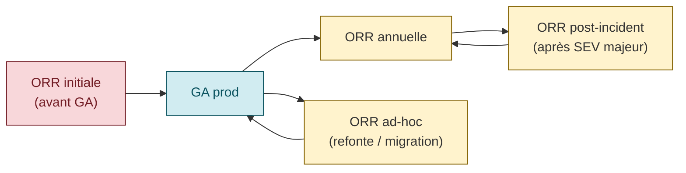
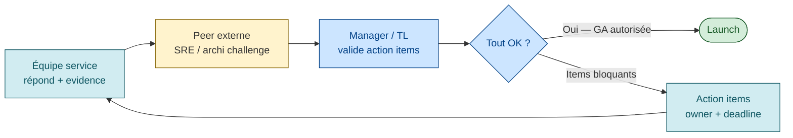

# Operational Readiness Review (ORR)

> **Sources** :
> - [AWS Well-Architected — Operational Readiness Reviews](https://docs.aws.amazon.com/wellarchitected/latest/operational-readiness-reviews/wa-operational-readiness-reviews.html "AWS Well-Architected — Operational Readiness Reviews (guide ORR)")
> - [AWS Docs — The ORR Tool](https://docs.aws.amazon.com/wellarchitected/latest/operational-readiness-reviews/the-orr-tool.html "AWS Well-Architected — The ORR Tool")
> - [AWS WA OE Pillar — OPS07-BP02](https://docs.aws.amazon.com/wellarchitected/latest/operational-excellence-pillar/ops_ready_to_support_const_orr.html "AWS Well-Architected — OPS07-BP02 Operational Readiness Review")
> - [AWS Cloud Ops Blog — Scale ORR with WA Tool](https://aws.amazon.com/blogs/mt/scale-operational-readiness-reviews-with-aws-well-architected-tool/)

## Définition

> *"The Operational Readiness Review (ORR) program distills the learnings from AWS operational incidents into curated questions with best practices guidance."* [📖¹](https://docs.aws.amazon.com/wellarchitected/latest/operational-readiness-reviews/wa-operational-readiness-reviews.html "AWS Well-Architected — Operational Readiness Reviews (guide ORR)")
>
> *En français* : le programme **ORR** distille les leçons tirées des incidents opérationnels AWS sous forme de **questions curatées** accompagnées de guidance best practice.

L'ORR est un **mécanisme créé par AWS** pour formaliser les bonnes pratiques opérationnelles sous forme de **checklist exécutée avant qu'un service entre en production**, puis re-passée périodiquement.

## Pourquoi — la justification AWS

Trois raisons officielles :

### 1. Prévention à l'échelle

> *"ORR questions uncover risks and educate service teams on the implementation of best practices to prevent the reoccurrence of incidents through removing common causes of impact."* [📖¹](https://docs.aws.amazon.com/wellarchitected/latest/operational-readiness-reviews/wa-operational-readiness-reviews.html "AWS Well-Architected — Operational Readiness Reviews (guide ORR)")
>
> *En français* : les questions ORR **révèlent les risques** et forment les équipes aux bonnes pratiques — pour éviter que les mêmes incidents se répètent, en supprimant les causes communes.

Empêcher les risques identifiés dans le processus **COE (Correction of Errors)** post-incident de se reproduire sur d'autres workloads.

### 2. Préserver la vélocité

> *"We, like so many of our customers, can't afford to slow the pace of innovation; developer speed and agility is critical to our business."* [📖¹](https://docs.aws.amazon.com/wellarchitected/latest/operational-readiness-reviews/wa-operational-readiness-reviews.html "AWS Well-Architected — Operational Readiness Reviews (guide ORR)")
>
> *En français* : comme nos clients, on ne peut **pas se permettre** de ralentir l'innovation — la vitesse et l'agilité des développeurs sont **critiques** pour le business.

L'ORR n'est pas un goulot d'étranglement — c'est un outil **self-service** pour les équipes.

### 3. Culture décentralisée

L'ORR est *spécifique à l'organisation*, là où le Well-Architected Framework est générique :

> *"Creating an ORR program can help supplement Well-Architected reviews by including lessons learned that are specific to your business, culture, tools, and governance rules."* [📖¹](https://docs.aws.amazon.com/wellarchitected/latest/operational-readiness-reviews/wa-operational-readiness-reviews.html "AWS Well-Architected — Operational Readiness Reviews (guide ORR)")
>
> *En français* : créer un programme ORR **complète** les revues Well-Architected en y intégrant les leçons apprises **spécifiques** à votre business, votre culture, vos outils et vos règles de gouvernance.

## Format

### Questions binaires + evidence

L'ORR est typiquement une checklist de **questions binaires** (Oui/Non/N/A) avec **evidence** obligatoire (lien vers dashboard, runbook, ticket).

Exemples :
- *"Avez-vous un runbook pour chaque alerte qui réveille un humain ?"* → Oui/Non + lien vers le runbook
- *"Le rollback prend-il moins de 5 minutes en pratique ?"* → Oui/Non + lien vers la dernière exécution

### Catégories typiques

D'après la doc AWS et l'expérience industrie :

#### 1. Architecture & design
- Le service est-il stateless ?
- Les SPOF (Single Points of Failure) sont-ils identifiés ?
- Quelle stratégie de redondance (multi-AZ, multi-region) ?

#### 2. Déploiement & rollback
- Déploiement progressif (canary, blue/green, ring) ?
- Rollback automatisé en moins de X minutes ?
- Feature flags pour désactiver sans redeploy ?
- Rollback testé récemment ?

#### 3. Observabilité (metrics, logs, traces, dashboards)
- Dashboard "golden signals" (latence, trafic, erreurs, saturation) ?
- Logs structurés avec corrélation (`trace_id`) ?
- Rétention metrics/logs/traces suffisante pour postmortem ?
- Distributed tracing en place ?

#### 4. Alerting et OnCall
- Chaque alerte qui réveille un humain a-t-elle un runbook ?
- Seuils calibrés (pas d'alert fatigue) ?
- Rotation OnCall documentée ?
- Escalation path clair ?
- Charge OnCall < 2 incidents/shift ?

#### 5. Runbooks
- Runbook pour chaque alerte ?
- Runbook pour chaque type d'incident historique ?
- Runbooks **testés** (pas seulement écrits) ?
- Runbook DR existant et joignable ?

#### 6. Capacité et scaling
- Load test à 2× le trafic pic ?
- Autoscaling configuré et **testé** ?
- Quotas et limites documentés (rate limiting, DB conn pool) ?

#### 7. Sécurité
- Scan de dépendances actif ?
- Secrets en vault (pas en env vars) ?
- Least privilege IAM ?
- Logs d'accès audités ?

#### 8. DR et backups
- RTO/RPO définis et validés en drill ?
- Backups testés en restore récemment ?
- Runbook DR exécuté dans les 6 derniers mois ?

#### 9. Tests
- Smoke tests post-deploy ?
- Synthetic monitoring en prod ?
- Load test avant chaque release majeure ?
- Chaos engineering / game days ?

#### 10. Documentation
- README du service à jour ?
- Architecture diagram ?
- Schéma des dépendances ?
- Liens vers les outils principaux ?

## Cycle ORR



| Type | Quand | Bloquant ? |
|------|-------|-----------|
| **ORR initiale** | Avant GA | Oui (pour Tier 1) |
| **ORR annuelle** | 1× par an, périodique | Non — capture le drift |
| **ORR post-incident** | Après incident majeur | Non — met à jour les questions |
| **ORR ad-hoc** | Changement majeur (refonte, migration) | Selon contexte |

## Qui passe l'ORR



- **L'équipe service** répond aux questions, fournit l'evidence
- **Un pair externe** (SRE / architecte d'une autre équipe) **challenge** les réponses
- **Un manager / tech lead** valide et priorise les action items résiduels

## Bloquant ou non

Dépend de la **criticité** du service :

| Tier | ORR bloquante ? | Action items "No" |
|------|-----------------|-------------------|
| **Tier 1** (mission-critical) | **Oui** | Tout "No" sur question critique = action item obligatoire avant GA |
| **Tier 2** | Recommandée | Action items différés possibles avec owner + deadline |
| **Tier 3** | Optionnelle | Best effort |

## Exemple de question ORR concrète

```markdown
## ORR Question : Runbook coverage

**Question** : Avez-vous un runbook pour chaque alerte qui réveille un humain en SEV-1 ou SEV-2 ?

**Pourquoi cette question** : un runbook réduit drastiquement le temps d'investigation. Une page sans runbook
oblige l'oncall à improviser sous stress.

**Réponse attendue** : Oui

**Evidence requise** :
- Lien vers le repo / wiki des runbooks
- Liste des alertes SEV-1/SEV-2 actives
- Mapping alerte → runbook

**Si Non — action requise** :
- P0 : créer les runbooks manquants avant GA
- Owner : @sre-lead
- Deadline : avant date GA

**Lien références** :
- /skills/sre/guides/oncall-practices.md (runbook template)
```

## Anti-patterns ORR

| Anti-pattern | Conséquence |
|--------------|-------------|
| **Rubber-stamping** | "On coche tout et on lance" — tue la valeur du mécanisme |
| **Jamais rejouée** | L'ORR initiale de 2022 n'a pas été refraîchie, le service a dérivé |
| **Pas d'action items** | Zéro écho post-ORR, on range le document et on oublie |
| **Pas de propriétaire** des items restants | Personne ne fait |
| **Questions génériques** non adaptées au contexte | Simple recopie d'un template sans réflexion |
| **Pas d'evidence** | L'équipe répond Oui sans lien vers un dashboard/runbook réel |
| **ORR vue comme "paperasse"** | Traité comme un obstacle, pas comme un outil |
| **Pas de revue cross-team** | Manque de challenge externe |
| **Questions pas alimentées par les incidents passés** | On rate les vraies leçons |

## Différences avec le Well-Architected Review

| Aspect | Well-Architected Review | ORR |
|--------|------------------------|-----|
| **Scope** | Générique (5 piliers AWS) | **Spécifique à l'organisation** |
| **Source des questions** | AWS catalog | **COE (incidents internes)** |
| **Objectif** | Identifier les écarts vs best practices génériques | Prévenir les répétitions d'incidents internes |
| **Format** | Questionnaire en ligne (WA Tool) | Checklist customisée |
| **Fréquence** | Périodique | Initial + annuel + post-incident |

> AWS recommande de **combiner les deux** — la doc AWS WA permet d'utiliser l'ORR Tool dans WA Tool.

## Comment démarrer un programme ORR

1. **Collecter les COE** des 12 derniers mois — quels incidents auraient pu être évités ?
2. **Dériver des questions** depuis les root causes
3. **Créer un template** initial (10-30 questions par catégorie)
4. **Tester sur 1 service** — itérer
5. **Étendre progressivement** aux autres services
6. **Update tous les 3 mois** avec les nouveaux COE
7. **Revue annuelle** des questions pour retirer celles qui ne servent plus

## Lien avec les autres piliers SRE

- **Postmortem** ([`postmortem.md`](postmortem.md)) : alimente les questions ORR
- **Runbooks** : majeure partie de la checklist
- **DR** ([`disaster-recovery.md`](disaster-recovery.md)) : section dédiée dans l'ORR
- **Capacity planning** ([`capacity-planning-load.md`](capacity-planning-load.md)) : section dédiée
- **Risk analysis** ([`risk-analysis.md`](risk-analysis.md)) : couplé à l'ORR pour priorisation

## Ressources

Sources primaires :

1. [AWS Well-Architected — Operational Readiness Reviews](https://docs.aws.amazon.com/wellarchitected/latest/operational-readiness-reviews/wa-operational-readiness-reviews.html "AWS Well-Architected — Operational Readiness Reviews (guide ORR)") — 4 citations verbatim

Ressources complémentaires :
- [AWS Docs — The ORR Tool](https://docs.aws.amazon.com/wellarchitected/latest/operational-readiness-reviews/the-orr-tool.html "AWS Well-Architected — The ORR Tool")
- [AWS WA OE Pillar — OPS07-BP02](https://docs.aws.amazon.com/wellarchitected/latest/operational-excellence-pillar/ops_ready_to_support_const_orr.html "AWS Well-Architected — OPS07-BP02 Operational Readiness Review") — practice *"Ensure a consistent review of operational readiness"*
- [AWS Cloud Ops Blog — Scale ORR with WA Tool](https://aws.amazon.com/blogs/mt/scale-operational-readiness-reviews-with-aws-well-architected-tool/)
- [Google SRE workbook — Launch Coordination Checklists (équivalent Google)](https://sre.google/sre-book/reliable-product-launches/ "Google SRE book ch. 27 — Reliable Product Launches at Scale")
