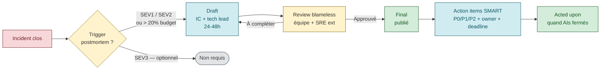

# Postmortem culture — apprendre des incidents sans blamer

> **Sources primaires** :
> - Google SRE book ch. 15, [*Postmortem Culture: Learning from Failure*](https://sre.google/sre-book/postmortem-culture/ "Google SRE book ch. 15 — Postmortem Culture: Learning from Failure")
> - Google SRE workbook, [*Postmortem Culture: Learning from Failure*](https://sre.google/workbook/postmortem-culture/ "Google SRE workbook — Postmortem Culture")
> - Google SRE workbook, [*Error Budget Policy*](https://sre.google/workbook/error-budget-policy/ "Google SRE workbook — Error Budget Policy (Steven Thurgood, 2018)")
> - Atlassian, [*Incident Postmortem*](https://www.atlassian.com/incident-management/postmortem "Atlassian — Incident Postmortem guide")
> - PagerDuty, [*Post-Mortem Process*](https://response.pagerduty.com/after/post_mortem_process/ "PagerDuty — Post-mortem process")

## Le principe fondateur : blameless

> *"A blamelessly written postmortem assumes that everyone involved in an incident had good intentions and did the right thing with the information they had. If a culture of finger pointing and shaming individuals or teams for doing the 'wrong' thing prevails, people will not bring issues to light for fear of punishment."* [📖¹](https://sre.google/sre-book/postmortem-culture/ "Google SRE book ch. 15 — Postmortem Culture: Learning from Failure")
>
> *En français* : un **postmortem blameless** part du principe que tout le monde a agi avec de bonnes intentions et a fait au mieux avec ce qu'il savait. Dès qu'une culture de **pointer du doigt** s'installe, les gens cachent les problèmes par peur des sanctions.

> *"You can't 'fix' people, but you can fix systems and processes to better support people making the right choices when designing and maintaining complex systems."* [📖¹](https://sre.google/sre-book/postmortem-culture/ "Google SRE book ch. 15 — Postmortem Culture: Learning from Failure")
>
> *En français* : on ne **répare pas** les gens — on répare les **systèmes et processus** qui les aident à faire les bons choix dans des systèmes complexes.

### Ce que blameless signifie EN PRATIQUE

| ✗ Avec blame (à éviter) | ✓ Blameless (à faire) |
|------|-------|
| *"Alice a poussé une migration cassée"* | *"Une migration a été poussée sans validation pre-prod"* |
| *"Bob a oublié de tester"* | *"Le pipeline n'a pas exécuté les tests sur cette branche"* |
| *"L'équipe SRE a mal réagi"* | *"Le runbook n'était pas à jour"* |
| *"Charlie a paniqué pendant l'incident"* | *"Aucune procédure n'existait pour ce type d'incident"* |

Le blame ne **résout** pas le problème — il pousse les gens à cacher les erreurs futures. Le blameless force à se demander *"qu'est-ce qui dans nos systèmes a permis ça ?"*.

> ⚠️ **Ces 4 exemples de reformulation** sont pédagogiques (pas des citations directes Google). Pattern largement partagé dans la communauté SRE, cohérent avec l'esprit blameless du SRE book ch. 15.

### Ce que blameless N'EST PAS

- ❌ Ne pas mentionner les noms (au contraire, si Alice a poussé la migration, c'est OK de l'écrire — sans jugement)
- ❌ Excuser tout (les erreurs humaines existent, mais elles révèlent des défauts système)
- ❌ Pas de conséquence (l'action item *est* la conséquence : on **fixe** le système)

> ⚠️ **Clarifications** — dérivées de la lecture commune du principe blameless. Pas de citation Google book exacte, mais alignées avec l'esprit (ch. 15).

## Quand écrire un postmortem (Google triggers)

Triggers explicites listés par le SRE book ch. 15 [📖¹](https://sre.google/sre-book/postmortem-culture/ "Google SRE book ch. 15 — Postmortem Culture: Learning from Failure") :

- *"User-visible downtime or degradation beyond a certain threshold"*
- *"Data loss of any kind"*
- *"On-call engineer intervention (release rollback, rerouting of traffic, etc.)"*
- *"A resolution time above some threshold"*
- *"A monitoring failure (which usually implies manual incident discovery)"*

Le principe général [📖¹](https://sre.google/sre-book/postmortem-culture/ "Google SRE book ch. 15 — Postmortem Culture: Learning from Failure") :

> *"It is important to define postmortem criteria before an incident occurs so that everyone knows when a postmortem is necessary."*
>
> *En français* : il faut **définir les critères de déclenchement** d'un postmortem **avant** qu'un incident arrive, pour que tout le monde sache quand en faire un.

### Trigger renforcé par l'error budget policy

Source : Google SRE workbook, [*Error Budget Policy*](https://sre.google/workbook/error-budget-policy/ "Google SRE workbook — Error Budget Policy (Steven Thurgood, 2018)") [📖²](https://sre.google/workbook/error-budget-policy/ "Google SRE workbook — Error Budget Policy (Steven Thurgood, 2018)") :

> *"If a single incident consumes more than 20% of error budget over four weeks, then the team must conduct a postmortem. The postmortem must contain at least one P0 action item to address the root cause."*
>
> *En français* : si un **seul** incident consomme plus de **20 %** du budget d'erreur sur 4 semaines, l'équipe **doit** faire un postmortem — qui doit contenir au moins **un action item P0** pour traiter la cause racine.

C'est le seuil chiffré le plus précis donné par Google : **>20% du budget mensuel = postmortem obligatoire avec P0**.

## Structure standard d'un postmortem

### Sections recommandées

| Section | Contenu | Longueur |
|---------|---------|----------|
| **Title + Date** | Nom court de l'incident + date | 1 ligne |
| **Status** | Draft / Final / Acted upon | 1 ligne |
| **Authors** | Qui a écrit (souvent l'IM + tech lead) | 1 ligne |
| **TL;DR** | 2-3 phrases : que s'est-il passé, durée, impact | 1 paragraphe |
| **Impact** | Utilisateurs touchés, requêtes en erreur, perte business | Quantifié |
| **Root cause(s)** | Cause racine technique ET organisationnelle | 1-3 paragraphes |
| **Trigger** | Ce qui a déclenché l'incident (action, événement, condition) | 1 paragraphe |
| **Detection** | Comment on a su (alerte, ticket client, …) — combien de temps | MTTD |
| **Response** | Ce qu'on a fait, dans quel ordre, par qui | Timeline |
| **Recovery** | Comment on a remis en marche | Mitigation |
| **Timeline** | Chronologie complète, datée à la minute | Détaillée |
| **What went well** | Ce qui a bien marché — important pour le moral et reproduire | Bullet list |
| **What went poorly** | Ce qui a mal marché — sans blame | Bullet list |
| **Where we got lucky** | Les coïncidences favorables (à ne pas dépendre de la chance) | Bullet list |
| **Action items** | Liste P0/P1/P2, owner, deadline | Tableau |
| **Lessons learned** | Synthèse des principes à retenir | 1-2 paragraphes |

> *Cette structure* est cohérente avec le template Google dans le SRE book ch. 15 (sections *Example Postmortem* et *Action items*) et avec le template du [SRE workbook](https://sre.google/workbook/postmortem-culture/ "Google SRE workbook — Postmortem Culture"). Sections *"Where we got lucky"*, *"What went well"*, *"What went poorly"* sont explicitement recommandées par Google.

### Template Markdown

```markdown
# Postmortem : <Title>

**Date** : YYYY-MM-DD
**Status** : Draft | Under review | Final | Acted upon
**Authors** : @alice, @bob
**Severity** : SEV1 | SEV2 | SEV3

## TL;DR

<2-3 phrases résumant l'incident, sa durée, son impact>

## Impact

- **Users impacted** : <X> utilisateurs (~Y% de la base)
- **Duration** : <minutes>
- **Failed requests** : <count> (<X% du traffic>)
- **Error budget consumed** : <X%> de la fenêtre 4 semaines
- **Revenue impact** : <€ ou estimé>

## Root cause(s)

<Description technique du *pourquoi*. Pas du *qui*. Pas du *comment on l'a découvert* (c'est la section Detection).>

### Contributing factors

- <Facteur contributif 1>
- <Facteur contributif 2>

## Trigger

<L'événement qui a transformé un état latent en incident>

## Detection

- **MTTD** : <minutes entre début incident et 1ère alerte>
- **Detection method** : alerte / ticket client / PMC qui passe
- **Alert** : <nom de l'alerte ou "n/a — détection manuelle">

## Response

### Timeline (UTC)

| Time | Event |
|------|-------|
| 10:00 | <action> par @alice |
| 10:05 | <action> par @bob |
| ... | ... |
| 11:30 | Service restored |
| 11:35 | All-clear |

### Mitigation

<Comment on a stoppé le saignement (pas la résolution complète)>

### Resolution

<Comment on a résolu définitivement>

## What went well

- <Point positif 1>
- <Point positif 2>

## What went poorly

- <Sans blame, sur les systèmes/processus>

## Where we got lucky

- <Coïncidences favorables — à NE PAS reproduire comme stratégie>

## Action items

| ID | Action | Owner | Priority | Due | Status |
|----|--------|-------|----------|-----|--------|
| AI-1 | Add alert on metric X | @alice | P0 | YYYY-MM-DD | Open |
| AI-2 | Write runbook for Y | @bob | P1 | YYYY-MM-DD | Open |
| AI-3 | Refactor module Z to handle edge case | @charlie | P2 | YYYY-MM-DD | Open |

## Lessons learned

<1-2 paragraphes synthétisant les leçons générales>

## Appendix

- <Liens dashboards>
- <Liens logs>
- <Liens commits / PRs>
```

## Action items — critères de qualité

C'est la section **la plus importante** du postmortem. Un postmortem sans bons action items est un exercice littéraire stérile.

### Critères SMART

| Critère | Exemple ✗ | Exemple ✓ |
|---------|-----------|-----------|
| **Specific** | "Améliorer le monitoring" | "Ajouter alerte burn rate 14.4 sur 1h pour SLI checkout" |
| **Measurable** | "Mieux tester" | "Ajouter 3 scénarios smoke @smoke pour le parcours checkout" |
| **Assignable** | "L'équipe va corriger" | "@alice est owner de AI-1" |
| **Realistic** | "Refonte complète du module" | "Ajouter validation input dans la fonction X" |
| **Time-bound** | "À faire un jour" | "Due 2026-04-25" |

*Critères SMART : cadre de management largement adopté (origine [Doran 1981 — "There's a S.M.A.R.T. way to write management's goals and objectives"](https://en.wikipedia.org/wiki/SMART_criteria "Wikipedia — SMART criteria (Doran 1981)")). Appliqué ici aux action items SRE.*

### Priorités

| Priorité | Définition | Délai typique |
|---------|-----------|---------------|
| **P0** | Bloque tout autre travail. Le risque est trop grand pour attendre. | Cette semaine |
| **P1** | À faire avant le prochain sprint | 2 semaines |
| **P2** | À faire dans le trimestre | 90 jours |
| **P3** | Idée notée, pas obligatoire | Quand on aura le temps |

> ⚠️ **Ces délais typiques** sont une convention interne courante (cf. [Google issue priority guidelines](https://chromium.googlesource.com/chromium/src/+/HEAD/docs/issue_triage.md) et pratiques équipes SRE) mais pas un standard SRE book Google. Adapter aux conventions de votre équipe.

### Anti-pattern : action items vagues

| ✗ À éviter | ✓ À faire |
|------|------|
| "More training" | "Document the runbook + 1h walkthrough avec l'équipe" |
| "Better monitoring" | "Add 3 SLI alerts on the X service (cf. table)" |
| "Improve communication" | "Set up #incidents-prod Slack channel + auto-page" |
| "Be more careful" | "Add pre-deploy validation step in pipeline" |

## Five whys — outil de root cause analysis

Technique simple popularisée par Taiichi Ohno chez Toyota [📖³](https://en.wikipedia.org/wiki/Five_whys "Wikipedia — Five whys (Taiichi Ohno / Toyota)") : poser *"pourquoi"* 5 fois pour creuser au-delà du symptôme.

**Exemple** :
- Q1 : Pourquoi le service est tombé ? → R : OOM kill du pod
- Q2 : Pourquoi OOM ? → R : Fuite mémoire dans le module X
- Q3 : Pourquoi fuite mémoire ? → R : Connection pool jamais fermé
- Q4 : Pourquoi pas fermé ? → R : Code path d'erreur ne libère pas la connection
- Q5 : Pourquoi le test n'a pas attrapé ça ? → R : Pas de test sur le path d'erreur

**Root cause** : pas de test sur le path d'erreur → action item : ajouter test.
**Contributing factor** : pas de monitoring memory/oom → action item : ajouter alerte.

⚠️ Le *"5"* est arbitraire — parfois 3 suffisent, parfois il en faut 7. L'important est de creuser au-delà du premier "pourquoi" évident.

## Postmortem review

### Cycle de vie

```
Incident → 24-48h → Draft → Review → Final → Acted upon (action items closed)
```



### Qui revoit

- **L'équipe directement impliquée** : valide la véracité
- **Un SRE externe à l'équipe** : challenge le framing, vérifie blameless
- **Un manager / tech lead** : valide les action items et leur priorisation

### Critères de validation

Le SRE book ch. 15 liste les critères de revue [📖¹](https://sre.google/sre-book/postmortem-culture/ "Google SRE book ch. 15 — Postmortem Culture: Learning from Failure") :

- *"completeness"* — tout est documenté
- *"root cause sufficiently deep"* — la cause va assez profond
- *"appropriate action plan"* — les actions sont SMART et adressent les causes

### Anti-pattern : rubber stamping

Si la review ne challenge **jamais** le draft, elle ne sert à rien. La review **doit** :
- Pousser à approfondir le root cause si c'est superficiel
- Refuser des action items vagues
- Vérifier que des contributing factors n'ont pas été oubliés

## Postmortem sharing

Le SRE book ch. 15 précise le partage [📖¹](https://sre.google/sre-book/postmortem-culture/ "Google SRE book ch. 15 — Postmortem Culture: Learning from Failure") :

> *"Once the initial review is complete, the postmortem is shared more broadly, typically with the larger engineering team or on an internal mailing list."*
>
> *En français* : une fois la revue initiale terminée, le postmortem est **partagé plus largement** — typiquement avec toute l'équipe engineering ou sur une mailing-list interne.

### Audiences possibles

| Audience | Pourquoi | Format |
|----------|----------|--------|
| **Équipe** | Validation, leçons internes | Document complet |
| **Larger engineering org** | Apprentissage transverse | Document complet ou résumé |
| **Toute l'entreprise** | Si l'incident a touché plusieurs équipes | Résumé non-technique |
| **Public** | Si transparence externe (style Stripe, Cloudflare) | Public postmortem (anonymisé si besoin) |

### Public postmortems d'exemple

- [Cloudflare incident postmortems](https://blog.cloudflare.com/tag/postmortem/)
- [GitLab incident postmortems](https://about.gitlab.com/handbook/engineering/incidents/)
- [Stripe Status — Postmortems](https://status.stripe.com/)

Ces postmortems publics sont une **mine d'apprentissage** et un excellent matériel pour montrer ce qu'est un postmortem mûr.

## Anti-patterns explicites

| Anti-pattern | Conséquence |
|--------------|-------------|
| **Pointing fingers** | Crée la peur, les incidents sont cachés |
| **Conclusions vagues** ("more training") | Aucune action concrète, le bug se reproduit |
| **Action items sans owner** | Personne ne fait, action perdue |
| **Action items sans deadline** | Reportées indéfiniment |
| **Postmortem qui dort** | Status "Draft" depuis 6 mois, pas de review |
| **Pas de revue cross-team** | Les leçons ne se diffusent pas |
| **1 postmortem = 1 page** | Trop court, pas de timeline, pas de root cause |
| **Postmortem de 30 pages** | Personne ne le lit, ROI nul |
| **Lessons learned = bullets génériques** | "Test plus", "monitor plus" → vide |
| **Pas de "Where we got lucky"** | Dépendance silencieuse à la chance |
| **Fix = "redémarrer le pod"** | Mitigation, pas root cause |
| **"Resolved by reboot"** sans investigation | Reproduira |

> ⚠️ **Tableau d'anti-patterns** — les 2 premiers (*pointing fingers*, *conclusions vagues*) sont couverts par le SRE book ch. 15. Les 10 autres sont des patterns communautaires cohérents avec l'esprit blameless mais pas littéralement dans le SRE book.

## Le PIR (Post-Incident Review) selon Atlassian

Atlassian publie un guide détaillé sur les postmortems [📖⁴](https://www.atlassian.com/incident-management/postmortem "Atlassian — Incident Postmortem guide") qui inclut les étapes :
1. Préparation (assemble le matériel)
2. Réunion blameless (1h max)
3. Document final (le postmortem proprement dit)
4. Suivi des action items

## Lien avec les autres piliers SRE

- **Error budget** : un incident > 20% du budget = postmortem obligatoire (cf. [`error-budget.md`](error-budget.md))
- **Blameless** : tu ne peux pas blamer si tu utilises l'error budget comme outil de pilotage, pas comme note de mérite
- **Action items** : alimentent le backlog SRE (anti-toil)
- **Runbooks** : chaque incident révèle des manques de runbook → action item
- **Game days** : un game day = postmortem préventif (qu'est-ce qui se passerait si...)

## Ressources

Sources primaires vérifiées :

1. [Google SRE book ch. 15 — Postmortem Culture](https://sre.google/sre-book/postmortem-culture/ "Google SRE book ch. 15 — Postmortem Culture: Learning from Failure") — blameless principle, triggers verbatim, review criteria, sharing
2. [Google SRE workbook — Error Budget Policy](https://sre.google/workbook/error-budget-policy/ "Google SRE workbook — Error Budget Policy (Steven Thurgood, 2018)") — seuil 20% + P0 action item obligatoire
3. [Wikipedia — Five whys](https://en.wikipedia.org/wiki/Five_whys "Wikipedia — Five whys (Taiichi Ohno / Toyota)") — origine Taiichi Ohno / Toyota
4. [Atlassian — Incident Postmortem](https://www.atlassian.com/incident-management/postmortem "Atlassian — Incident Postmortem guide") — processus postmortem étendu

Ressources complémentaires :
- [Google SRE workbook — Postmortem Culture](https://sre.google/workbook/postmortem-culture/ "Google SRE workbook — Postmortem Culture")
- [PagerDuty — Post-Mortem Process](https://response.pagerduty.com/after/post_mortem_process/ "PagerDuty — Post-mortem process")
- [Wikipedia — SMART criteria (Doran 1981)](https://en.wikipedia.org/wiki/SMART_criteria "Wikipedia — SMART criteria (Doran 1981)")
- Public postmortems : [Cloudflare](https://blog.cloudflare.com/tag/postmortem/), [GitLab](https://about.gitlab.com/handbook/engineering/incidents/), [Stripe](https://status.stripe.com/)
