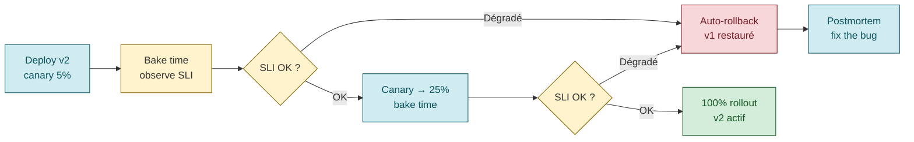
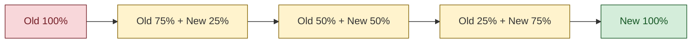
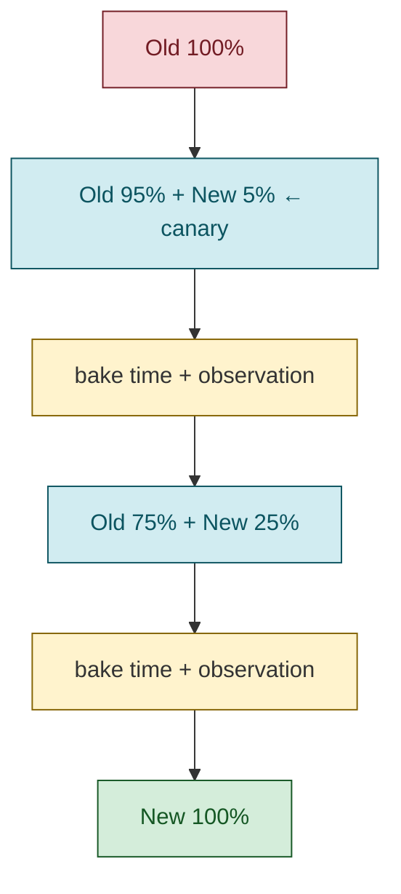
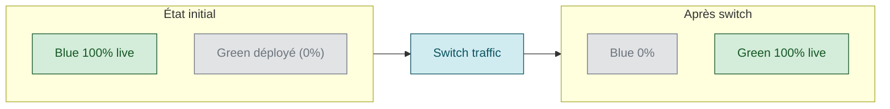
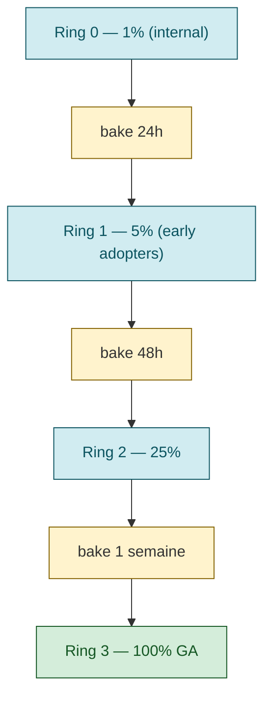

# Release Engineering — déployer sans casser

> **Sources primaires** :
> - Google SRE book ch. 8, [*Release Engineering*](https://sre.google/sre-book/release-engineering/ "Google SRE book ch. 8 — Release Engineering")
> - AWS Builders' Library, [*Going faster with continuous delivery*](https://aws.amazon.com/builders-library/going-faster-with-continuous-delivery/ "AWS Builders Library — Going faster with continuous delivery")
> - AWS Builders' Library, [*Automating safe, hands-off deployments*](https://aws.amazon.com/builders-library/automating-safe-hands-off-deployments/ "AWS Builders Library — Automating safe, hands-off deployments (Clare Liguori)")
> - Microsoft Azure WAF, [*Operational Excellence — Safe deployment practices*](https://learn.microsoft.com/en-us/azure/well-architected/operational-excellence/safe-deployments "Microsoft Azure WAF — Safe deployment practices (ring deployment)")

## Les 4 principes Google (SRE book ch. 8)

### 1. Self-service model

> *"In order to work at scale, teams must be self-sufficient. Release engineering has developed best practices and tools that allow our product development teams to control and run their own release processes."* [📖¹](https://sre.google/sre-book/release-engineering/ "Google SRE book ch. 8 — Release Engineering")
>
> *En français* : pour **passer à l'échelle**, les équipes doivent être autonomes. Le release engineering fournit les outils permettant aux équipes produit de **piloter elles-mêmes** leurs releases.

Le release engineering ne **fait pas** les releases — il fournit les **outils** pour que les équipes les fassent elles-mêmes. C'est un anti-pattern de centralisation : si une seule équipe approuve toutes les releases, elle devient un goulot.

### 2. High velocity

> *"We have embraced the philosophy that frequent releases result in fewer changes between versions."* [📖¹](https://sre.google/sre-book/release-engineering/ "Google SRE book ch. 8 — Release Engineering")
>
> *En français* : on embrasse la philosophie : des **releases fréquentes** = moins de diff entre versions = moins de risque par release.

Plus vous déployez fréquemment, plus le diff par release est petit, plus le risque par release est petit, plus le rollback est facile.

Certaines équipes Google déploient *"every build that passes all tests"* — modèle **Push on Green** [📖¹](https://sre.google/sre-book/release-engineering/ "Google SRE book ch. 8 — Release Engineering").

### 3. Hermetic builds

> *"Build tools must allow us to ensure consistency and repeatability. […] Our builds are hermetic, meaning that they are insensitive to the libraries and other software installed on the build machine."* [📖¹](https://sre.google/sre-book/release-engineering/ "Google SRE book ch. 8 — Release Engineering")
>
> *En français* : les outils de build doivent garantir **cohérence** et **reproductibilité**. Nos builds sont **hermétiques** : ils sont insensibles aux bibliothèques et logiciels installés sur la machine de build.

Un build de la **même révision** sur deux machines différentes doit produire **exactement le même artefact** (bit-for-bit idéalement).

Implications :
- Pas de `apt-get install` pendant le build
- Toolchain figée (image avec versions exactes)
- Dépendances en cache local, pas de fetch internet pendant le build
- Reproductibilité dans le temps (un build d'il y a 6 mois doit donner le même résultat aujourd'hui)

> ⚠️ **Implications listées** — conséquences opérationnelles du principe hermetic, largement documentées dans la communauté (cf. [Bazel hermeticity](https://bazel.build/basics/hermeticity)) mais pas un tableau littéral du SRE book.

### 4. Enforcement of policies and procedures

> *"Several layers of security and access control determine who can perform specific operations when releasing a project."* [📖¹](https://sre.google/sre-book/release-engineering/ "Google SRE book ch. 8 — Release Engineering")
>
> *En français* : **plusieurs couches** de sécurité et contrôle d'accès déterminent qui peut exécuter telle ou telle opération lors d'une release.

Permissions explicites pour :
- **Approuver** un changement de code (code review)
- **Créer** une release (tag, build officiel)
- **Déployer** dans tel ou tel environnement

## Patterns de déploiement progressif

### Big Bang (à éviter)



```
Old version (100%) → New version (100%)
```

- ✅ Simple
- ❌ Tout casse en même temps si bug
- ❌ Rollback = nouveau déploiement (lent)
- ❌ Pas de validation utilisateur

**Ne jamais utiliser en prod** sauf services peu critiques avec excellent rollback.

### Rolling update



K8s `Deployment` avec `RollingUpdate` strategy [📖²](https://kubernetes.io/docs/concepts/workloads/controllers/deployment/#rolling-update-deployment). Standard de facto.

- ✅ Pas d'interruption
- ✅ Rollback rapide (revert le déploiement)
- ⚠️ Pendant la phase mixte, les deux versions servent → compatibilité requise
- ❌ Pas de gate observation entre les phases

### Canary deployment



- ✅ Limite le blast radius (5% des users)
- ✅ Permet d'observer les SLI sur la nouvelle version avant rollout complet
- ✅ Auto-rollback possible sur burn rate
- ⚠️ Nécessite du traffic splitting ([Istio](https://istio.io/latest/docs/concepts/what-is-istio/), LB conditionnel, [feature flags](feature-flags.md))
- ⚠️ Compatibilité backward obligatoire

> *"A canary test isn't really a test; rather, it's structured user acceptance."* [📖³](https://sre.google/sre-book/testing-reliability/ "Google SRE book ch. 17 — Testing for Reliability")
>
> *En français* : un **canary test** n'est pas vraiment un test — c'est une forme **structurée de validation par les utilisateurs réels**.

### Blue/Green deployment



- ✅ Rollback instantané (re-switch traffic)
- ✅ Pas de phase mixte
- ❌ Coût × 2 (deux environnements complets)
- ❌ Difficile pour les services stateful (DB, sessions)
- ⚠️ Migrations DB doivent être backward-compatible (Blue tourne sur le nouveau schéma)

*Pattern Blue/Green popularisé par Martin Fowler [📖⁴](https://martinfowler.com/bliki/BlueGreenDeployment.html "Martin Fowler — Blue-Green Deployment").*

### Ring deployment (Microsoft pattern)

Source : [Microsoft — Safe deployment practices](https://learn.microsoft.com/en-us/azure/well-architected/operational-excellence/safe-deployments "Microsoft Azure WAF — Safe deployment practices (ring deployment)") [📖⁵](https://learn.microsoft.com/en-us/azure/well-architected/operational-excellence/safe-deployments "Microsoft Azure WAF — Safe deployment practices (ring deployment)") :



- ✅ Détection précoce, blast radius minimal
- ✅ Validation utilisateur réelle
- ❌ Cycle de release long (jours)
- ❌ Complexité opérationnelle

Microsoft utilise ce pattern pour Office 365, Azure, etc.

> ⚠️ **Pourcentages et bake times du ring diagram** — valeurs illustratives, pas des chiffres officiels Microsoft. Microsoft Safe Deployment Practices recommande le concept des rings sans imposer de durées exactes.

### Pattern AWS — Hands-off deployments

Source : [AWS — Automating safe, hands-off deployments](https://aws.amazon.com/builders-library/automating-safe-hands-off-deployments/ "AWS Builders Library — Automating safe, hands-off deployments (Clare Liguori)") [📖⁶](https://aws.amazon.com/builders-library/automating-safe-hands-off-deployments/ "AWS Builders Library — Automating safe, hands-off deployments (Clare Liguori)")

AWS décrit un pipeline en plusieurs phases avec **bake time** et **automatic rollback** entre chaque phase :

```
Source → Build → Test → Pre-prod → Prod (one-box) → Prod (1 zone) → Prod (regional) → Prod (multi-region)
```

À chaque phase :
1. **Deploy** sur le sous-ensemble
2. **Bake time** : observer les metrics pendant N minutes/heures
3. **Auto-rollback** si métriques dégradées
4. **Promotion automatique** vers la phase suivante si OK

Concept clé : *"one-box deployment"* — déployer d'abord sur **une seule** instance et observer [📖⁶](https://aws.amazon.com/builders-library/automating-safe-hands-off-deployments/ "AWS Builders Library — Automating safe, hands-off deployments (Clare Liguori)").

## Bake time

**Définition** : période d'observation passive **après** un déploiement, pendant laquelle on ne fait *rien* d'autre que surveiller les SLI.

**Pourquoi c'est critique** :
- Beaucoup de bugs ne se manifestent pas immédiatement (memory leak, retry storm, schedule cron…)
- Donne le temps aux dashboards et burn rate alerts de réagir
- Évite le syndrome "deploy → smoke OK → next deploy → problème détecté trop tard"

**Durées typiques** :
- Canary 1% : 15 min - 1h
- Canary 5% : 1-4h
- Canary 25% : 4-24h
- Full rollout : 24-72h

> ⚠️ **Durées typiques** — heuristiques industrie (cf. [Argo Rollouts analysis](https://argoproj.github.io/argo-rollouts/features/analysis/), [AWS CodeDeploy](https://docs.aws.amazon.com/codedeploy/latest/userguide/deployment-configurations-create.html)). Pas un standard unique, à adapter au taux d'erreur observé et au trafic.

**Mesure pendant le bake time** :
- 4 golden signals sur la nouvelle version
- Comparaison side-by-side avec l'ancienne version (same dashboard, 2 lignes)
- Burn rate consolidé du SLO

## Auto-rollback metrics-based

Pattern : déclencher un rollback **automatiquement** si pendant le bake time on observe :
- Burn rate > seuil (ex : 14.4 sur 5 min)
- Augmentation > X% du taux d'erreur vs baseline
- p95 latency > seuil
- Décrochage du SLI principal

Implémentations :
- **[Argo Rollouts](https://argoproj.github.io/argo-rollouts/features/analysis/)** + analysis templates Prometheus
- **[Flagger (Flux)](https://flagger.app/ "Flagger — progressive delivery Flux (CNCF)")** + canary analysis
- **[AWS CodeDeploy](https://docs.aws.amazon.com/codedeploy/latest/userguide/deployments-rollback-and-redeploy.html)** + CloudWatch alarms
- **[Spinnaker Kayenta](https://spinnaker.io/docs/guides/user/canary/)** canary analysis

**Anti-pattern** : auto-rollback sans bake time → rollback infini si la metric est instable au démarrage.

## Le test en CI/CD selon Google

Source : Google SRE book ch. 17, [*Testing for Reliability*](https://sre.google/sre-book/testing-reliability/ "Google SRE book ch. 17 — Testing for Reliability") [📖³](https://sre.google/sre-book/testing-reliability/ "Google SRE book ch. 17 — Testing for Reliability") :

> *"It's essential that the latest version of a software project in source control is working completely. When the build system notifies engineers about broken code, they should drop all of their other tasks and prioritize fixing the problem."*
>
> *En français* : il est **essentiel** que la dernière version dans le source control fonctionne **complètement**. Quand le build system signale un code cassé, les ingénieurs doivent **tout laisser tomber** et prioriser la correction.

Pyramide de tests Google :

| Niveau | Quoi | Quand |
|--------|------|-------|
| **Unit tests** | Une fonction, une classe | Pre-commit, pre-merge |
| **Integration tests** | Composants assemblés | Post-merge, pre-image |
| **System tests** | Système complet pré-prod | Post-image, pre-deploy |
| ↳ **Smoke tests** | *"Among the simplest type of system tests"*, parcours critiques | Court-circuit pour bloquer le pipeline tôt |
| ↳ **Performance tests** | Vérifier que ça ne ralentit pas dans le temps | Régulièrement |
| ↳ **Regression tests** | Chaque bug historique = un test | À chaque commit |
| **Production tests** | Tests dans/sur la prod réelle | Post-deploy + 24/7 |
| ↳ **Configuration tests** | Le binaire en prod = le code en source control | Post-deploy |
| ↳ **Canary** | "Structured user acceptance" | Pendant le rollout |
| ↳ **Synthetic monitoring** | Probes blackbox 24/7 | Continu |

> ⚠️ **Les durées/timings (« Pre-commit, pre-merge », etc.)** sont des heuristiques opérationnelles, pas des prescriptions du SRE book. La classification des niveaux (unit / integration / system / production) suit bien la structure du ch. 17.

## Rollback strategies

### Versioning V-x.y.z (notre cicd)

Le pipeline tagge `V-1.0.0`, `V-1.1.0`, etc. après chaque déploiement réussi en prod. Le rollback :
1. Récupère `V-(n-1)`
2. Redéploie l'image correspondante
3. Health check
4. Notification

Avantages :
- Trace d'audit (chaque V-x.y.z = un état prod connu)
- Rollback rapide (juste un helm upgrade avec l'ancien tag)
- N'inclut pas les changements non-déployés

*Convention interne — cf. [`cicd-sre-link.md`](cicd-sre-link.md).*

### Rollback "infrastructure"

| Stratégie | Quoi rollback | Outil |
|-----------|--------------|-------|
| **[Helm rollback](https://helm.sh/docs/helm/helm_rollback/)** | Release helm, image, values | `helm rollback <release> <revision>` |
| **[K8s deployment rollback](https://kubernetes.io/docs/concepts/workloads/controllers/deployment/#rolling-back-a-deployment)** | ReplicaSet précédent | `kubectl rollout undo deployment/<name>` |
| **GitOps revert** | Commit dans le repo de manifests | `git revert` + reconciler reapply |
| **Blue/green switch** | Re-switch traffic | LB / DNS / service mesh |

### Rollback DB — le piège

⚠️ **Les schémas DB ne sont pas rollbackables comme du code.** Pattern :
- **Backward-compatible migrations** : ajoutez des colonnes en `nullable`, ne supprimez jamais en une seule release
- **Expand/Contract pattern** :
  1. Phase 1 : ajouter le nouveau schéma (expand) tout en gardant l'ancien
  2. Phase 2 : déployer le code qui utilise le nouveau schéma
  3. Phase 3 : supprimer l'ancien schéma (contract) — **après** que le rollback du code soit impossible

*Pattern Expand/Contract documenté par Martin Fowler [📖⁷](https://martinfowler.com/bliki/ParallelChange.html "Martin Fowler — ParallelChange (Expand/Contract pattern)") (variante « Parallel Change ») et par [Pramod Sadalage & Scott Ambler — Refactoring Databases](https://www.martinfowler.com/books/refactoringDatabases.html).*

## Anti-patterns release engineering

| Anti-pattern | Conséquence |
|--------------|-------------|
| **Push on Friday** | Aucun rollback possible le week-end (code freeze recommandé) |
| **Deploy = "code complete"** | Aucune phase d'observation post-deploy |
| **Pas de canary** | 100% de l'impact sur 100% des users |
| **Rollback manuel non-testé** | Le rollback est cassé quand on en a besoin |
| **Smoke tests post-deploy = E2E complets** | Trop lents (15min) → fenêtre de vulnérabilité |
| **Pas de bake time** | Bug détecté après que tout soit en prod |
| **Configurations non versionnées** | Drift entre envs, debug impossible |
| **Build non-hermetic** | "Marche sur ma machine" → builds cassés |
| **Deploy as a heroic act** | Une personne sait, équipe bloquée si elle est en vacances |

> ⚠️ **Tableau anti-patterns** — patterns communautaires consolidés à partir de la pratique SRE et DevOps. Pas une liste littérale d'une source unique.

## Cycle de release recommandé

```mermaid
flowchart LR
    classDef key  fill:#CCE5FF,stroke:#004085,color:#004085
    classDef proc fill:#D1ECF1,stroke:#0C5460,color:#0C5460
    classDef warn fill:#FFF3CD,stroke:#856404,color:#333
    classDef ok   fill:#D4EDDA,stroke:#155724,color:#155724
    M["1. Code merge (main)"]:::key
    subgraph CI["CI"]
        C["2. unit + integ + lint + sec"]:::proc
        I["3. Image build (SHA tag)"]:::proc
    end
    subgraph E2Env["E2E Env"]
        DE["4. Deploy E2E"]:::proc
        TE["5. E2E tests (Behave)"]:::proc
    end
    subgraph TIS["TIS"]
        DT["6. Deploy TIS"]:::proc
        ST["7. Smoke tests TIS"]:::proc
    end
    subgraph VA["VA"]
        DV["8. Deploy VA"]:::proc
        SV["9. Smoke tests VA"]:::proc
    end
    subgraph PROD["PROD"]
        MG["10. Manual gate SNOW"]:::warn
        DP["11. Canary 5%"]:::proc
        BK["12. Bake 1h + obs"]:::warn
        PR["13. Promote 100%"]:::ok
        SP["14. Smoke prod 24/7"]:::ok
        VT["15. Tag V-x.y.z"]:::ok
    end
    M --> CI --> E2Env --> TIS --> VA --> PROD
```



*Cycle type combinant CI/CD SRE (SRE book ch. 8 + ch. 17) et pattern AWS hands-off. À adapter au contexte organisationnel.*

## Lien avec les autres piliers SRE

- **SLO & error budget** : pilote le rythme de release. Budget plein = release rapide. Budget bas = freeze.
- **Smoke tests** : gate post-deploy. Voir [`smoke-tests.md`](smoke-tests.md).
- **Synthetic monitoring** : observation 24/7 entre les releases. Voir [`synthetic-monitoring.md`](synthetic-monitoring.md).
- **Toil** : un release engineering mature élimine le toil de promotion manuelle. Voir [`toil.md`](toil.md).
- **Postmortem** : chaque rollback déclenche idéalement un postmortem si SLO impacté. Voir [`postmortem.md`](postmortem.md).

## 📐 À l'échelle d'une grande organisation

La release engineering single-service décrite chez Google s'étend à l'échelle par trois patterns :

- **Release par tier** — la cadence et la rigueur d'un déploiement T1 (chaîne critique) ne sont pas celles d'un T4. Canary 1% pendant 24h pour T1 ; déploiement direct pour T4. Voir [`sre-at-scale.md`](sre-at-scale.md) §*Tier de service*.
- **Coordination de chaîne** — un déploiement sur un maillon foundational (auth, bus, paiement) peut casser plusieurs chaînes en aval. Coordination cross-team obligatoire (fenêtres communes, freeze pendant rollouts critiques). Voir [`journey-slos-cross-service.md`](journey-slos-cross-service.md).
- **Multi-stack** — toutes les équipes ne sont pas K8s + Argo Rollouts. Le pattern release engineering doit fonctionner sur VM JBoss/WebLogic, mainframe, serverless. Voir [`multi-stack-observability.md`](multi-stack-observability.md).
- **Gate error budget cross-chaîne** — le gate de déploiement consulte non seulement l'error budget du service mais aussi celui des chaînes auxquelles il participe. Voir [`alerting-consolidation-strategy.md`](alerting-consolidation-strategy.md).

## Ressources

Sources primaires vérifiées :

1. [Google SRE book ch. 8 — Release Engineering](https://sre.google/sre-book/release-engineering/ "Google SRE book ch. 8 — Release Engineering") — 5 citations verbatim + Push on Green
2. [Kubernetes — Rolling update deployments](https://kubernetes.io/docs/concepts/workloads/controllers/deployment/#rolling-update-deployment)
3. [Google SRE book ch. 17 — Testing for Reliability](https://sre.google/sre-book/testing-reliability/ "Google SRE book ch. 17 — Testing for Reliability") — canary = structured user acceptance, build broken priority
4. [Martin Fowler — Blue-Green Deployment](https://martinfowler.com/bliki/BlueGreenDeployment.html "Martin Fowler — Blue-Green Deployment")
5. [Microsoft Azure WAF — Safe deployment practices](https://learn.microsoft.com/en-us/azure/well-architected/operational-excellence/safe-deployments "Microsoft Azure WAF — Safe deployment practices (ring deployment)") — ring deployment
6. [AWS Builders' Library — Automating safe hands-off deployments](https://aws.amazon.com/builders-library/automating-safe-hands-off-deployments/ "AWS Builders Library — Automating safe, hands-off deployments (Clare Liguori)") — one-box, bake, auto-rollback
7. [Martin Fowler — ParallelChange (Expand/Contract)](https://martinfowler.com/bliki/ParallelChange.html "Martin Fowler — ParallelChange (Expand/Contract pattern)")

Ressources complémentaires :
- [AWS Builders' Library — Going faster with continuous delivery](https://aws.amazon.com/builders-library/going-faster-with-continuous-delivery/ "AWS Builders Library — Going faster with continuous delivery")
- [Argo Rollouts — Progressive Delivery for Kubernetes](https://argoproj.github.io/argo-rollouts/ "Argo Rollouts — progressive delivery Kubernetes")
- [Flagger — Progressive delivery operator](https://flagger.app/ "Flagger — progressive delivery Flux (CNCF)")
- [Spinnaker Kayenta — Canary analysis](https://spinnaker.io/docs/guides/user/canary/)
- [Helm rollback](https://helm.sh/docs/helm/helm_rollback/)
- [Sadalage & Ambler — Refactoring Databases](https://www.martinfowler.com/books/refactoringDatabases.html)
