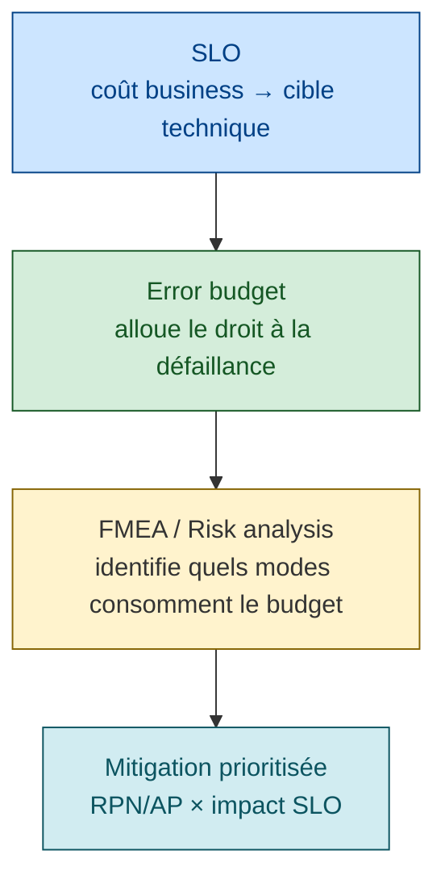
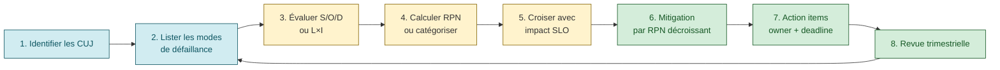

# Risk Analysis & FMEA

> **Sources** :
> - [Google SRE book ch. 3 — Embracing Risk](https://sre.google/sre-book/embracing-risk/ "Google SRE book ch. 3 — Embracing Risk")
> - [Wikipedia — Failure Mode and Effects Analysis](https://en.wikipedia.org/wiki/Failure_mode_and_effects_analysis "Wikipedia — FMEA (Failure Mode and Effects Analysis)")
> - [6Sigma.us — Risk Priority Number in FMEA](https://www.6sigma.us/six-sigma-articles/risk-priority-number-rpn/)
> - [Wikipedia — Risk Matrix](https://en.wikipedia.org/wiki/Risk_matrix)
> - [Atlassian — What is a Risk Matrix](https://www.atlassian.com/work-management/project-management/risk-matrix)

## La position Google SRE — Embracing Risk

Citations clés :

> *"A user on a 99% reliable smartphone cannot tell the difference between 99.99% and 99.999% service reliability!"* [📖¹](https://sre.google/sre-book/embracing-risk/ "Google SRE book ch. 3 — Embracing Risk")
>
> *En français* : un utilisateur sur un smartphone **fiable à 99 %** ne percevra aucune différence entre un service à 99,99 % et un service à 99,999 % ! (Le maillon faible masque le gain.)

> *"Site Reliability Engineering seeks to balance the risk of unavailability with the goals of rapid innovation and efficient service operations, so that users' overall happiness is optimized."* [📖¹](https://sre.google/sre-book/embracing-risk/ "Google SRE book ch. 3 — Embracing Risk")
>
> *En français* : le SRE cherche à **équilibrer** le risque d'indisponibilité avec l'objectif d'innovation rapide et d'opérations efficaces — de façon à **maximiser la satisfaction utilisateur globale**.

> *"Extreme reliability comes at a cost: maximizing stability limits how fast new features can be developed."* [📖¹](https://sre.google/sre-book/embracing-risk/ "Google SRE book ch. 3 — Embracing Risk")
>
> *En français* : la **fiabilité extrême a un coût** : maximiser la stabilité **freine** le rythme de développement des fonctionnalités.

> *"The error budget provides a clear, objective metric that determines how unreliable the service is allowed to be within a single quarter."* [📖¹](https://sre.google/sre-book/embracing-risk/ "Google SRE book ch. 3 — Embracing Risk")
>
> *En français* : l'**error budget** fournit une **métrique claire et objective** qui fixe le niveau d'indisponibilité permis sur un trimestre donné.

### Position Google sur le risque

Google **n'utilise pas le FMEA** au sens classique. L'approche Google :

1. **Accepter** qu'un service ait un **error budget** (1 - SLO)
2. **Ne pas chercher à prévenir toute défaillance** — certaines coûtent plus cher à prévenir qu'à accepter
3. Utiliser le budget pour **autoriser** la prise de risque (releases, chaos engineering, expérimentation)

C'est une approche **probabiliste** (combien d'erreurs on peut accepter) plutôt que **déterministe** (lister tous les modes de défaillance).

## FMEA — Failure Mode and Effects Analysis

### Définition

> *"the process of reviewing as many components, assemblies, and subsystems as possible to identify potential failure modes in a system and their causes and effects."* [📖²](https://en.wikipedia.org/wiki/Failure_mode_and_effects_analysis "Wikipedia — FMEA (Failure Mode and Effects Analysis)")
>
> *En français* : le **FMEA** est le processus qui **passe en revue** un maximum de composants, sous-ensembles et sous-systèmes pour identifier les modes de défaillance potentiels, leurs causes et leurs effets.

Méthode systématique née de l'ingénierie militaire et automobile (années 1940-60), adoptée en logiciel/SRE.

### Variantes

| Variante | Scope |
|----------|-------|
| **Design FMEA (DFMEA)** | Défaillances de conception |
| **Process FMEA (PFMEA)** | Process de fabrication / déploiement |
| **Software FMEA** | Code et architecture logicielle |
| **Functional FMEA** | Haut niveau, design fonctionnel |

## RPN — Risk Priority Number

### Formule

```
RPN = Severity × Occurrence × Detection
```

Chaque facteur noté sur **1-10** (ou 1-5 selon l'organisation) :

| Facteur | Définition | 1 = | 10 = |
|---------|-----------|-----|------|
| **Severity (S)** | Gravité de l'effet sur l'utilisateur final | Bénin | Catastrophique (perte de vie, perte de toutes les données) |
| **Occurrence (O)** | Probabilité que la cause survienne | Quasi-impossible | Fréquent |
| **Detection (D)** | Probabilité que le mode soit **détecté avant impact client** | Toujours détecté | Indétectable avant incident |

⚠️ **Pour Detection : plus le score est élevé, pire c'est** (10 = indétectable).

### Plage de RPN

RPN varie de **1 à 1000**.

| Seuil | Action |
|-------|--------|
| RPN > 200 | Action prioritaire |
| RPN > 100 | Mitigation obligatoire |
| RPN > 50 | À surveiller |
| RPN < 50 | Acceptable |

### Exemple software simplifié

| Mode défaillance | S | O | D | RPN | Mitigation |
|-----------------|---|---|---|-----|------------|
| DB master crash, replica non à jour | 9 | 3 | 2 | **54** | Sync replication, monitoring lag |
| Fuite mémoire lente sur worker | 5 | 6 | 7 | **210** | Heap profiling CI, alerte RSS |
| Retry storm sur 503 downstream | 8 | 4 | 5 | **160** | Circuit breaker, budget retry |
| Certif TLS expire silencieusement | 10 | 2 | 8 | **160** | Monitoring expiration J-30 |

## Limites du RPN

Wikipedia souligne un **défaut mathématique** :

> *"Multiplying ordinal scales is mathematically incorrect... Rank reversals can produce a less serious failure mode receiving a higher RPN than a more serious failure mode."* [📖²](https://en.wikipedia.org/wiki/Failure_mode_and_effects_analysis "Wikipedia — FMEA (Failure Mode and Effects Analysis)") ⚠️ citation composite (reformulation résumée)
>
> *En français* : **multiplier des échelles ordinales est mathématiquement incorrect**. Cela peut produire des **inversions de rang** : un mode moins grave finit avec un RPN plus élevé qu'un mode catastrophique.

Exemple :
- Mode A : S=10, O=1, D=1 → RPN=10 (catastrophique mais quasi-impossible et toujours détecté)
- Mode B : S=4, O=4, D=4 → RPN=64 (modéré mais pourrait être pire numériquement)

→ Le RPN suggère que B est pire que A, alors que A est catastrophique.

### Solution : Action Priority (AP)

Le handbook **[AIAG/VDA FMEA 2019](https://www.aiag.org/quality/automotive-core-tools/fmea)** a remplacé le RPN par **Action Priority** — une grille déterministe qui attribue High/Medium/Low selon la combinaison S/O/D, **sans multiplier**.

Pour SRE pragmatique : **garder le RPN comme outil de tri relatif** dans une même session FMEA, sans comparer les RPN entre domaines/sessions différents.

## Risk matrix — Likelihood × Impact

Alternative plus simple au RPN, dominante en gestion de risque projet :

### Échelles typiques

**Likelihood** : Rare (1) / Unlikely (2) / Possible (3) / Likely (4) / Almost Certain (5)
**Impact** : Insignificant (1) / Minor (2) / Moderate (3) / Major (4) / Catastrophic (5)

### Matrice 5×5

```
                Impact →
Likelihood ↓  Ins  Min  Mod  Maj  Cat
Almost Cert    M    H    H    E    E
Likely         M    M    H    H    E
Possible       L    M    M    H    H
Unlikely       L    L    M    M    H
Rare           L    L    L    M    M
```

### Catégories et règles d'action

| Catégorie | Action |
|-----------|--------|
| **E**xtreme | Stop launch, mitigate avant GA |
| **H**igh | Mitigation obligatoire, owner + deadline |
| **M**edium | Backlog, monitor |
| **L**ow | Accept, review périodique |

## Threat modeling vs risk analysis

Distinction importante souvent confondue :

| Aspect | Threat Modeling | Risk Analysis / FMEA |
|--------|----------------|---------------------|
| **Orientation** | **Sécurité** | **Fiabilité** |
| **Question** | "Qu'est-ce qu'un attaquant pourrait faire ?" | "Qu'est-ce qui peut casser tout seul ?" |
| **Méthodes** | [STRIDE](https://learn.microsoft.com/en-us/azure/security/develop/threat-modeling-tool-threats), PASTA, attack trees ([OWASP — *Threat Modeling*](https://owasp.org/www-community/Threat_Modeling)) | FMEA, FTA, RCM |
| **Output** | Threats + mitigations sécurité | Failure modes + mitigations résilience |

Un système mature fait **les deux en parallèle**. Les livrables se recoupent parfois (ex: DoS est à la fois un threat sécu et un failure mode fiabilité), mais les méthodologies diffèrent.

## Lien risk ↔ SLO

Calibrage **bidirectionnel** :



**Règles** :
- Mode haut RPN qui menace le SLO → action immédiate
- Mode haut RPN qui ne touche pas le SLO (ex: log rotation) → priorité basse, même si techniquement impressionnant

## Cascading failure analysis

Extension de FMEA : analyser les **chaînes de dépendances**, pas seulement les composants isolés.

**Question type** : *"si service A échoue, quelle est la probabilité que service B suive dans les 5 minutes ?"*

### Outillage

- **Dependency graph** à jour (souvent manquant) — service mesh comme [Istio](https://istio.io/latest/docs/concepts/what-is-istio/) peut aider
- **Chaos engineering** pour valider expérimentalement (cf. [`chaos-engineering.md`](chaos-engineering.md))
- **[AWS Resilience Hub](https://aws.amazon.com/resilience-hub/)** : analyse automatisée de conformité RTO/RPO d'une stack, détection de SPOF cachés
- **Architecture review** annuelle avec un architecte externe à l'équipe

## Anti-patterns

| Anti-pattern | Conséquence |
|--------------|-------------|
| **Analyse en silo** | Équipe A fait sa FMEA sans parler à équipe B dont elle dépend |
| **Conclusions sans actions** | Document produit, jamais relu, rien de corrigé |
| **Oubli des dépendances tierces** | CDN, DNS, IdP externe — souvent les vrais SPOF |
| **FMEA "one-shot"** | Faite une fois avant le lancement, jamais mise à jour |
| **Multiplier des ordinaux** sans en avoir conscience | Comparer des RPN entre contextes différents |
| **Mélanger threat modeling et risk analysis** | On rate les deux |
| **Pas de propriétaire** des modes identifiés | Liste de modes sans action |
| **Effort proportionnel à la complexité, pas au risque** | Beaucoup d'analyse sur du non-critique |

## Workflow recommandé



1. **Identifier les CUJ** ([`critical-user-journeys.md`](critical-user-journeys.md))
2. **Pour chaque CUJ**, lister les modes de défaillance possibles
3. **Évaluer S, O, D** (ou Likelihood × Impact)
4. **Calculer RPN** (ou catégoriser via matrice)
5. **Croiser avec impact SLO** (mode qui ne touche pas le SLO = priorité basse)
6. **Mitigation prioritisée** par RPN décroissant
7. **Action items** avec owner + deadline (cf. [`postmortem.md`](postmortem.md))
8. **Revue trimestrielle** : nouveaux modes ? Modes existants encore valides ?

## Lien avec les autres piliers SRE

- **SLO / Error budget** : la cible que les risques menacent
- **Postmortem** ([`postmortem.md`](postmortem.md)) : chaque incident révèle des modes non identifiés → MAJ FMEA
- **Chaos engineering** ([`chaos-engineering.md`](chaos-engineering.md)) : valide expérimentalement que les modes prévus se comportent comme attendu
- **ORR** ([`operational-readiness-review.md`](operational-readiness-review.md)) : intègre les modes identifiés en checklist pre-prod
- **Capacity planning** ([`capacity-planning-load.md`](capacity-planning-load.md)) : un mode "saturation" alimente le planning

## Ressources

Sources primaires :

1. [Google SRE book ch. 3 — Embracing Risk](https://sre.google/sre-book/embracing-risk/ "Google SRE book ch. 3 — Embracing Risk") — 4 citations verbatim
2. [Wikipedia — Failure Mode and Effects Analysis](https://en.wikipedia.org/wiki/Failure_mode_and_effects_analysis "Wikipedia — FMEA (Failure Mode and Effects Analysis)") — définition + critique ordinale

Ressources complémentaires :
- [6Sigma.us — Risk Priority Number in FMEA](https://www.6sigma.us/six-sigma-articles/risk-priority-number-rpn/)
- [HBK — Examining Risk Priority Numbers in FMEA](https://www.hbkworld.com/en/knowledge/resource-center/articles/examining-risk-priority-numbers-in-fmea)
- [Wikipedia — Risk Matrix](https://en.wikipedia.org/wiki/Risk_matrix)
- [Atlassian — What is a Risk Matrix](https://www.atlassian.com/work-management/project-management/risk-matrix)
- [AIAG/VDA FMEA Handbook 2019](https://www.aiag.org/quality/automotive-core-tools/fmea) — Action Priority
- [AWS Resilience Hub](https://aws.amazon.com/resilience-hub/)
- [OWASP Threat Modeling](https://owasp.org/www-community/Threat_Modeling) — pour sécurité vs fiabilité
