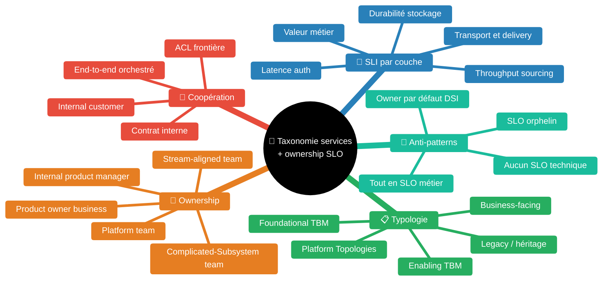

# Taxonomie des services et ownership des SLO — qui porte quoi quand un service ne voit pas la valeur métier

> *"Solutions are not limited to 'business-facing' offerings. Many are foundational or enabling in nature."* [📖¹](https://www.tbmcouncil.org/learn-tbm/tbm-taxonomy/ "TBM Council — TBM Taxonomy v4.0, Solutions layer")
>
> *En français* : les offres d'une DSI ne se résument pas aux services **orientés métier**. Beaucoup sont **fondamentales** ou **habilitantes** — sans valeur métier directe, mais sans elles aucun service métier ne tient.

Skill construite à partir de sources officielles : TBM Council Taxonomy v4.0 (services foundational/enabling), TOGAF TRM (Infrastructure Applications), Google SRE Workbook chapitre 27 « SLO Engineering Case Studies » (Home Depot, Evernote), Skelton & Pais *Team Topologies*, CNCF Platform Engineering Whitepaper, Eric Evans *Domain-Driven Design* (Anti-Corruption Layer), avec citations vérifiées verbatim.

## Pourquoi tous les services ne sont pas « métier »

Le SRE book originel illustre la mise en place de SLO sur des services Google qui ont **une fonction métier identifiable** (Search, Gmail, Drive). La doctrine y est limpide : un SLO mesure ce qui compte **du point de vue de l'utilisateur final**.

À l'échelle d'une grande organisation tech hétérogène, ce modèle se complique. Une partie du portefeuille applicatif n'a **pas** de valeur métier propre. Quelques exemples pris dans des secteurs variés (e-commerce, SaaS, banque/assurance, services publics, télécom) :

- un **bus d'événements** (Kafka, RabbitMQ, JMS, AWS SNS/SQS) — l'équipe sait dire si les messages ont été transportés, pas si la transaction métier (commande, virement, dossier) a été honorée ;
- un **service de gestion documentaire** (GED, document store, content management) — l'équipe sait combien de documents sont indexés, pas si le cas d'usage métier (dossier complet, contrat exécuté) est abouti ;
- un **service d'authentification** (SSO, OAuth/OIDC provider, IdP) — l'équipe sait si l'utilisateur s'est authentifié, pas s'il a complété son parcours ;
- des **API de sourcing de données** (façades sur référentiels, master data services, gateways legacy) — l'équipe sait si la donnée a été servie, pas si elle a abouti à une décision métier ;
- un **portail** (intranet, extranet, marketplace, app shell) — l'équipe sait si le shell s'est chargé, pas si le module embarqué a délivré la valeur ;
- un **service de paiement / facturation** transverse — l'équipe sait si la transaction de paiement a réussi, pas si la commande globale est complète ;
- un **moteur de notifications** (email, SMS, push) — l'équipe sait si la notification a été délivrée, pas si elle a déclenché l'action utilisateur escomptée ;
- une **plateforme de déploiement** (Internal Developer Platform) — l'équipe sait si le déploiement a réussi, pas si le service déployé sert ses utilisateurs.

Ces services existent *pour* les services métier, mais leur télémétrie ne **voit pas** la chaîne complète. Définir leurs SLO comme s'ils étaient « métier » revient à mesurer le mauvais signal — et fait porter à l'équipe technique une responsabilité qui n'est pas la sienne.

## Carte des concepts

| Concept | Source |
|---|---|
| Foundational / enabling solutions (au-delà du business-facing) | TBM Council Taxonomy v4.0 §*Solutions layer* |
| Infrastructure Applications (general-purpose, basées sur Infrastructure Services) | TOGAF TRM §*Application Platform* |
| Team Topologies — 4 types et interactions | Skelton & Pais §*Four Team Types* |
| Microservice availability + latency SLOs sur appels inter-services | Workbook §*SLO Engineering Case Studies — Home Depot* |
| SLO posés par le **business owner** du service | Workbook §*Home Depot — SLO ownership* |
| Internal Developer Platform — produit interne avec SLOs | CNCF Platform Engineering Whitepaper |
| Anti-Corruption Layer — frontière entre contextes | Evans *DDD* §*Anti-Corruption Layer* |

## Les quatre familles de services et leur grain de SLO

### 1. Services « business-facing » — la couche visible

Ce que TBM appelle *business-facing solutions* : un service consommé directement par un utilisateur métier ou un client final. Le SLO **doit** refléter la valeur métier perçue (latence d'un parcours, taux de réussite d'une transaction, fraîcheur d'une donnée vue par le client).

> *"SLOs for a service should be set by the business owner of the service (often called a product manager) based on its criticality to the business."* [📖²](https://sre.google/workbook/slo-engineering-case-studies/ "Google SRE Workbook ch. 27 — Home Depot, SLO ownership")
>
> *En français* : les SLO d'un service doivent être **posés par le propriétaire métier** du service (souvent appelé product manager), en fonction de sa **criticité métier**.

Conséquence : pour un service business-facing, **l'équipe SRE n'est pas légitime à définir le SLO seule**. Elle outille la mesure et propose des cibles, le product owner tranche.

### 2. Services « foundational » — fondamentaux, sans visage métier

TBM v4.0 définit explicitement une catégorie de solutions qui ne sont **pas** orientées métier mais qui sont indispensables. La référence verbatim :

> *"Solutions are not limited to 'business-facing' offerings. Many are foundational or enabling in nature, supporting other solutions or business activities."* [📖¹](https://www.tbmcouncil.org/learn-tbm/tbm-taxonomy/ "TBM Council Taxonomy v4.0 — Solutions layer")
>
> *En français* : les solutions ne se limitent pas aux offres orientées métier. Beaucoup sont **fondamentales** ou **habilitantes**, supportant d'autres solutions ou activités métier.

Exemples typiques : bus d'événements, master data services / référentiels, service d'authentification SSO, plateforme de signature électronique, document management system, service de paiement, moteur de notifications. Le SLO de ces services se mesure sur ce qu'**ils contrôlent réellement** :

| Service foundational | SLI primaire | SLI secondaire | Ce que le service ne mesure PAS |
|---|---|---|---|
| Bus événements (Kafka, JMS) | *delivery success rate* (publish + consume) | end-to-end latency p99, consumer lag | la valeur métier portée par l'événement |
| Document management (GED, DMS, content) | document store success rate, durabilité | latence indexation, latence recherche | la complétude fonctionnelle du dossier ou contrat |
| SSO / auth | authentication success rate, p99 latence callback | token issuance latency, refresh success | le succès du parcours derrière le login |
| Référentiels (master data) | API availability, freshness lag | p95 latence read, cache hit ratio | la décision métier qui consomme la donnée |
| Sourcing legacy (REST devant un mainframe) | proxy availability, error budget par endpoint | latence p99, throughput soutenu | la justesse fonctionnelle de la donnée legacy |

Ces SLI sont **honnêtes** : l'équipe peut s'engager dessus parce qu'elle les contrôle. Vouloir lui demander un SLO « valeur métier » serait soit malhonnête (elle ne mesure pas la chaîne), soit toxique (elle serait pénalisée pour un échec qu'elle ne cause pas).

### 3. Services « platform » — produit interne pour autres équipes

Le whitepaper CNCF Platform Engineering pose le concept d'**Internal Developer Platform** (IDP) [📖³](https://tag-app-delivery.cncf.io/whitepapers/platforms/ "CNCF Platforms Whitepaper — Internal Developer Platforms"). Le pattern est repris dans *Team Topologies* sous le nom de **platform team** :

> *"The purpose of a platform team is to enable stream-aligned teams to deliver work with substantial autonomy. The stream-aligned team maintains full ownership of building, running, and fixing their application in production. The platform team provides internal services to reduce the cognitive load that would be required from stream-aligned teams to develop these underlying services."* [📖⁴](https://teamtopologies.com/key-concepts "Team Topologies — Four Fundamental Team Types: Platform Team")
>
> *En français* : la **platform team** existe pour permettre aux **stream-aligned teams** de livrer en autonomie. La stream-aligned garde la responsabilité de build/run/fix de son service en prod. La platform team fournit des **services internes** réduisant la charge cognitive.

Une platform team a un **product manager interne**, un backlog produit, des SLO orientés *developer experience* :

- *time to first deploy* (J+1 pour une nouvelle équipe)
- *availability of the build pipeline* (99,5 % sur les heures ouvrées)
- *p95 cluster provisioning time*
- *paved road adoption rate*

Et **aussi** des SLO de service : disponibilité des contrôleurs Kubernetes managés, fraîcheur des images de base, SLA des registres d'artefacts. Le SLO d'une plateforme **n'est jamais un SLO métier** — il est mesuré contre ses utilisateurs internes (les autres équipes).

### 4. Services « legacy » — héritage à encadrer

Une partie du patrimoine n'a pas été conçue pour la mesure SRE : applications JBoss/WebLogic packagées il y a 10–20 ans, mainframes exposés via API REST, batches nocturnes en COBOL. Deux choix architecturaux clés :

- soit l'application est instrumentée *in situ* (agent APM, logs structurés) → on peut poser des SLI directement ;
- soit elle ne l'est pas → on pose les SLI sur la **frontière**, c'est-à-dire l'**Anti-Corruption Layer** (Evans, *DDD*) qui sépare le legacy de l'écosystème moderne.

> *"Create an isolating layer to provide clients with functionality in terms of their own domain model. The layer talks to the other system through its existing interface, requiring little or no modification to the other system."* [📖⁵](https://www.domainlanguage.com/ddd/reference/ "Eric Evans — DDD Reference, Anti-Corruption Layer")
>
> *En français* : crée une **couche d'isolation** qui expose au client la fonctionnalité dans son propre modèle de domaine. La couche dialogue avec l'autre système via son interface existante, sans (ou presque) modifier celui-ci.

Sur cette ACL, on pose des SLO qui parlent à l'équipe moderne (latence p99 de l'appel proxifié, taux de succès de la transformation), tout en laissant le legacy gouverné par ses indicateurs propres (disponibilité du LPAR, RTO/RPO du backup) qui restent du ressort de l'équipe d'exploitation legacy.

## Matrice ownership — qui pose le SLO, qui répond du budget, qui est on-call

| Type de service | Pose le SLO | Répond du budget | On-call primaire | Cadre Topologies |
|---|---|---|---|---|
| Business-facing direct utilisateur | Product owner métier (avec SRE en support) | Équipe stream-aligned | Stream-aligned | Stream-aligned team |
| Foundational technique (bus, document management, auth, référentiel, paiement, notification) | Product manager **interne** + équipe technique | Équipe technique foundational | Équipe technique | Stream-aligned (sur axe technique) ou Complicated-Subsystem |
| Platform interne (IDP, observabilité, build) | Platform PM | Platform team | Platform | Platform team |
| Sous-système complexe (moteur de calcul, optim, ML) | Tech lead + product owner | Équipe spécialiste | Équipe spécialiste | Complicated-Subsystem team |
| Legacy via ACL | Architecte SI + équipe ACL moderne | Équipe ACL côté moderne, équipe legacy côté legacy | ACL côté moderne | Stream-aligned (ACL) + Complicated-Subsystem (legacy) |
| Chaîne (CUJ multi-services) | Aucun owner unique — **comité chaîne** | Budget de chaîne distinct, partagé | Coordonné — pas de défaut | Aucune des 4, pattern d'orchestration |

Le dernier rang est le piège classique : un parcours utilisateur traverse plusieurs services, **aucune équipe individuelle ne peut s'engager sur le SLO de bout en bout**. Le pattern correct est documenté dans le guide *journey-slos-cross-service.md* (composition multiplicative, règle 1/N, ownership de chaîne en comité).

## Le pattern « internal customer » — ce que dit Home Depot

L'étude de cas Home Depot dans le SRE Workbook (chapitre 27) est la référence la plus opérationnelle pour cadrer les SLO d'un service technique consommé par d'autres microservices. Les deux ancrages :

> *"Each microservice had to have availability and latency SLOs for its API calls that were called by other microservices."* [📖⁶](https://sre.google/workbook/slo-engineering-case-studies/ "Google SRE Workbook ch. 27 — Home Depot, microservice SLOs")
>
> *En français* : **chaque microservice** doit avoir des SLO de disponibilité et de latence sur les **appels d'API consommés par d'autres microservices**.

> *"For internal services, we treat the consuming team as the customer."* [📖⁷](https://sre.google/workbook/slo-engineering-case-studies/ "Google SRE Workbook ch. 27 — Home Depot, internal customer pattern")
>
> *En français* : pour les services **internes**, on traite l'équipe **consommatrice** comme le client.

Conséquence pratique : un service technique a un **client interne identifié** (pas un client externe abstrait, pas une « DSI » floue). Le SLO se négocie avec ce client interne :
- l'équipe consommatrice exprime sa **demande** (« j'ai besoin de p99 < 200 ms à 99,9 % pour respecter mon propre SLO ») ;
- l'équipe technique répond par une **proposition** (« je peux engager 99,5 % en p99 < 300 ms compte tenu de mon stack ») ;
- la négociation aboutit à un SLO contracté dans un **document partagé** (catalogue de services interne, exposé via Backstage ou équivalent).

Si plusieurs équipes consomment le même service technique, le SLO publié est **le plus exigeant** des engagements pris — pas une moyenne, pas le plus laxiste. Conséquence directe sur la conception : on isole les flux critiques (queues dédiées, quotas, classes de service) pour ne pas pénaliser le contrat le plus serré.

## Coopération harmonieuse sur la chaîne — qui répond de quoi

Quand un parcours métier traverse plusieurs maillons (par exemple, un parcours e-commerce typique : `App shell → Auth → Catalog → Cart → Payment → Event bus → Order service → Notification`), la lecture des incidents se fait à **plusieurs niveaux** :

```mermaid
%%{init: {"theme": "base", "themeVariables": {
  "primaryColor": "#2C3E50", "primaryTextColor": "#FFFFFF",
  "cScale0": "#9B59B6", "cScale1": "#27AE60", "cScale2": "#E67E22",
  "cScale3": "#2980B9", "cScale4": "#E74C3C"
}}}%%
flowchart LR
  U[👤 Utilisateur] --> P[App shell<br/>SLO shell + assets]
  P --> A[Auth / IdP<br/>SLO login success]
  A --> M1[Service catalogue<br/>SLO API métier]
  M1 --> M2[Service panier<br/>SLO API métier]
  M2 --> PAY[Service paiement<br/>SLO transaction]
  PAY --> B[Event bus<br/>SLO delivery]
  B --> O[Service commande<br/>SLO API métier]
  O --> N[Notification<br/>SLO delivery]
  N --> R[📊 Résultat<br/>SLO de CHAÎNE<br/>cross-team]
```

Chaque maillon a un SLO honnête sur **ce qu'il contrôle**. Le SLO de chaîne (CUJ) est **distinct** et porté par un comité cross-team — pas par l'équipe app shell, pas par l'équipe bus, pas par l'équipe paiement seule.

Lecture d'un incident :

| Symptôme observé | Niveau d'analyse | Équipe primaire concernée |
|---|---|---|
| Le SLO de chaîne brûle, mais tous les SLO de maillon sont verts | Composition (1 − produit des disponibilités) | Comité chaîne — la chaîne est trop longue ou les contrats sont mal calibrés |
| Le SLO du bus est rouge, le SLO de chaîne est rouge | Maillon défaillant | Équipe bus — réponse incident sur son périmètre |
| Le SLO du bus est vert, mais le SLO de chaîne est rouge sur des messages portés par le bus | Donnée erronée transportée correctement | Équipe productrice du message — le bus a fait son job |
| Le SLO du service de gestion documentaire est vert, mais le journey échoue côté utilisateur | Document stocké mais non utilisable | Équipe métier consommatrice — workflow cassé |
| Le SLO d'auth est vert, mais une part anormale des utilisateurs n'arrive pas en page d'accueil | Auth réussit, le post-auth échoue | Équipe portail / orchestration — pas l'équipe auth |

Cette grille est explicite : **un service technique vert + un parcours rouge** signifie que le problème est **ailleurs sur la chaîne**, pas chez l'équipe technique. C'est ce qui rend la coopération harmonieuse — pas de blame par défaut sur l'équipe la plus en bas de la pile.

## Anti-patterns courants

### Anti-pattern 1 — tout passer en « SLO métier »

Symptôme : on demande à l'équipe bus un SLO de type *"99 % des commandes clients aboutissent en moins de 5 secondes"*. L'équipe bus n'a **aucune visibilité** sur ce qu'est une « commande client » — elle voit des messages JSON. Elle ne peut pas s'engager honnêtement, elle inventera une corrélation fragile.

Correction : poser un SLO de **transport** (delivery rate, latence p99, lag consumer) côté bus, et un SLO de **chaîne** (taux de commandes abouties) au comité chaîne, qui agrège tous les maillons.

### Anti-pattern 2 — aucun SLO sur les services techniques

Symptôme : seuls les services métier ont des SLO. Le bus, le document management, l'auth, le paiement transverse tournent « en best effort ». Conséquence : quand le bus dégrade, personne n'a d'alerte pertinente — on découvre la panne par les SLO métier qui brûlent **en aval**, avec un MTTR élevé.

Correction : chaque service technique a au moins un SLO sur sa **fonction primaire** (cf. tableau §1.2), publié au catalogue interne, avec on-call dédié.

### Anti-pattern 3 — SLO orphelin (« service shared », pas d'owner clair)

Symptôme : un service de référentiel d'entreprise a été développé il y a 8 ans, l'équipe d'origine a été dissoute, le service tourne, plusieurs dizaines de consommateurs en dépendent, **personne n'est nommément responsable**. L'incident n'a pas d'on-call.

Correction : appliquer la règle CNCF Platform / Team Topologies — tout service en production a une équipe **product owner** identifiée. Si l'équipe d'origine a disparu, soit on transfère le service à une platform team, soit on le décommissionne. Un service sans équipe est un risque opérationnel.

### Anti-pattern 4 — l'équipe SRE pose les SLO seule

Symptôme : l'équipe SRE centrale calibre des SLO « depuis l'extérieur » sans le product owner. Les cibles ne reflètent pas la criticité métier — elles sont uniformes (99,9 % partout) ou copiées de Google. Les équipes les ignorent.

Correction : SRE outille la **mesure** et propose un **format**, le product owner (ou product manager interne pour un service technique) décide la **cible**. Le workshop « SLI design » de la GDS Way est un format reproductible [📖⁸](https://gds-way.digital.cabinet-office.gov.uk/standards/slis-and-slos.html "GOV.UK GDS Way — SLI/SLO design workshop").

### Anti-pattern 5 — SLO de chaîne porté par l'équipe « la plus en aval »

Symptôme : par défaut, on charge l'équipe la plus visible (souvent celle du portail ou du dernier service métier de la chaîne) du SLO de bout en bout. Cette équipe ne contrôle qu'une fraction du périmètre — elle ne peut pas tenir l'engagement.

Correction : le SLO de chaîne est porté par un **comité multi-équipes** avec un sponsor (architecte de domaine ou tech lead de produit transverse), pas par une équipe seule. Le budget de chaîne est distinct et géré collectivement (cf. *journey-slos-cross-service.md*).

## Articulation avec les autres patterns SRE de la KB

- **Composition de la chaîne** : ce guide pose la *typologie* et l'*ownership* ; le calcul (règle 1/N, rule of extra 9) est dans `journey-slos-cross-service.md`.
- **À l'échelle d'une grande DSI** : les implications organisationnelles (centre d'expertise SRE, Consume vs Build, dissémination des standards) sont dans `sre-at-scale.md`.
- **Multi-vendor abstraction** : quand un service foundational s'appuie sur plusieurs APM, voir `multi-vendor-abstraction.md` pour le pattern d'isolation.
- **Knowledge indexing** : le catalogue interne où publier le SLO d'un service foundational (Backstage, GitOps registry) est traité dans `knowledge-indexing-strategy.md`.
- **CUJ** : la définition d'un Critical User Journey est dans `critical-user-journeys.md`.
- **SLI/SLO/SLA** : les fondations sont dans `sli-slo-sla.md`.

## Ressources

| # | Source | URL | Pourquoi cette source ici |
|---|---|---|---|
| 1 | TBM Council — TBM Taxonomy v4.0, Solutions layer | https://www.tbmcouncil.org/learn-tbm/tbm-taxonomy/ | Définit `foundational` et `enabling solutions` au-delà du business-facing — référence pour la typologie des services techniques |
| 2 | Google SRE Workbook ch. 27 — Home Depot SLO ownership | https://sre.google/workbook/slo-engineering-case-studies/ | Verbatim sur le rôle du *business owner* dans la définition des SLO |
| 3 | CNCF Platforms Whitepaper | https://tag-app-delivery.cncf.io/whitepapers/platforms/ | Définit l'Internal Developer Platform comme produit interne avec SLO orientés DevEx |
| 4 | Skelton & Pais — Team Topologies (Key Concepts) | https://teamtopologies.com/key-concepts | Définit les 4 types d'équipes et leurs interactions, dont Platform team |
| 5 | Eric Evans — DDD Reference (Anti-Corruption Layer) | https://www.domainlanguage.com/ddd/reference/ | Pattern d'isolation entre contextes (essentiel pour services legacy) |
| 6 | Google SRE Workbook ch. 27 — Home Depot microservice SLOs | https://sre.google/workbook/slo-engineering-case-studies/ | Verbatim sur l'obligation de SLO disponibilité + latence sur les appels inter-microservices |
| 7 | Google SRE Workbook ch. 27 — Home Depot internal customer | https://sre.google/workbook/slo-engineering-case-studies/ | Verbatim sur le pattern « équipe consommatrice = client » pour services internes |
| 8 | GOV.UK GDS Way — SLI / SLO standards | https://gds-way.digital.cabinet-office.gov.uk/standards/slis-and-slos.html | Format de workshop SLI design, reproductible, validé par le service public britannique |
| 9 | TOGAF Standard — Technical Reference Model | https://pubs.opengroup.org/togaf-standard/ | Catégorie *Infrastructure Applications* (general-purpose business functionality basée sur Infrastructure Services) |
| 10 | Nobl9 — SLO Development Lifecycle (SLODLC) | https://slodlc.com/ | 5 phases de la mise en place SLO (Discover, Design, Implement, Iterate, Mature) — outillage de la coopération |
