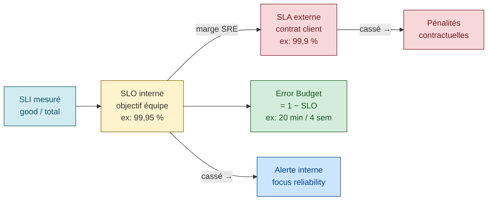

# SLI / SLO / SLA — le cœur du SRE

> Source primaire : Google SRE book ch. 4 [*Service Level Objectives*](https://sre.google/sre-book/service-level-objectives/ "Google SRE book ch. 4 — Service Level Objectives") + SRE workbook [*Implementing SLOs*](https://sre.google/workbook/implementing-slos/ "Google SRE workbook — Implementing SLOs (Steven Thurgood)")

## SLI — Service Level Indicator

### Définition officielle

> *"a carefully defined quantitative measure of some aspect of the level of service that is provided"* [📖¹](https://sre.google/sre-book/service-level-objectives/#indicators "Google SRE book ch. 4 — SLO, section Indicators (définition SLI)")
>
> *En français* : un SLI est **une mesure quantitative**, rigoureusement définie, qui capture un aspect précis de la qualité du service rendu aux utilisateurs.

### Forme canonique : ratio good/total

Le SRE workbook recommande **toujours** d'exprimer un SLI comme le ratio *number of good events / total events* [📖²](https://sre.google/workbook/implementing-slos/#what-to-measure-using-slis "Google SRE workbook — Implementing SLOs, section What to Measure Using SLIs") :

```
SLI = number of good events / total events
```

Échelle 0–100 % où 0 = rien ne marche, 100 = rien n'est cassé.

**Pourquoi cette forme** [📖²](https://sre.google/workbook/implementing-slos/#what-to-measure-using-slis "Google SRE workbook — Implementing SLOs, section What to Measure Using SLIs") :
- Comparable entre services
- Composable (vous pouvez combiner deux SLI proportionnels)
- Aligné avec le calcul de l'error budget (`1 − SLO`)
- Robuste aux changements de trafic (le ratio reste stable même si le volume varie)

### Typologie SRE book des SLI

Le SRE book propose un classement des SLI par type de système [📖³](https://sre.google/sre-book/service-level-objectives/#what-do-you-and-your-users-care-about "Google SRE book ch. 4 — SLO, section What Do You and Your Users Care About") :

| Type de système | SLI typiques |
|-----------------|--------------|
| **User-facing serving** (web, API) | Availability, Latency, Throughput |
| **Storage** (DB, blob, KV) | Latency (read/write), Availability, Durability |
| **Big data / batch** | Throughput, End-to-end latency (ingestion → complétion) |
| **Tous** | Correctness (bonnes données / bonnes réponses) |

### Exemples concrets (workbook)

Exemples tirés du SRE workbook [📖²](https://sre.google/workbook/implementing-slos/#what-to-measure-using-slis "Google SRE workbook — Implementing SLOs, section What to Measure Using SLIs") :

- `successful_HTTP_requests / total_HTTP_requests`
- `gRPC_calls_completing_in_under_100ms / total_gRPC_calls`
- `search_results_returning_using_entire_corpus / total_search_results`
- `bytes_durably_stored / bytes_received`
- `bytes_processed_within_SLO / total_bytes_processed`

### Anti-patterns explicites

**1. Utiliser des moyennes au lieu de percentiles** (SRE book ch. 4, section *Aggregation*) [📖⁴](https://sre.google/sre-book/service-level-objectives/#aggregation "Google SRE book ch. 4 — SLO, section Aggregation (moyennes vs percentiles)") :

> *"5% of requests are 20 times slower"*
>
> *En français* : 5 % des requêtes peuvent être 20 fois plus lentes — une moyenne ne le verra jamais, elle aplatit la queue de distribution.

Toujours préférer : p50 (médiane), p95, p99, p99.9.

**2. Mesurer ce qu'on peut, pas ce qui compte**

Compter les requêtes serveur ne capture **pas** les requêtes qui n'arrivent jamais (DNS down, LB cassé, app crashée). C'est pourquoi le SRE book ch. 10 insiste sur le **blackbox monitoring** complémentaire [📖⁵](https://sre.google/sre-book/practical-alerting/ "Google SRE book ch. 10 — Practical Alerting from Time-Series Data") :

> *"You only see the queries that arrive at the target; the queries that never make it due to a DNS error are invisible, while queries lost due to a server crash never make a sound."*
>
> *En français* : vous ne voyez que les requêtes qui parviennent au serveur. Celles tuées par un DNS en rade sont invisibles, et celles perdues quand un serveur crashe ne font aucun bruit.

### Fenêtre d'agrégation

Le SRE workbook recommande explicitement [📖⁶](https://sre.google/workbook/implementing-slos/#choosing-an-appropriate-time-window "Google SRE workbook — Implementing SLOs, section Choosing an Appropriate Time Window") :

> Une **fenêtre roulante de 4 semaines** avec un **nombre entier de semaines** (pour neutraliser la variation weekday/weekend).

Exemples : 4 semaines (28 jours), 8 semaines, 12 semaines. **Pas** 30 jours, **pas** "dernier mois calendaire".

---

## SLO — Service Level Objective

### Définition officielle

> *"a target value or range of values for a service level that is measured by an SLI, expressed as `SLI ≤ target` or `lower bound ≤ SLI ≤ upper bound`"* [📖⁷](https://sre.google/sre-book/service-level-objectives/#objectives "Google SRE book ch. 4 — SLO, section Objectives (définition SLO)")
>
> *En français* : un SLO est une **valeur cible** (ou une plage de valeurs) pour un SLI, exprimée sous la forme `SLI ≤ cible` ou `borne inférieure ≤ SLI ≤ borne supérieure`.

### Le débat des "neufs"

| Cible | "Neufs" | Indispo / mois (30j) | Indispo / 4sem |
|-------|---------|---------------------|----------------|
| 99% | 2 | ~7h | ~6.7h |
| 99.5% | 2.5 | ~3.6h | ~3.4h |
| 99.9% | 3 | ~43min | ~40min |
| 99.95% | 3.5 | ~22min | ~20min |
| 99.99% | 4 | ~4.3min | ~4min |
| 99.999% | 5 | ~26s | ~24s |

*Valeurs calculées arithmétiquement depuis la fenêtre ; la terminologie « neufs » est couramment utilisée dans l'industrie.* [📖⁸](https://en.wikipedia.org/wiki/High_availability#%22Nines%22 "Wikipedia — High Availability (terminologie nines)")

> *Google Compute Engine vise "three and a half nines" (99.95%)* [📖¹](https://sre.google/sre-book/service-level-objectives/#indicators "Google SRE book ch. 4 — SLO, section Indicators (définition SLI)")

**Coût marginal des « neufs »**. Le SRE book ch. 3 documente explicitement le caractère non linéaire du coût de la fiabilité [📖⁹](https://sre.google/sre-book/embracing-risk/ "Google SRE book ch. 3 — Embracing Risk") : *"cost does not increase linearly as reliability increments — an incremental improvement in reliability may cost 100x more than the previous increment"*.

> *En français* : le coût ne croît **pas** linéairement avec les neufs — chaque incrément supplémentaire peut coûter jusqu'à 100× le précédent.

Au-delà de 99.99%, les pannes résiduelles proviennent souvent de dépendances externes (DNS, ISP, hardware) sur lesquelles vous n'avez aucun contrôle.

> ⚠️ **Point communautaire** — l'argument « dépendances externes = limite à 99.99% » est largement partagé dans la pratique SRE mais n'est pas une citation verbatim du SRE book. Il est cohérent avec la section *Embracing Risk* [📖⁹](https://sre.google/sre-book/embracing-risk/ "Google SRE book ch. 3 — Embracing Risk").

### Fenêtres de mesure

| Type | Avantages | Inconvénients | Quand l'utiliser |
|------|-----------|---------------|------------------|
| **Rolling** (4 sem glissantes) | Aligné expérience utilisateur, lisse les week-ends | Plus complexe à reporter | **Recommandé pour l'opérationnel** [📖⁶](https://sre.google/workbook/implementing-slos/#choosing-an-appropriate-time-window "Google SRE workbook — Implementing SLOs, section Choosing an Appropriate Time Window") |
| **Calendar** (mois civil, trimestre) | Facile pour le planning business | Incertitude en milieu de période | Reporting trimestriel |

Recommandation Workbook : **rolling 4 semaines pour l'exploitation, résumés hebdos pour la priorisation, calendar trimestriel pour le reporting projet.** [📖⁶](https://sre.google/workbook/implementing-slos/#choosing-an-appropriate-time-window "Google SRE workbook — Implementing SLOs, section Choosing an Appropriate Time Window")

### Anti-patterns explicites (SRE book ch. 4, *Choosing Targets*) [📖¹⁰](https://sre.google/sre-book/service-level-objectives/#choosing-targets "Google SRE book ch. 4 — SLO, section Choosing Targets (5 anti-patterns)")

1. **Don't pick targets based on current performance** — *"Doing so can lead to supporting a system through heroic efforts."*

   > *En français* : ne calez pas la cible sur la performance actuelle — vous vous condamnez à maintenir le système par efforts héroïques répétés. Démarrez avec une cible **plus lâche**, puis resserrez.

2. **Keep it simple** — *"Complicated SLI aggregations […] can obscure changes to the performance of the system."*

   > *En français* : un SLI agrégé de façon complexe masque les régressions. 1 SLI clair vaut mieux que 5 agrégats savants.

3. **Avoid absolutes** — Pas de *"infinitely scalable"*, pas de *"always available"*. C'est physiquement impossible et ça vous expose.

4. **Have as few SLOs as possible** — *"if you can't ever win a conversation about priorities by quoting a particular SLO, it's probably not worth having that SLO."*

   > *En français* : si un SLO ne vous permet pas de trancher une discussion de priorité, il ne sert à rien — supprimez-le.

5. **Perfection can wait** — Démarrez lâche, ajoutez des SLO plus tard. Vous apprendrez ce qui compte vraiment en 1 trimestre.

### Le piège de la sur-performance — cas Chubby

Cas raconté dans le SRE book section *The Global Chubby Planned Outage* [📖¹¹](https://sre.google/sre-book/service-level-objectives/#the-global-chubby-planned-outage "Google SRE book ch. 4 — SLO, section The Global Chubby Planned Outage") : Chubby (le service de coordination distribuée Google) avait un SLO et performait **systématiquement** au-dessus. Résultat : tous les autres services Google s'étaient mis à dépendre **silencieusement** de la disponibilité réelle (proche de 100%) et plus du SLO déclaré.

**Solution Google** : *planned outages* — Google met **volontairement** Chubby en panne pour ramener le service à son SLO et casser les dépendances cachées. [📖¹¹](https://sre.google/sre-book/service-level-objectives/#the-global-chubby-planned-outage "Google SRE book ch. 4 — SLO, section The Global Chubby Planned Outage")

> Un service qui reste **durablement au-dessus** de son SLO crée une dette de fiabilité invisible : les consommateurs s'adaptent à la réalité observée (quasi-100%), et les vraies pannes deviennent catastrophiques parce que personne n'était préparé à la dégradation pourtant autorisée.

### Exemples multi-percentile (SRE book ch. 4)

Le chapitre 4 donne des exemples de SLO multi-percentiles typiques [📖⁷](https://sre.google/sre-book/service-level-objectives/#objectives "Google SRE book ch. 4 — SLO, section Objectives (définition SLO)") :

- p90 très bas (millisecondes) pour le trafic interactif chaud
- p99 un ordre de grandeur au-dessus
- p99.9 encore un ordre de grandeur plus haut
- Workloads séparés : SLO différents pour interactif (strict) vs batch (lâche)

> ⚠️ **Valeurs chiffrées** — les percentiles exacts (*p90 < 1 ms*, etc.) dépendent du service cité et du chapitre du SRE book. Utilisez le principe (multi-percentile + workloads séparés), pas les chiffres comme standard.

---

## SLA — Service Level Agreement

### Définition officielle

> *"an explicit or implicit contract with your users that includes consequences of meeting (or missing) the SLOs they contain"* [📖¹²](https://sre.google/sre-book/service-level-objectives/#agreements "Google SRE book ch. 4 — SLO, section Agreements (définition SLA)")
>
> *En français* : un SLA est un **contrat explicite ou implicite** avec vos utilisateurs, qui précise les conséquences du respect (ou du non-respect) des SLO qu'il contient.

### Relation SLI — SLO — SLA et marges de sécurité



### Le test pour les distinguer

> *"an easy way to tell the difference between an SLO and an SLA is to ask 'what happens if the SLOs aren't met?': if there is no explicit consequence, then you are almost certainly looking at an SLO."* [📖¹²](https://sre.google/sre-book/service-level-objectives/#agreements "Google SRE book ch. 4 — SLO, section Agreements (définition SLA)")
>
> *En français* : pour distinguer un SLO d'un SLA, posez la question *« qu'est-ce qui se passe si le SLO n'est pas tenu ? »*. S'il n'y a **pas de conséquence explicite**, c'est un SLO — pas un SLA.

### SLA < SLO toujours

Le SRE book recommande des **safety margins** [📖¹²](https://sre.google/sre-book/service-level-objectives/#agreements "Google SRE book ch. 4 — SLO, section Agreements (définition SLA)") :
- SLA externe : 99.9% (contractuel, avec pénalités)
- SLO interne : 99.95% (objectif équipe, plus strict)
- SLI mesuré : doit rester ≥ 99.95% pour ne **jamais** approcher la zone SLA

L'idée : un SLO violé = alerte interne, mais pas de pénalité. Vous avez le temps de réagir avant que ça touche le SLA.

### Conséquences typiques d'un SLA cassé

Pratiques industrie consensuelles (cf. [AWS Service Level Agreements](https://aws.amazon.com/legal/service-level-agreements/ "AWS — Service Level Agreements (SLA contractuels)"), [GCP SLA terms](https://cloud.google.com/terms/sla "Google Cloud — SLA contractuels"), [Azure SLA](https://azure.microsoft.com/en-us/support/legal/sla/ "Microsoft Azure — SLA contractuels")) :

- **Financières** : crédits service, rebates, pénalités contractuelles
- **Réputationnelles** : status page publique, communication crise
- **Régulatoires** : selon l'industrie (banque, santé, énergie)

### Anti-pattern : confondre SLO et SLA en interne

Si vous publiez un SLO comme un SLA **en interne** (avec sanctions pour l'équipe qui le rate), vous cassez la mécanique error budget. L'équipe perd l'incitation à consommer le budget pour innover — elle cherche à le préserver à tout prix.

> *Principe communautaire largement partagé* — cohérent avec la logique blameless + error budget du SRE book ch. 3 [📖⁹](https://sre.google/sre-book/embracing-risk/ "Google SRE book ch. 3 — Embracing Risk"). Les comportements concrets (sous-déclaration d'incidents, SLO trivialisés, refus de déployer) sont observés dans les équipes mais ne sont pas listés verbatim dans la source.

---

## Le bon ordre pour démarrer

Séquence recommandée par le SRE workbook [📖¹³](https://sre.google/workbook/implementing-slos/#continuous-improvement-of-slo-targets "Google SRE workbook — Implementing SLOs, section Continuous Improvement of SLO Targets") :

1. **Identifier les CUJ** (Critical User Journeys) — pas plus de 5
2. **1-2 SLI par CUJ** : commencer simple (availability + latency)
3. **SLO modeste** : 99.5% est OK pour démarrer, pas 99.999%
4. **Window roulante 4 semaines** [📖⁶](https://sre.google/workbook/implementing-slos/#choosing-an-appropriate-time-window "Google SRE workbook — Implementing SLOs, section Choosing an Appropriate Time Window")
5. **Error budget** = 1 − SLO, calculé sur la même fenêtre
6. **Pas de SLA** tant que vous n'avez pas 1 trimestre de SLO stable
7. **Itérer** : ajustez la cible après chaque trimestre

---

## Cheatsheet conversion taux d'erreur ↔ minutes d'indispo

Pour une fenêtre 4 semaines (40 320 minutes) :

| SLO | Error budget % | Minutes d'indispo permises (4 sem) |
|-----|----------------|-----------------------------------|
| 99% | 1% | 403 min (≈ 6h45) |
| 99.5% | 0.5% | 202 min (≈ 3h22) |
| 99.9% | 0.1% | 40 min |
| 99.95% | 0.05% | 20 min |
| 99.99% | 0.01% | 4 min |
| 99.999% | 0.001% | 24 secondes |

*Valeurs arithmétiques — aucune source externe nécessaire (calcul = `window_min × (1 − SLO)`).*

⚠️ Ces valeurs supposent un SLI de **disponibilité temps**. Pour un SLI ratio de requêtes (good/total), le budget se compte en **requêtes erronées** sur la fenêtre, pas en minutes.

---

## Composition de SLO sur une chaîne d'appels

Le SLO mono-service ci-dessus décrit la fiabilité d'un service isolé. À l'échelle, la plupart des parcours utilisateurs traversent **5 à 10 services** possédés par autant d'équipes. La fiabilité devient une propriété de la **chaîne**, pas d'un maillon.

Trois règles dérivées du *Calculus of Service Availability* (Treynor, Dahlin, Rau, Beyer — ACM Queue 2017) :

1. **Règle 1/N** — si un service a `N` dépendances critiques uniques, chacune contribue `1/N` à l'indisponibilité induite, **indépendamment de la profondeur** dans le graphe. Ce n'est pas la profondeur qui borne le SLO atteignable, c'est le nombre de dépendances critiques uniques.
2. **Rule of the extra 9** — vos dépendances critiques doivent offrir **un 9 de plus** que votre service. Si vous visez 99,9 %, vos dépendances doivent tenir 99,99 %. Sinon votre cible est mécaniquement intenable.
3. **Corollaire de renégociation** — si vous êtes invoqué pour un niveau de disponibilité que vous ne pouvez pas livrer, **réduire l'attente publiée** est souvent le bon choix : un SLO honnête vaut mieux qu'un SLO inflaté que personne ne tient.

Pour un parcours qui traverse plusieurs services, on définit :

- un **SLO end-to-end** porté par une équipe-pilote (souvent la plus en aval, celle qui voit l'utilisateur)
- des **SLO per-service** portés par chaque équipe propriétaire, avec un 9 supplémentaire par rapport au SLO end-to-end
- un **contrat inter-équipes** explicite : qui s'engage à quel SLO, quel on-call, quelle escalade

Les patterns de mitigation pour une dépendance qui ne tient pas son 9 supplémentaire (capacity cache, *failing safe/open/closed*, failover automatique, asynchronicité, sharding, isolation géographique, dégradation gracieuse) sont détaillés dans [`journey-slos-cross-service.md`](journey-slos-cross-service.md).

> **Anti-pattern à éviter** : présumer l'indépendance des dépendances. Mes 5 dépendances ont chacune 99,9 % donc le produit est 99,5 % — **faux** dans la majorité des cas réels, parce qu'elles partagent souvent une infra commune (même cluster, même réseau, même éditeur). Mesurer la corrélation observée plutôt que de calculer un produit théorique.

## Outillage

Trois outils open source industrialisent ce guide (définition SLO → règles Prometheus + alerting + dashboards) : **Pyrra**, **Sloth**, **OpenSLO**. Voir [`slo-tooling.md`](slo-tooling.md) pour le format CRD de chacun, le choix entre les trois, et l'intégration avec Prometheus/Thanos/Mimir/VictoriaMetrics.

Raccourci : si on veut une UI clé en main sur Kubernetes → Pyrra ; si on veut juste des `PrometheusRule` en GitOps → Sloth ; si on veut éviter le lock-in → OpenSLO + Sloth.

---

## Ressources

Sources primaires vérifiées :

1. [SRE book ch. 4 — Indicators](https://sre.google/sre-book/service-level-objectives/#indicators "Google SRE book ch. 4 — SLO, section Indicators (définition SLI)") — définition SLI, *three and a half nines*
2. [SRE workbook — What to Measure Using SLIs](https://sre.google/workbook/implementing-slos/#what-to-measure-using-slis "Google SRE workbook — Implementing SLOs, section What to Measure Using SLIs") — ratio good/total, exemples
3. [SRE book ch. 4 — What Do You and Your Users Care About](https://sre.google/sre-book/service-level-objectives/#what-do-you-and-your-users-care-about "Google SRE book ch. 4 — SLO, section What Do You and Your Users Care About") — typologie SLI
4. [SRE book ch. 4 — Aggregation](https://sre.google/sre-book/service-level-objectives/#aggregation "Google SRE book ch. 4 — SLO, section Aggregation (moyennes vs percentiles)") — anti-pattern moyennes
5. [SRE book ch. 10 — Practical Alerting](https://sre.google/sre-book/practical-alerting/ "Google SRE book ch. 10 — Practical Alerting from Time-Series Data") — *You only see the queries that arrive at the target* verbatim
6. [SRE workbook — Choosing an Appropriate Time Window](https://sre.google/workbook/implementing-slos/#choosing-an-appropriate-time-window "Google SRE workbook — Implementing SLOs, section Choosing an Appropriate Time Window") — fenêtre rolling 4 semaines
7. [SRE book ch. 4 — Objectives](https://sre.google/sre-book/service-level-objectives/#objectives "Google SRE book ch. 4 — SLO, section Objectives (définition SLO)") — définition SLO
8. [Wikipedia — High Availability, terminologie « neufs »](https://en.wikipedia.org/wiki/High_availability#%22Nines%22 "Wikipedia — High Availability (terminologie nines)")
9. [SRE book ch. 3 — Embracing Risk](https://sre.google/sre-book/embracing-risk/ "Google SRE book ch. 3 — Embracing Risk") — coût non linéaire des neufs (*100x more*)
10. [SRE book ch. 4 — Choosing Targets](https://sre.google/sre-book/service-level-objectives/#choosing-targets "Google SRE book ch. 4 — SLO, section Choosing Targets (5 anti-patterns)") — 5 anti-patterns
11. [SRE book ch. 4 — The Global Chubby Planned Outage](https://sre.google/sre-book/service-level-objectives/#the-global-chubby-planned-outage "Google SRE book ch. 4 — SLO, section The Global Chubby Planned Outage") — cas Chubby
12. [SRE book ch. 4 — Agreements](https://sre.google/sre-book/service-level-objectives/#agreements "Google SRE book ch. 4 — SLO, section Agreements (définition SLA)") — définition SLA, test SLO vs SLA, safety margins
13. [SRE workbook — Continuous Improvement of SLO Targets](https://sre.google/workbook/implementing-slos/#continuous-improvement-of-slo-targets "Google SRE workbook — Implementing SLOs, section Continuous Improvement of SLO Targets") — itération cible

Voir aussi [`error-budget.md`](error-budget.md) pour le calcul et la policy.
