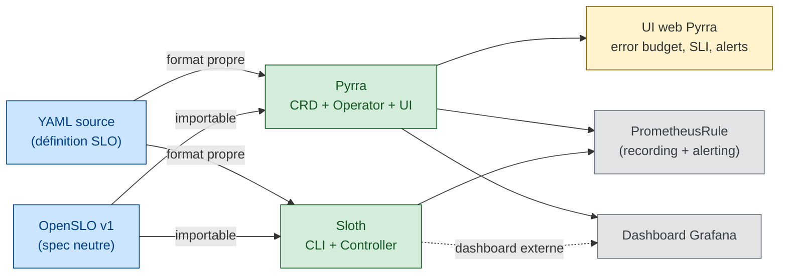
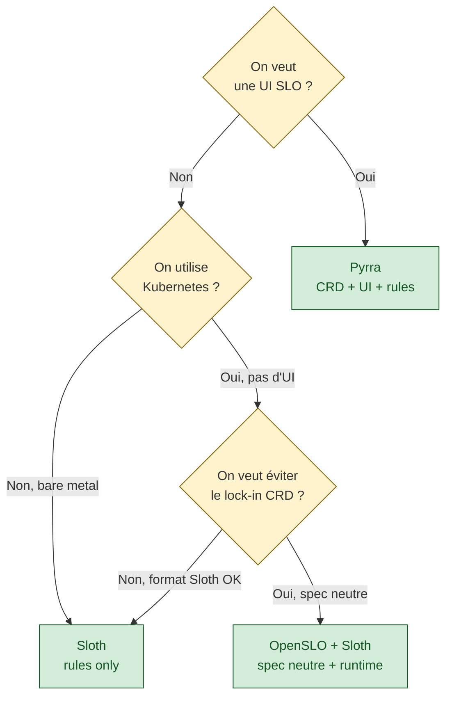

# Outillage SLO — Pyrra, Sloth, OpenSLO

> **Sources primaires** :
> - [Pyrra (pyrra-dev)](https://github.com/pyrra-dev/pyrra "Pyrra — SLO controller Kubernetes + UI + génération règles Prometheus") — maintenu par Grafana Labs + Polar Signals, Apache 2.0
> - [Sloth (slok)](https://github.com/slok/sloth "Sloth — générateur PrometheusRule depuis CRD, support OpenSLO") — générateur CLI + Kubernetes controller, Apache 2.0
> - [OpenSLO (OpenSLO/OpenSLO)](https://github.com/OpenSLO/OpenSLO "OpenSLO — spec YAML neutre, initiée par Nobl9") — spec vendor-agnostic
> - Google SRE workbook [*Alerting on SLOs*](https://sre.google/workbook/alerting-on-slos/ "Google SRE workbook — Alerting on SLOs (burn rate alerting multi-window)") — référence burn-rate multi-window que ces outils implémentent

Ce guide documente les trois outils SLO open source qui industrialisent ce que le SRE workbook décrit. Il répond à une question opérationnelle : *comment éviter d'écrire soi-même les recording rules et les alertes burn-rate quand on a déjà Prometheus ?*

---

## Pourquoi un outillage dédié

Le SRE workbook [*Implementing SLOs*](https://sre.google/workbook/implementing-slos/ "Google SRE workbook — Implementing SLOs (Steven Thurgood)") et [*Alerting on SLOs*](https://sre.google/workbook/alerting-on-slos/ "Google SRE workbook — Alerting on SLOs (burn rate alerting multi-window)") décrivent **quoi** mesurer et **comment** alerter, mais pas l'implémentation. Appliqué naïvement, un SLO = plusieurs dizaines de lignes de PromQL :

- 1 recording rule `good / total` par fenêtre (5m, 30m, 1h, 6h, 1d, 3d, 28d…)
- 2 à 4 `ALERT` multi-window (rapide 1h+5m, lent 6h+30m, drain 3j+6h) avec seuils 14.4× / 6× / 1×
- 1 dashboard Grafana avec panels error budget, burn-rate, SLI courant

À 3 SLOs × 5 services, on maintient ~600 lignes YAML. **Les trois outils de ce guide automatisent cette génération à partir d'une définition de 20 lignes.** Ils restent compatibles Prometheus pur (pas d'agent, pas de backend propriétaire).

---

## Panorama des trois outils



| Outil | Rôle | Sortie | UI | Supporte OpenSLO |
|---|---|---|---|---|
| **Pyrra** | CRD K8s + operator + UI + générateur | `PrometheusRule` + dashboards Grafana | Oui, intégrée | Non (CRD propriétaire `pyrra.dev/v1alpha1`) |
| **Sloth** | CLI ou controller K8s, générateur pur | `PrometheusRule` uniquement | Non (délégué à Grafana) | **Oui** |
| **OpenSLO** | Spec YAML neutre | Rien — c'est une spec | N/A | N/A (c'est la spec elle-même) |

> *Sloth déclare explicitement un support OpenSLO dans son README* — permet d'écrire ses SLOs en OpenSLO et de laisser Sloth produire les règles Prometheus, utile quand on veut éviter le lock-in CRD.

---

## Pyrra — CRD, operator, UI en un binaire

### Qu'est-ce que Pyrra

Pyrra est un binaire unique qui combine trois composants :

1. **Operator Kubernetes** — watch les ressources `ServiceLevelObjective` (CRD `pyrra.dev/v1alpha1`) et génère les `PrometheusRule` associées.
2. **API** — sert les données SLO au frontend (état courant, historique, burn-rate).
3. **UI web** — liste triable des SLOs, visualisation error budget, alertes actives.

Modes de déploiement supportés : **Kubernetes** (operator + Prometheus Operator), **Docker**, **filesystem** (bare metal, lecture de fichiers YAML). Compatible Prometheus, [Thanos](https://thanos.io/), [Mimir](https://grafana.com/oss/mimir/), et tout backend exposant l'API Prometheus (dont VictoriaMetrics).

### Format CRD — indicateur `ratio`

Forme la plus courante (SLI = requêtes réussies / requêtes totales) :

```yaml
apiVersion: pyrra.dev/v1alpha1
kind: ServiceLevelObjective
metadata:
  name: prometheus-http-errors
  namespace: monitoring
  labels:
    pyrra.dev/team: platform    # Préfixe pyrra.dev/ → label Prometheus après strip
spec:
  target: "99"                   # String (contrainte kubebuilder) — lu comme 99%
  window: 2w                     # Valeurs : 1w, 2w, 4w
  description: Prometheus API 5xx error rate
  indicator:
    ratio:
      errors:
        metric: prometheus_http_requests_total{code=~"5.."}
      total:
        metric: prometheus_http_requests_total
      grouping:
        - handler              # 1 SLO → N alertes, une par valeur de handler
```

Le `ratio` correspond **exactement** à la forme canonique *"number of good events / total events"* du workbook [📖¹](https://sre.google/workbook/implementing-slos/#what-to-measure-using-slis "Google SRE workbook — Implementing SLOs, section What to Measure Using SLIs") — Pyrra ne réinvente rien, il exécute.

### Format CRD — indicateur `latency`

Pour un SLO de latence (ex : 99% des requêtes < 200 ms), Pyrra lit un histogramme Prometheus :

```yaml
apiVersion: pyrra.dev/v1alpha1
kind: ServiceLevelObjective
metadata:
  name: pyrra-api-latency
spec:
  target: "99"
  window: 2w
  description: Pyrra API request latency
  indicator:
    latency:
      success:
        metric: connect_server_requests_duration_seconds_bucket{le="0.2"}
      total:
        metric: connect_server_requests_duration_seconds_count
      grouping:
        - service
        - method
```

Le bucket `le="0.2"` doit exister dans l'histogramme — sinon Pyrra refuse la ressource. C'est aligné avec la recommandation SRE book ch. 4 *Aggregation* : utiliser des percentiles issus d'histogrammes, pas des moyennes [📖²](https://sre.google/sre-book/service-level-objectives/#aggregation "Google SRE book ch. 4 — SLO, section Aggregation (moyennes vs percentiles)").

### Génération automatique des règles burn-rate

Pour chaque SLO, Pyrra génère automatiquement des **multi-window multi-burn-rate alerts à 4 niveaux de sévérité**, dérivés du tableau 5-8 du SRE workbook [📖³](https://sre.google/workbook/alerting-on-slos/ "Google SRE workbook — Alerting on SLOs (burn rate alerting multi-window)") :

| Sévérité | Fenêtre longue | Fenêtre courte | Burn-rate seuil | Budget consommé avant alerte |
|---|---|---|---|---|
| Page critique | 1h | 5m | 14.4× | 2% |
| Page normale | 6h | 30m | 6× | 5% |
| Ticket | 3j | 6h | 1× | 10% |
| Drain lent | — | — | — | alerte basse |

Les recording rules intermédiaires (3m, 15m, 30m, 1h, 3h, 12h, 2d) sont créées automatiquement. L'équipe ne voit que la définition de 20 lignes ; Pyrra écrit les ~200 lignes PrometheusRule associées.

### Intégration Alertmanager

Les alertes générées portent les labels `severity`, `slo`, le label `pyrra.dev/team` (propagé depuis la metadata), et tout label de `grouping`. Routage Alertmanager classique — aucune extension nécessaire.

### Modes de déploiement

| Mode | Source des SLOs | Cible des règles | Utilisation |
|---|---|---|---|
| Kubernetes operator | CRD `ServiceLevelObjective` | `PrometheusRule` créées par l'operator | Cluster K8s avec Prometheus Operator |
| Kubernetes ConfigMap | ConfigMap YAML | ConfigMap de règles | K8s sans Prometheus Operator |
| Filesystem | Fichiers YAML sur disque | Fichiers `rules.yaml` régénérés | Bare metal / Docker Compose |

---

## Sloth — générateur pur

Sloth n'a pas d'UI. Il prend une définition YAML (format `sloth.slok.dev/v1` `PrometheusServiceLevel` **ou** `openslo/v1`) et produit un fichier `PrometheusRule` à appliquer manuellement ou via un controller.

### Format CRD Sloth

```yaml
version: prometheus/v1
service: myservice
labels:
  team: platform
slos:
  - name: requests-availability
    objective: 99.0
    description: HTTP 5xx error rate
    sli:
      events:
        error_query: sum(rate(http_requests_total{job="myservice",code=~"5.."}[{{.window}}]))
        total_query: sum(rate(http_requests_total{job="myservice"}[{{.window}}]))
    alerting:
      name: MyServiceHighErrorRate
      page_alert:
        labels: { severity: critical }
      ticket_alert:
        labels: { severity: warning }
```

Sloth utilise le placeholder Go template `{{.window}}` qu'il remplace pour chaque fenêtre. C'est plus verbeux que Pyrra mais **plus explicite** : on voit exactement la PromQL qui alimentera les règles.

### Quand préférer Sloth à Pyrra

- Le cluster n'a **pas** d'UI à maintenir (Grafana suffit).
- On veut écrire les SLOs en **OpenSLO** (Sloth le supporte, Pyrra non).
- On fait de la génération offline (CI/CD) et on commit les `PrometheusRule` dans Git — un pattern GitOps classique.
- Moins de composants actifs → moins de surface à opérer.

---

## OpenSLO — la spec neutre

OpenSLO est une **spécification YAML**, pas un runtime. Initiée par Nobl9, licence CC BY 4.0.

### Objets de base

| Kind | Rôle |
|---|---|
| `SLO` | Objectif sur un SLI, avec `target` et `timeWindow` (rolling ou calendar) |
| `SLI` | Description d'une mesure — `ratioMetric`, `thresholdMetric`, `rawMetric` |
| `Service` | Regroupement logique de SLOs |
| `AlertPolicy` / `AlertCondition` | Règles d'alerting (burn-rate, time-based) |
| `DataSource` | Source métrique (Prometheus, Datadog, CloudWatch…) |

### Exemple minimal

```yaml
apiVersion: openslo/v1
kind: SLO
metadata:
  name: foo-slo
  displayName: Foo availability
spec:
  service: foo
  indicator:
    metadata:
      name: foo-availability
    spec:
      ratioMetric:
        counter: true
        good:
          metricSource:
            type: Prometheus
            spec: { query: 'sum(rate(http_requests{code!~"5.."}[1m]))' }
        total:
          metricSource:
            type: Prometheus
            spec: { query: 'sum(rate(http_requests[1m]))' }
  timeWindow:
    - duration: 28d
      isRolling: true
  budgetingMethod: Occurrences
  objectives:
    - target: 0.99
```

### Modèles de budgeting

Trois modes officiels :

- **Occurrences** — ratio d'événements (workbook canonique)
- **Timeslices** — ratio de tranches de temps respectant l'objectif
- **RatioTimeslices** — hybride

Le workbook Google recommande implicitement **Occurrences** via la forme `good/total` [📖¹](https://sre.google/workbook/implementing-slos/#what-to-measure-using-slis "Google SRE workbook — Implementing SLOs, section What to Measure Using SLIs"). Les autres modes existent pour des cas spécifiques (batch, SLO calendaires).

### Quand utiliser OpenSLO

- On veut éviter le **lock-in** à un outil — écrire la spec une fois, changer de runtime plus tard.
- On a plusieurs runtimes en parallèle (Sloth en interne, Nobl9 chez un prestataire).
- On envoie les SLOs à un outil commercial qui parle OpenSLO (Nobl9, plus rare).

---

## Comment choisir



### Raccourci par profil

- **Plateforme K8s + besoin d'UI clé en main** → Pyrra.
- **Plateforme K8s, UI = Grafana, GitOps des règles** → Sloth.
- **Multi-runtime ou anticipation de portage** → OpenSLO + Sloth.

---

## Intégration avec les backends Prometheus-compatibles

Les trois outils produisent des règles Prometheus standard. Ils fonctionnent donc avec tout backend qui expose l'API `/api/v1/query` et qui supporte les `PrometheusRule` :

| Backend | Pyrra (operator) | Sloth (controller) | Sloth (CLI + GitOps) |
|---|---|---|---|
| [Prometheus](https://prometheus.io/docs/introduction/overview/ "Prometheus — Overview (pull model)") | ✅ natif | ✅ natif | ✅ natif |
| [Thanos](https://thanos.io/) | ✅ natif | ✅ natif | ✅ natif |
| [Mimir (Grafana)](https://grafana.com/oss/mimir/) | ✅ natif | ✅ natif | ✅ natif |
| VictoriaMetrics | ✅ via API Prom | ✅ via API Prom | ✅ via API Prom |
| CloudWatch / Datadog | ❌ (indicator Prom uniquement) | ❌ (idem) | ❌ (idem) |

Pour un backend non-Prometheus (CloudWatch, Datadog), le choix naturel est **OpenSLO + Nobl9** ou l'outillage natif du fournisseur.

---

## Anti-patterns

### 1. Définir les recording rules à la main à côté du SLO

Si on déploie Pyrra ou Sloth mais qu'on continue à écrire des règles PromQL `_error_ratio_5m` en parallèle, on se retrouve avec **deux sources de vérité** qui divergent. La règle : si l'outil peut le générer, il génère ; rien d'écrit à la main à côté.

### 2. Mettre plus de 5 SLOs par service

Pas un défaut de l'outil, mais Pyrra/Sloth rendent triviale la création → tentation. Le SRE book insiste que les SLOs servent à **trancher les arbitrages** [📖⁴](https://sre.google/sre-book/service-level-objectives/#choosing-targets "Google SRE book ch. 4 — SLO, section Choosing Targets (5 anti-patterns)"). Au-delà de 3-5 SLOs, plus personne ne les consulte pour arbitrer.

### 3. Multi-fenêtres incohérentes entre services

Pyrra supporte `1w`, `2w`, `4w`. Si on a 5 services, utiliser 5 fenêtres différentes empêche toute comparaison. Fixer une fenêtre par organisation (le workbook recommande 28 jours = 4 semaines [📖⁵](https://sre.google/workbook/implementing-slos/#choosing-an-appropriate-time-window "Google SRE workbook — Implementing SLOs, section Choosing an Appropriate Time Window")).

### 4. Ignorer les alertes "ticket" (3j/6h)

Les 4 sévérités existent pour une raison : les alertes lentes (drain, ticket) **préviennent** l'incident. Les router toutes vers Slack ou les désactiver vide 50% de la valeur du multi-window burn-rate.

---

## 📐 À l'échelle d'une grande organisation

Les outils SLO (Pyrra, Sloth, Nobl9, OpenSLO) sont conçus pour des services individuels. À l'échelle d'une grande organisation, trois extensions sont nécessaires :

- **Multi-tenant** — l'outil SLO doit servir des dizaines à des centaines d'équipes en isolation (RBAC, quotas, namespaces). Pyrra-en-fédération ou Nobl9 multi-org. Voir [`sre-at-scale.md`](sre-at-scale.md).
- **SLO de chaîne en plus du SLO de service** — les outils SLO standards calculent un SLO par cible. Composer ces SLO en SLO de chaîne (composition multiplicative, règle 1/N) exige une couche supplémentaire (DevLake, Backstage, scripts custom). Voir [`journey-slos-cross-service.md`](journey-slos-cross-service.md).
- **Typologie de service** — un service business-facing, un service foundational et une plateforme n'ont pas le même format de SLO. L'outillage doit accepter ces catégories différentes. Voir [`service-taxonomy-slo-ownership.md`](service-taxonomy-slo-ownership.md).
- **Multi-stack** — l'outil SLO doit ingérer des SLI venant de Prometheus K8s, CloudWatch AWS, Dynatrace VM legacy, OMEGAMON mainframe — voir [`multi-stack-observability.md`](multi-stack-observability.md) et [`multi-vendor-abstraction.md`](multi-vendor-abstraction.md).

## Ressources

Sources primaires vérifiées :

1. [SRE workbook — What to Measure Using SLIs](https://sre.google/workbook/implementing-slos/#what-to-measure-using-slis "Google SRE workbook — Implementing SLOs, section What to Measure Using SLIs") — forme canonique `good/total`
2. [SRE book ch. 4 — Aggregation](https://sre.google/sre-book/service-level-objectives/#aggregation "Google SRE book ch. 4 — SLO, section Aggregation (moyennes vs percentiles)") — percentiles via histogrammes
3. [SRE workbook — Alerting on SLOs](https://sre.google/workbook/alerting-on-slos/ "Google SRE workbook — Alerting on SLOs (burn rate alerting multi-window)") — multi-window multi-burn-rate, tables 5-4 et 5-8
4. [SRE book ch. 4 — Choosing Targets](https://sre.google/sre-book/service-level-objectives/#choosing-targets "Google SRE book ch. 4 — SLO, section Choosing Targets (5 anti-patterns)") — SLOs qui arbitrent
5. [SRE workbook — Choosing an Appropriate Time Window](https://sre.google/workbook/implementing-slos/#choosing-an-appropriate-time-window "Google SRE workbook — Implementing SLOs, section Choosing an Appropriate Time Window") — fenêtre 4 semaines

Outillage (documentation officielle) :

6. [Pyrra (pyrra-dev/pyrra)](https://github.com/pyrra-dev/pyrra "Pyrra — SLO controller Kubernetes + UI + génération règles Prometheus") — repo principal, exemples dans `examples/`
7. [Pyrra — site officiel](https://pyrra.dev/ "Pyrra — SLO controller Kubernetes + UI + génération règles Prometheus") — landing page + docs
8. [Sloth (slok/sloth)](https://github.com/slok/sloth "Sloth — générateur PrometheusRule depuis CRD, support OpenSLO") — repo principal, spec `sloth.slok.dev/v1`
9. [OpenSLO (OpenSLO/OpenSLO)](https://github.com/OpenSLO/OpenSLO "OpenSLO — spec YAML neutre, initiée par Nobl9") — spec YAML, objets SLO/SLI/AlertPolicy

Contexte backend Prometheus :

10. [Prometheus — Overview (pull model)](https://prometheus.io/docs/introduction/overview/ "Prometheus — Overview (pull model)")
11. [Prometheus — Recording rules](https://prometheus.io/docs/prometheus/latest/configuration/recording_rules/ "Prometheus — Recording rules")
12. [Prometheus — Alertmanager](https://prometheus.io/docs/alerting/latest/alertmanager/ "Prometheus — Alertmanager (routing, deduplication)")

Voir aussi [`sli-slo-sla.md`](sli-slo-sla.md) pour la définition SLI/SLO et la forme canonique `good/total`, et [`monitoring-alerting.md`](monitoring-alerting.md) pour les principes d'alerting sous-jacents.
