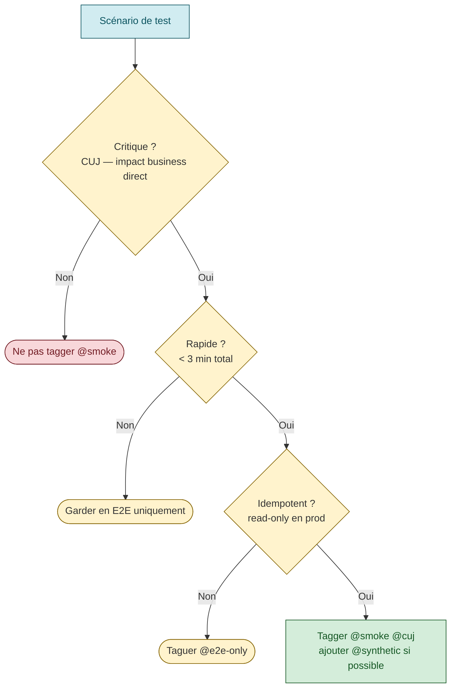
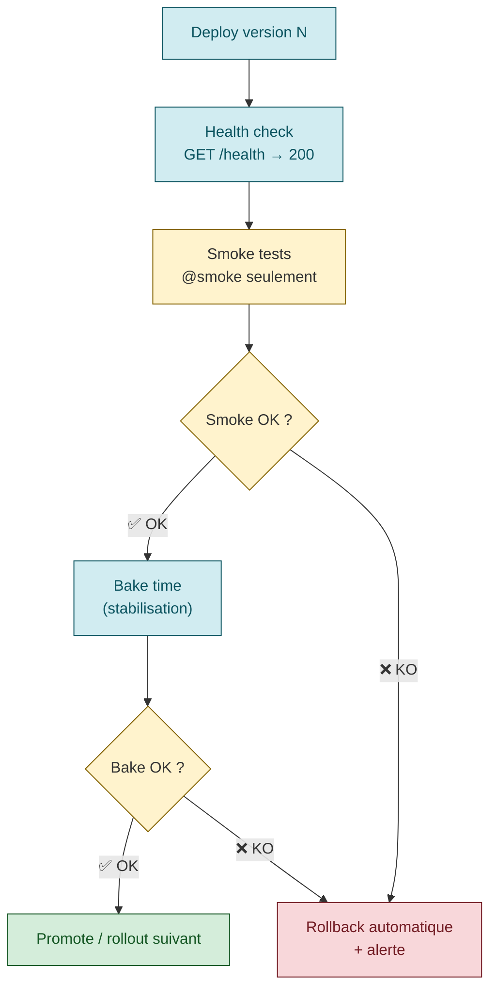
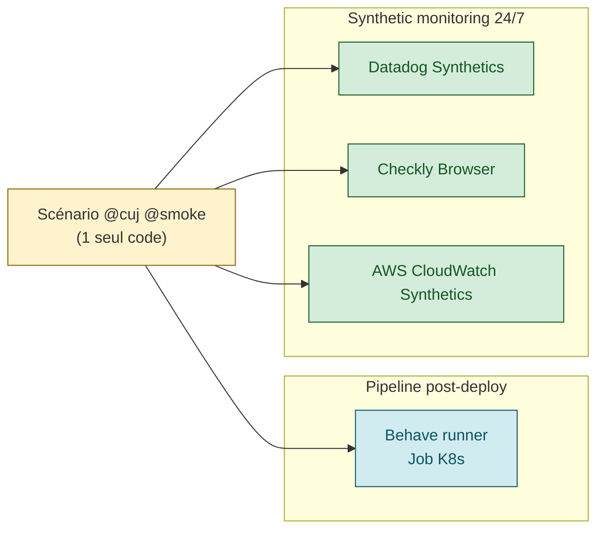

# Smoke tests — gate de déploiement minimal mais critique

> **Sources primaires** :
> - Google SRE book ch. 17, [*Testing for Reliability*](https://sre.google/sre-book/testing-reliability/ "Google SRE book ch. 17 — Testing for Reliability") — section *System tests*
> - Martin Fowler, [*SmokeTest*](https://martinfowler.com/bliki/SmokeTest.html "Martin Fowler — SmokeTest (définition canonique)")
> - Martin Fowler, [*Continuous Integration*](https://martinfowler.com/articles/continuousIntegration.html "Martin Fowler — Continuous Integration")
> - Microsoft Learn, [*Testing strategies for cloud applications*](https://learn.microsoft.com/en-us/azure/well-architected/reliability/testing-strategy "Microsoft Azure WAF — Reliability, Testing strategy")

## Définition

> *"Smoke tests, in which engineers test very simple but critical behavior, are among the simplest type of system tests. Smoke tests are also known as sanity testing, and serve to short-circuit additional and more expensive testing."* [📖¹](https://sre.google/sre-book/testing-reliability/ "Google SRE book ch. 17 — Testing for Reliability")
>
> *En français* : les smoke tests — des tests **très simples** portant sur des comportements **critiques** — sont parmi les tests système les plus basiques. On parle aussi de *sanity testing*. Leur rôle : **court-circuiter** les tests plus coûteux qui n'ont aucune chance de passer si les bases sont cassées.

**Origine du terme** (Martin Fowler) [📖²](https://martinfowler.com/bliki/SmokeTest.html "Martin Fowler — SmokeTest (définition canonique)") :
> *"A smoke test is a simple test that ensures the basic operation of a system or part of the system."*
>
> *En français* : un smoke test est un **test simple** qui vérifie le fonctionnement de base d'un système (ou d'une partie).

Et sur la métaphore originelle [📖²](https://martinfowler.com/bliki/SmokeTest.html "Martin Fowler — SmokeTest (définition canonique)") :
> *"The name comes from the analogy that you are plugging in some electrical equipment and looking to see if smoke comes out."*
>
> *En français* : le terme vient de l'analogie électrique : on branche l'appareil et on regarde s'il **fume**.

### Smoke ≠ E2E ≠ regression ≠ sanity

| Type | Scope | Durée | Quand |
|------|-------|-------|-------|
| **Smoke** | 1-5 parcours critiques (subset minimal) | 30s - 3 min | Post-deploy, gate |
| **E2E full** | Tout le système, tous les flows | 5 - 30 min | Pre-prod, validation complète |
| **Regression** | Tous les bugs déjà fixés | Variable | Périodiquement |
| **Sanity** | Narrow et profond — une fonction précise après un changement ciblé | Très court | Après hotfix / bugfix |

> ⚠️ **Tableau comparatif** — compilation de conventions industrie (pyramide des tests, cf. [Martin Fowler — Test Pyramid](https://martinfowler.com/bliki/TestPyramid.html "Martin Fowler — Test Pyramid")). Pas un tableau littéral SRE book mais cohérent avec la typologie ch. 17.

### Sanity testing — nuance historique vs usage moderne

Le SRE book ch. 17 traite **smoke** et **sanity** comme synonymes [📖¹](https://sre.google/sre-book/testing-reliability/ "Google SRE book ch. 17 — Testing for Reliability"). Dans la pratique SRE/DevOps moderne c'est ce qui domine : mêmes tags `@smoke`, même gate post-deploy, même objectif (court-circuiter les tests plus coûteux).

Historiquement, l'école QA traditionnelle (ISTQB, industries régulées : banque, médical, aviation) distingue les deux par deux axes — **largeur** de scope et **profondeur** de vérification [📖⁶](https://en.wikipedia.org/wiki/Sanity_check "Wikipedia — Sanity check (origine QA)") :

| Axe | Smoke test | Sanity test |
|-----|------------|-------------|
| **Scope (largeur)** | Large — couvre le système de bout en bout | Étroit (narrow) — une seule fonction / sous-module |
| **Profondeur** | Superficielle — *« ça démarre ? ça répond ?»* | Profonde — *« le comportement fin tient-il après la modif ?»* |
| **Déclencheur typique** | Nouvelle build complète / nouveau déploiement | Hotfix ciblé / patch urgent sur une fonction |
| **Question posée** | *« La build mérite-t-elle qu'on lui fasse passer la suite complète ?»* | *« La correction du bug #123 n'a-t-elle rien cassé dans cette zone ?»* |
| **Métaphore** | *Brancher l'appareil, voir s'il fume* [📖²](https://martinfowler.com/bliki/SmokeTest.html "Martin Fowler — SmokeTest (définition canonique)") | *Vérification de bon sens* sur le point qu'on vient de toucher |

> ⚠️ **Distinction historique ISTQB** — séparation encore enseignée en certifications QA et utilisée en industries régulées. Google SRE book et Martin Fowler assument la fusion des deux termes [📖¹](https://sre.google/sre-book/testing-reliability/ "Google SRE book ch. 17 — Testing for Reliability") [📖²](https://martinfowler.com/bliki/SmokeTest.html "Martin Fowler — SmokeTest (définition canonique)"). Selon l'équipe, *sanity* peut donc désigner soit le synonyme strict de smoke (culture SRE), soit un test de re-vérification ciblé post-patch (culture ISTQB).

**Posture SRE recommandée** — ne pas surinvestir dans la nomenclature. Ce qui compte : **(a)** un gate rapide post-deploy (smoke/sanity indifféremment), **(b)** la réutilisation des mêmes scénarios en synthetic monitoring 24/7 (cf. [`synthetic-monitoring.md`](synthetic-monitoring.md)).

#### Usage typique : le test que le dev lance sur son poste après une modif

Dans la pratique dev quotidienne, le *sanity test* désigne souvent le **petit test rapide que le développeur exécute localement juste après un changement**, avant même de pusher. Objectif : vérifier que la modif ciblée n'a rien cassé de visible, sans lancer la suite complète.

> ⚠️ **Pas une définition canonique verbatim.** Aucune source de référence (Wikipedia, SRE book, Martin Fowler) n'énonce telle quelle cette équivalence *sanity = test local du dev post-modif*. C'est un **usage communautaire** très répandu, cohérent avec la définition Wikipedia qui situe les sanity tests *« prior to merging development code into a testing or trunk version control branch »* [📖⁶](https://en.wikipedia.org/wiki/Sanity_check "Wikipedia — Sanity check (origine QA)"), c'est-à-dire **avant merge** — ce qui, dans une boucle dev moderne, inclut naturellement l'exécution locale avant push.

**Cross-références dans cette KB :**
- [`capacity-planning-load.md`](capacity-planning-load.md) — *sanity check* au sens **load testing** : charge faible et courte qui valide que le système démarre et que l'instrumentation fonctionne avant un vrai load test. Même sémantique transposée au test de charge.
- [`critical-user-journeys.md`](critical-user-journeys.md) — les CUJ fournissent à la fois les scénarios larges (smoke) et les points précis à re-vérifier après hotfix (sanity).
- [`synthetic-monitoring.md`](synthetic-monitoring.md) — un smoke/sanity joué en boucle en prod **devient** un synthetic monitor.

## Les 5 caractéristiques d'un bon smoke test

### 1. Critique — pas optionnel



Il teste un Critical User Journey (CUJ — cf. [`critical-user-journeys.md`](critical-user-journeys.md)).

**Bon** : "Un utilisateur peut se connecter et voir son compte"
**Mauvais** : "La page À propos s'affiche" (pas critique pour le business)

### 2. Rapide — < 3 min idéalement

Le smoke est un **gate** : il bloque le déploiement. S'il prend 15 min, il devient un goulot et les ingés finiront par le contourner.

**Cible** : 1-3 min total.

> ⚠️ **Cible 1-3 min** — heuristique opérationnelle largement partagée. Fowler précise *"should execute quickly"* [📖²](https://martinfowler.com/bliki/SmokeTest.html "Martin Fowler — SmokeTest (définition canonique)") sans chiffrer. La borne 3 min est une convention équipe.

### 3. Stable — pas flaky

Un smoke flaky tue la confiance. Si 1 fois sur 10 il échoue sans raison, les ingés vont le re-trigger jusqu'à passer → il ne sert plus à rien.

**Solution** :
- Pas de timing serré
- Pas de dépendances aux ressources externes flaky
- Cleanup garanti

> ⚠️ **Arguments anti-flaky** — cohérents avec les patterns de gestion des flaky tests (cf. [Google Testing Blog — Flaky Tests](https://testing.googleblog.com/2016/05/flaky-tests-at-google-and-how-we.html)) mais formulation communautaire, pas citation SRE book.

### 4. Idempotent — surtout en prod

Le même smoke doit pouvoir tourner 100 fois en prod **sans** :
- Créer de la donnée pollution
- Modifier des comptes utilisateurs réels
- Déclencher des notifications/emails
- Affecter le business

**Pattern** : read-only en prod, ou write avec auto-cleanup garanti (voir plus bas).

### 5. Aligné sur le SLI

Le smoke test doit valider **exactement** ce que mesure le SLI. Sinon, votre smoke peut passer pendant que votre SLI est cassé (ou l'inverse).

> **Triptyque indissociable** : CUJ → SLI → smoke test sont **les mêmes** parcours, juste matérialisés différemment. Pattern cohérent avec la philosophie SRE : *tester ce qui est sous SLO* (cf. [SRE workbook — Implementing SLOs](https://sre.google/workbook/implementing-slos/ "Google SRE workbook — Implementing SLOs (Steven Thurgood)")).

## Pattern : @smoke tag dans Behave/Cucumber

```gherkin
# tests/features/login.feature

Feature: User authentication

  @cuj @smoke
  Scenario: User logs in with valid credentials
    Given a user with email "test@example.com"
    When the user submits valid credentials
    Then the user is redirected to the dashboard
    And a welcome message is displayed

  @cuj @e2e-only
  Scenario: User registers a new account
    # Destructeur — créé un user → @e2e-only, pas en prod
    Given the email "newuser@example.com" is not registered
    When the user submits the signup form
    Then a new account is created
    And a confirmation email is sent
```

Filtrage à l'exécution via [Behave tag expressions](https://behave.readthedocs.io/en/stable/tag_expressions/ "Behave (Python BDD) — Tag expressions v2 (documentation)") :
- Pre-prod E2E : `behave --tags=@cuj` (tout, y compris destructeur)
- Smoke post-deploy : `behave --tags=@cuj --tags=@smoke` (read-only seulement)
- Synthetic 24/7 : idem smoke, depuis l'extérieur

## Smoke test as deployment gate — pattern complet



*Pattern deploy+health+smoke+bake+rollback cohérent avec [AWS — Automating safe hands-off deployments](https://aws.amazon.com/builders-library/automating-safe-hands-off-deployments/ "AWS Builders Library — Automating safe, hands-off deployments (Clare Liguori)") et [Google Cloud — Progressive delivery](https://cloud.google.com/architecture/application-deployment-and-testing-strategies).*

### Implémentation Concourse (exemple)

```yaml
- task: helm-deploy
  file: tasks/deploy/helm-deploy.yml

- task: health-check
  file: tasks/deploy/health-check.yml
  params:
    HEALTH_PATH: "/q/health"
    MAX_RETRIES: "30"

- task: smoke-tests
  file: tasks/test/behave-e2e.yml
  params:
    BEHAVE_TAGS: "@smoke"
    FEATURES: "features"
    BACKEND_URL: "http://my-service.namespace.svc.cluster.local:8080"
```

### Comportement en cas d'échec

```yaml
on_failure:
  do:
    - task: rollback
      file: tasks/deploy/helm-rollback.yml
    - task: notify-teams
      file: tasks/teams/teams-deploiement.yml
      params:
        STATUT: KO
```

## Idempotence — obligatoire en prod

Un smoke en prod qui pollue → catastrophe. Pattern d'idempotence :

### Option A : Read-only

Le smoke ne fait que des `GET` :
- Login en lecture (utiliser un compte de test technique read-only)
- GET /products
- GET /orders/last
- GET /search?q=...

**Avantage** : zéro risque de pollution.
**Inconvénient** : ne valide pas les paths d'écriture.

### Option B : Write avec auto-cleanup garanti

Si vous devez tester un write :

```python
def test_smoke_create_resource():
    resource_id = None
    try:
        # Create
        resource_id = api.create_resource({"name": "smoke-test-{ts}".format(ts=time.time())})
        # Verify
        assert api.get_resource(resource_id).status == "OK"
    finally:
        # ALWAYS cleanup
        if resource_id:
            api.delete_resource(resource_id, force=True)
```

**Convention** : tagger toutes les ressources créées avec un préfixe (`smoke-test-`, `synthetic-`) pour pouvoir les nettoyer en batch en cas de fuite.

### Option C : Compte de test isolé

Avoir un **utilisateur de test** dédié, dans un environnement de test logique :
- Comptes de test isolés (cohort `smoke-test`)
- Données qui n'apparaissent jamais dans le business reporting
- Quotas séparés pour ne pas affecter les capacités

> ⚠️ **Les 3 options A/B/C** sont des patterns communautaires pour l'idempotence. Convention cohérente avec les pratiques *synthetic monitoring* (header `X-Synthetic` chez [Google SRE workbook — Alerting on SLOs](https://sre.google/workbook/alerting-on-slos/ "Google SRE workbook — Alerting on SLOs (burn rate alerting)"), pattern [Datadog Synthetics](https://docs.datadoghq.com/synthetics/)). Pas un standard SRE book Google.

## Anti-patterns smoke tests

| Anti-pattern | Conséquence |
|--------------|-------------|
| **Smoke = E2E complet** | Trop lent (15 min), bloque le pipeline, contourné par les ingés |
| **Smoke pas idempotent** | Pollution prod à chaque run |
| **Smoke flaky** | Faux positifs → on retrigger → il ne sert plus |
| **Smoke qui ne couvre pas le CUJ** | Vous validez ce qui n'est pas critique |
| **Smoke avec assertions vagues** | "HTTP 200 = OK" → mais le payload est cassé, vous ne le voyez pas |
| **Smoke sans timeout strict** | Hangs → pipeline bloqué |
| **Smoke avec dépendances aux fixtures non commitées** | Ne marche que sur la machine de Bob |
| **Smoke qui dépend d'un email externe / SMS** | Flaky par nature |
| **Smoke qui modifie un user réel** | Catastrophe RH/business |
| **Smoke jamais maintenu** | Diverge de la réalité, valide une feature qui n'existe plus |
| **Pas de smoke → seulement E2E** | Pas de gate post-deploy, pannes silencieuses |

> ⚠️ **Liste d'anti-patterns** — patterns communautaires cohérents avec le principe Fowler *"test de base rapide et fiable"*. Pas de source SRE book pour ce tableau consolidé.

## Checklist : un bon smoke test

- [ ] Couvre **un** Critical User Journey
- [ ] S'exécute en **moins de 3 min**
- [ ] **Idempotent** : peut tourner 1000× sans effet de bord
- [ ] **Cleanup** garanti via try/finally
- [ ] Assertions **strictes** (pas juste HTTP 200, valider le payload)
- [ ] **Timeouts** explicites pour éviter les hangs
- [ ] Logs lisibles en cas d'échec (quel step a cassé, quelle valeur attendue vs reçue)
- [ ] **Tagué** explicitement (`@smoke`, `@cuj`)
- [ ] Documenté dans le repo de tests
- [ ] Maintenu (revue trimestrielle)
- [ ] Passe **localement** et en CI sans modification
- [ ] Pas de dépendance aux services externes flaky
- [ ] Pas de dépendance à l'ordre d'exécution avec d'autres scénarios

## Le pattern smoke + synthetic combinés

Le même scénario `@cuj @smoke` peut servir à 3 endroits :



Avantage majeur : **un seul code**, deux chemins d'exécution. Quand le scénario change, il change pour les deux.

Cf. [`synthetic-monitoring.md`](synthetic-monitoring.md) pour le détail synthetics.

## Smoke tests en production — vraiment ?

Oui, et c'est l'intérêt principal. Smoke tests en pre-prod uniquement = vous validez que pre-prod marche, pas que prod marche.

**Pratique recommandée** :

1. Smoke en E2E (full stack pre-prod) — chaque release
2. Smoke en <env-staging> / staging — chaque déploiement <env-staging>
3. Smoke en <env-preprod> — chaque déploiement <env-preprod>
4. **Smoke en PROD** après chaque déploiement — version `@smoke` read-only
5. Smoke en <env-preprod-cppf> / <env-preprod-pri> — idem prod

**Le plus controversé** : exécuter en prod. Les arguments pour :
- C'est la **seule** façon de savoir si la prod marche
- Si vous avez peur de tester en prod, c'est que vos tests ne sont pas idempotents → fix
- Les utilisateurs testent en prod 24/7 — autant que vous le fassiez aussi

> ⚠️ **Arguments « testing in production »** — concept popularisé par [Charity Majors / Honeycomb (Testing in Production)](https://www.honeycomb.io/blog/testing-in-production) et couramment présenté en conférences SRE/observability. Pas cité directement dans le SRE book mais dans l'esprit SRE moderne (notamment chaos engineering, canary testing).

## Frequency vs CI/CD

| Phase | Smoke fréquence |
|-------|----------------|
| Post-deploy E2E | 1× par release |
| Post-deploy env cible (<env-staging>, <env-preprod>, <env-prod>, ...) | 1× par déploiement |
| Synthetic monitoring 24/7 | toutes les 5-15 min |
| Smoke "preflight" pre-deploy | optionnel — vérifier que la version actuelle marche avant de déployer la nouvelle |

## Ressources

Sources primaires vérifiées :

1. [Google SRE book ch. 17 — Testing for Reliability](https://sre.google/sre-book/testing-reliability/ "Google SRE book ch. 17 — Testing for Reliability") — définition smoke tests dans *System tests*
2. [Martin Fowler — SmokeTest](https://martinfowler.com/bliki/SmokeTest.html "Martin Fowler — SmokeTest (définition canonique)") — définition canonique + origine du terme (métaphore électrique)

Ressources complémentaires :
- [Martin Fowler — Continuous Integration](https://martinfowler.com/articles/continuousIntegration.html "Martin Fowler — Continuous Integration")
- [Martin Fowler — Test Pyramid](https://martinfowler.com/bliki/TestPyramid.html "Martin Fowler — Test Pyramid") — typologie tests
- [Microsoft Azure WAF — Testing strategies](https://learn.microsoft.com/en-us/azure/well-architected/reliability/testing-strategy "Microsoft Azure WAF — Reliability, Testing strategy")
- [AWS — Automating safe hands-off deployments](https://aws.amazon.com/builders-library/automating-safe-hands-off-deployments/ "AWS Builders Library — Automating safe, hands-off deployments (Clare Liguori)")
- [Honeycomb — Testing in production](https://www.honeycomb.io/blog/testing-in-production)
- [Google Testing Blog — Flaky Tests](https://testing.googleblog.com/2016/05/flaky-tests-at-google-and-how-we.html)
- [Behave — Tag expressions](https://behave.readthedocs.io/en/stable/tag_expressions/ "Behave (Python BDD) — Tag expressions v2 (documentation)")
- Voir aussi [`synthetic-monitoring.md`](synthetic-monitoring.md) pour comment réutiliser les smoke en monitoring 24/7
- Voir aussi [`critical-user-journeys.md`](critical-user-journeys.md) pour identifier les bons scénarios
