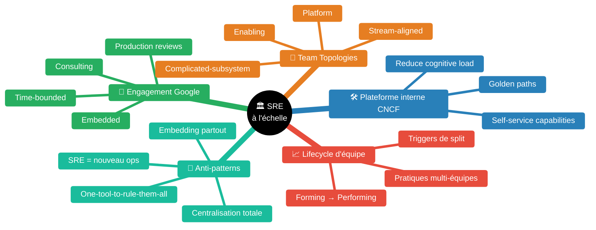
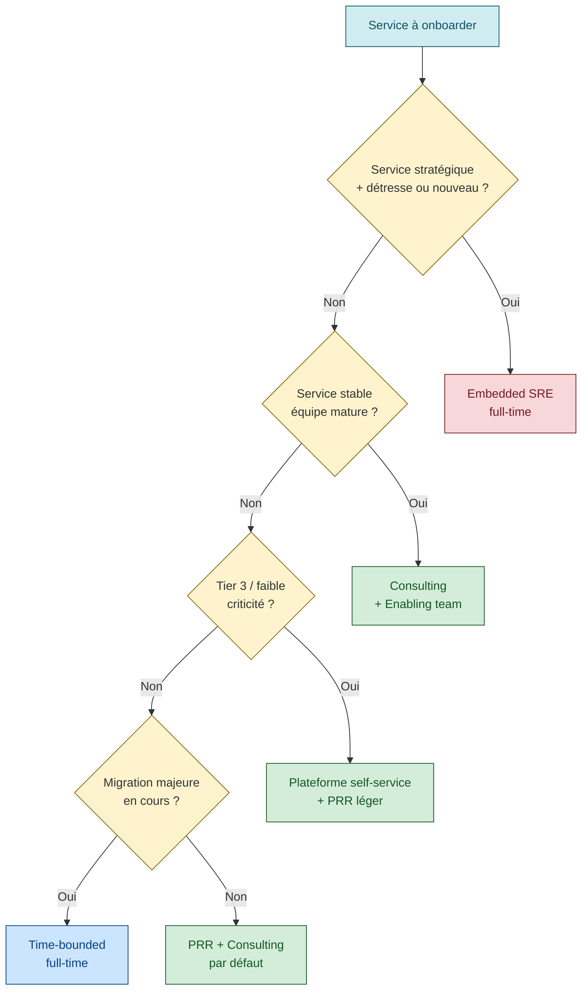
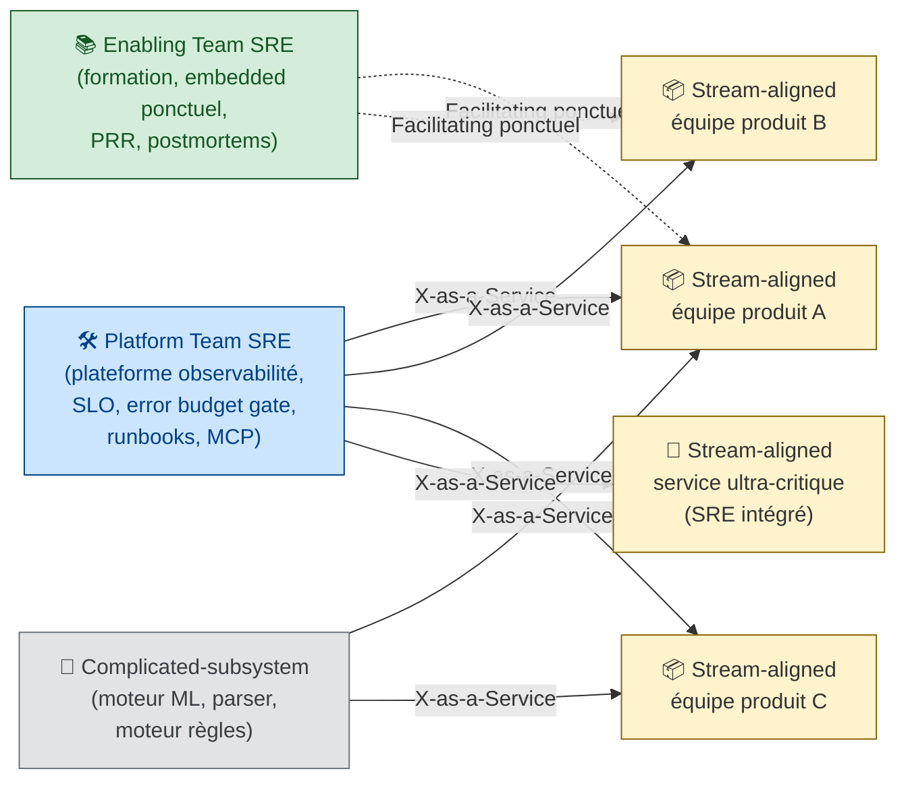

> *"Expect changes that come with scale: a service that begins as a relatively simple binary on a single machine may grow to have many obvious and nonobvious dependencies when deployed at a larger scale. Every order of magnitude in scale will reveal new bottlenecks — not just for your service, but for your dependencies as well."* [📖¹](https://queue.acm.org/detail.cfm?id=3096459 "Treynor, Dahlin, Rau, Beyer — The Calculus of Service Availability — section Plan for the future (ACM Queue march-april 2017, p. 17)")
>
> *En français* : **chaque ordre de grandeur en échelle révèle de nouveaux goulets** — pas seulement pour votre service, mais aussi pour ses dépendances. Le SRE artisanal (1 équipe, quelques services) ne se prolonge pas linéairement vers le SRE de masse (centaines d'équipes, milliers de services entremêlés). Il faut changer de modèle.

Skill construite à partir de sources officielles reconnues (Google SRE workbook, Team Topologies de Skelton & Pais, CNCF TAG App Delivery, articles ACM Queue) et de la doctrine SRE consolidée. Chaque pattern est associé à sa source via `[📖n]`. Les patterns non verbatim portent un `⚠️`.

## Pourquoi le SRE change de nature à l'échelle

Le SRE tel que décrit dans le SRE book Google (1 équipe SRE de ~10 personnes, 1 produit, ~10 services) ne se réplique pas tel quel quand on a :

- des **centaines d'équipes** produit
- des **milliers de services** dont la plupart sont entremêlés
- des **dépendances cross-équipe** majoritaires (un parcours utilisateur traverse 5 à 10 services possédés par 5 à 10 équipes différentes)
- des **outils hétérogènes** hérités (monitoring, alerting, déploiement) avec ancienneté variable

Trois forces structurelles font que la naïveté du modèle "1 équipe SRE par produit" se brise :

1. **Le ratio SRE/devs est borné**. Google travaille à `< 10 %` SRE/devs [📖²](https://sre.google/workbook/engagement-model/ "Google SRE workbook — Engagement Model, section Scaling SRE to Larger Environments"), avec un range observé de `1:5` à `1:50` [📖³](https://sre.google/workbook/team-lifecycles/ "Google SRE workbook — Team Lifecycles, section SRE Funding and Hiring"). À 1000 développeurs, on a 50 à 200 SRE — pas 1 SRE par service.
2. **Les dépendances explosent en `1/N`**. La règle correcte du Calculus dit que si un service a `N` dépendances critiques uniques, chacune contribue `1/N` à l'indisponibilité induite [📖⁴](https://queue.acm.org/detail.cfm?id=3096459 "Treynor, Dahlin, Rau, Beyer — The Calculus of Service Availability — section Clarifying the rule of the extra 9 for nested dependencies"). Avec `N=10`, chaque dépendance ne peut faillir que `1/10ᵉ` du service. À l'échelle d'une grande DSI, `N` devient grand vite.
3. **Conway's Law impose ses contraintes**. La structure d'équipe finit par dicter l'architecture [📖⁵](https://martinfowler.com/bliki/TeamTopologies.html "Martin Fowler bliki — Team Topologies (Skelton & Pais)"). Si on garde une structure d'équipes en silo, on aura une architecture en silo, peu importe la doctrine officielle.

> **🟢 Confiance 9/10** — Les trois forces sont directement étayées par les sources Google et Skelton & Pais. La synthèse en triade est une mise en relation didactique, pas un verbatim.

## Carte des modèles d'organisation SRE

| Pilier | Source canonique | Application typique |
|---|---|---|
| Engagement Google | [SRE workbook ch. 18](https://sre.google/workbook/engagement-model/) | Choisir comment SRE et devs travaillent ensemble |
| Team Topologies | [teamtopologies.com](https://teamtopologies.com/key-concepts) | Structurer la grammaire des équipes (4 types, 3 modes) |
| Plateforme CNCF | [CNCF Platforms WG](https://tag-app-delivery.cncf.io/whitepapers/platforms/) | Industrialiser les capacités SRE en self-service |
| Lifecycle d'équipe | [SRE workbook ch. 19](https://sre.google/workbook/team-lifecycles/) | Faire grandir, splitter, fédérer des équipes SRE |

## Modèles d'engagement (Google SRE workbook)

Google distingue plusieurs façons dont une équipe SRE peut s'engager auprès d'une équipe produit. Le choix dépend de la **bande passante SRE disponible**, de la **maturité du service**, et du **stade de son lifecycle**.

> *"We define the type of engagement based upon the SRE team's bandwidth."* [📖⁶](https://sre.google/workbook/engagement-model/ "Google SRE workbook — Engagement Model, section Setting Up the Relationship")
>
> *En français* : le **type d'engagement se définit en fonction de la bande passante SRE** disponible — pas de l'enthousiasme du produit ni de la séniorité de l'équipe.

### Embedded — full-time, hands-on

> *"For full-time engagements, we prefer to embed an SRE in a product development team."* [📖⁶](https://sre.google/workbook/engagement-model/ "Google SRE workbook — Engagement Model, section Setting Up the Relationship — NYT case study")
>
> *En français* : pour un engagement à temps plein, on **insère un SRE dans une équipe produit** — il code, configure, opère le service avec eux.

L'Embedded est le modèle le plus dense. Le SRE est traité comme membre de l'équipe produit (stand-up, sprint, on-call partagé). Il convient bien :
- aux **services nouveaux** (phase Architecture/Design ou Active Development du lifecycle)
- aux **services en grande détresse** (gros incidents, dette de fiabilité massive)
- aux **services stratégiques** où la perte de fiabilité a un coût direct

Limite : un SRE ne peut être embedded que dans **1 ou 2 équipes**. À 200 équipes produit, l'embedding pur est mathématiquement impossible.

### Consulting — part-time, conseil

Le SRE intervient sur des cycles courts, en mode atelier ou revue. Il **ne code pas** le service ; il aide l'équipe produit à se former, à choisir une architecture, à définir ses SLO.

Convient bien :
- aux **services en croisière** (GA depuis longtemps, fiabilité honorable)
- aux **services à faible criticité** (où on n'a pas le budget d'un SRE embedded)
- aux **équipes matures** qui peuvent absorber les pratiques SRE en autonomie

Le Consulting est le modèle qui **scale le mieux** : un SRE peut consulter sur 5 à 20 services en parallèle si les services sont bien découpés et l'équipe formée. C'est ce qui rapproche le Consulting d'un mode Enabling team de Team Topologies (cf. ci-dessous).

### Production Readiness Review (PRR) — engagement borné

Engagement par projet : "on regarde ton service avant la mise en prod, on dit oui/non/conditions, on s'engage à intervenir en cas de pépin pendant N semaines après lancement". L'équipe SRE ne **possède pas** le service à long terme — elle valide qu'il est *opérable*.

Le PRR est le canal d'**onboarding** typique d'un service vers une organisation SRE structurée. Il fait office de gate de qualité opérationnelle (cf. [`operational-readiness-review.md`](operational-readiness-review.md)).

### Quand utiliser quel modèle — règle de bande passante

| Situation | Modèle conseillé | Justification |
|---|---|---|
| Service stratégique en détresse | Embedded full-time | Hands-on requis |
| Nouveau service critique avant GA | Embedded → Consulting | Embedded pendant build, transfert à l'équipe |
| Service stable depuis 2 ans | Consulting | Équipe formée, budget SRE rare ailleurs |
| Service tier 3 (faible criticité) | Self-service via plateforme | Pas de SRE dédié — outillage suffit |
| Onboarding d'un nouveau service | PRR puis Consulting | Gate opérationnel + accompagnement |
| Migration majeure (ex. cloud, K8s) | Time-bounded full-time | Engagement projet borné |

> **🟢 Confiance 8/10** — Tableau aligné sur la doctrine du workbook ch. 18 ; la ligne "tier 3 → self-service" reformule la règle "scaling limited SRE resources" et reflète la pratique CNCF Platform Engineering. Confiance plus haute pour les 5 premières lignes, plus basse pour la dernière.

### Lifecycle de service et niveaux d'engagement

Le workbook ch. 18 définit 7 phases de lifecycle [📖⁷](https://sre.google/workbook/engagement-model/ "Google SRE workbook — Engagement Model, section The Service Lifecycle") :

1. Architecture and Design
2. Active Development
3. Limited Availability
4. General Availability
5. Deprecation
6. Abandoned
7. Unsupported

Le niveau d'engagement SRE varie selon la phase : faible en Architecture/Design (revues ponctuelles), maximal en Limited Availability (le service apprend la prod), décroissant après GA stable, puis remontée si le service entre en Deprecation (besoin de dérouler proprement).

> ⚠️ La courbe d'engagement *en cloche* est la lecture standard du chapitre, mais le workbook l'illustre par une figure 18-1 plutôt que par une équation — la formulation "en cloche" est didactique.

## Conditions du *one SRE team supporting many services*

Le workbook donne une condition explicite pour qu'**une seule équipe SRE puisse supporter plusieurs services** [📖⁸](https://sre.google/workbook/engagement-model/ "Google SRE workbook — Engagement Model, section Supporting Multiple Services with a Single SRE Team") :

> *"you can scale limited SRE resources to many services if those services have the following characteristics: Services are part of a single product... Services are built on similar tech stacks... Services are built by the same developer team or a small number of related developer teams"*
>
> *En français* : on peut **mutualiser une équipe SRE** sur plusieurs services si ces services partagent un produit, des stacks similaires, et un petit nombre d'équipes de dev. Sinon la mutualisation devient une dilution.

Implication à l'échelle d'une grande DSI : **n'essayez pas de mutualiser une équipe SRE sur des services hétérogènes possédés par des équipes sans lien**. Le coût cognitif et politique annule le gain de mutualisation. Il vaut mieux investir dans une **plateforme self-service** (cf. CNCF ci-dessous) qui sert tous les services hétérogènes via des capacités industrialisées.

## Lifecycle d'une équipe SRE (workbook ch. 19)

Le workbook applique le modèle Tuckman aux équipes SRE [📖⁹](https://sre.google/workbook/team-lifecycles/ "Google SRE workbook — Team Lifecycles, sections Forming/Storming/Norming/Performing") :

1. **Forming** — équipe se constitue, méthodes émergent
2. **Storming** — frictions internes, calibrage des rôles
3. **Norming** — pratiques stabilisées, on-call rodé
4. **Performing** — équipe efficace, partenariat architecture, charge auto-régulée

### Triggers de split d'équipe SRE

> *"Service complexity / SRE rollout / Geographically split"* [📖¹⁰](https://sre.google/workbook/team-lifecycles/ "Google SRE workbook — Team Lifecycles, section Making More SRE Teams")
>
> *En français* : on splitte une équipe SRE pour **trois raisons** : la complexité du service explose, on déploie le SRE dans une nouvelle partie de l'organisation, ou on cherche une couverture géographique (follow-the-sun).

Le workbook insiste sur le fait qu'une équipe trop large devient inefficace : la communication interne explose et le sentiment d'appartenance se dilue. À ~10-12 personnes, splitter — c'est la même borne que les *two-pizza teams* d'Amazon.

### Pratiques pour orchestrer plusieurs équipes SRE

Le workbook cite plusieurs pratiques pour faire vivre une **organisation SRE multi-équipes** [📖¹¹](https://sre.google/workbook/team-lifecycles/ "Google SRE workbook — Team Lifecycles, section Suggested Practices for Running Many Teams") :

| Pratique | Rôle |
|---|---|
| **Mission Control** | Programme d'immersion : un SRE va vivre dans une autre équipe SRE pendant 3-6 mois |
| **SRE Exchange** | Échange régulier de talks et de patterns entre équipes |
| **Training** | Cursus commun (production excellence, on-call, postmortem) |
| **Horizontal Projects** | Projets transverses portés par un sous-groupe inter-équipes |
| **SRE Mobility** | Possibilité de changer d'équipe tous les 18-24 mois |
| **Travel** | Budget pour visites inter-sites |
| **Launch Coordination Engineering** | Équipe horizontale dédiée aux lancements (PRR à l'échelle) |
| **Production Excellence** | Forum de partage des bonnes pratiques de production |

> **🟢 Confiance 9/10** — Tableau directement extrait de la section *Suggested Practices for Running Many Teams* du workbook. Aucune interprétation.

## Team Topologies — la grammaire des équipes (Skelton & Pais)

Là où le workbook Google parle d'engagement entre SRE et devs, *Team Topologies* (Matthew Skelton et Manuel Pais, 2019) donne la **grammaire complète des équipes** dans une organisation tech moderne. C'est le langage standard côté Platform Engineering, repris par CNCF, Atlassian, AWS Well-Architected DevOps Guidance, IT Revolution.

> *"The primary kind of team in this framework is the stream-aligned team, a Business Capability Centric team that is responsible for software for a single business capability."* [📖¹²](https://martinfowler.com/bliki/TeamTopologies.html "Martin Fowler bliki — Team Topologies, section The Four Team Types")
>
> *En français* : le **type d'équipe primaire** est l'équipe alignée sur un flux de valeur — elle possède de bout en bout une capacité métier (front, back, base, déploiement, monitoring).

### Les 4 types fondamentaux

| Type | Rôle | Exemples typiques |
|---|---|---|
| **Stream-aligned team** | Possède un flux de valeur métier de bout en bout. Full-stack, full-lifecycle. C'est le **type majoritaire** (~80 % des équipes dans une org saine). | Équipe produit qui possède un produit ou un domaine métier de bout en bout |
| **Platform team** | Construit une plateforme **self-service** (APIs, CLIs, golden paths) pour réduire la charge cognitive des stream-aligned. | Équipe qui livre des operators K8s ; équipe qui livre un broker de secrets ; équipe SRE qui livre une plateforme de fiabilité (observabilité, SLO, error budget gate) en self-service |
| **Enabling team** | **Coache** les stream-aligned sur une compétence rare (perf, sécurité, archi, SRE). Itinérant, à durée limitée. | Équipe SRE centrale en mode embedded ponctuel ; experts perf qui aident une équipe à passer un cap |
| **Complicated-Subsystem team** | Possède un sous-système **complexe** qui ne mérite pas d'être dans toutes les têtes (ex : moteur ML, codec, parser financier). | Équipe sur un moteur de règles métier complexe ; équipe sur un module cryptographique ou un moteur ML ; équipe sécurité qui possède un sous-système d'auth |

> *"complicated-subsystem team. The goal of a complicated-subsystem team is to reduce the cognitive load of the stream-aligned teams that use that complicated subsystem"* [📖¹²](https://martinfowler.com/bliki/TeamTopologies.html "Martin Fowler bliki — Team Topologies, section Complicated-Subsystem Team")
>
> *En français* : le but d'une équipe sous-système complexe est de **réduire la charge cognitive** des stream-aligned qui consomment ce sous-système.

### Les 3 modes d'interaction

| Mode | Quand | Exemple |
|---|---|---|
| **X-as-a-Service** | Mode par défaut entre Platform et Stream-aligned : la plateforme expose une API self-service, le client la consomme sans dépendre d'un humain. | Une équipe d'infrastructure expose un operator K8s ; une équipe produit le consomme via un simple manifest |
| **Collaboration** | Phase courte et intense, en début de relation ou pour défricher un sujet flou. **Doit être borné** sinon la dépendance perdure. | SRE embedded pendant 3 mois pour cadrer les SLO et les runbooks |
| **Facilitating** | Mode propre aux Enabling teams : on coache, on transmet, on s'efface. | Une équipe SRE centrale forme une équipe produit à un outil SLO (Pyrra, Sloth…), puis se retire |

> **🟢 Confiance 9/10** — Définitions issues directement de Skelton & Pais via Martin Fowler bliki. Les exemples typiques sont des projections didactiques (à adapter à chaque organisation).

### La contrainte fondatrice : la charge cognitive

> *"A crucial insight of Team Topologies is that the primary benefit of a platform is to reduce the cognitive load on stream-aligned teams"* [📖¹²](https://martinfowler.com/bliki/TeamTopologies.html "Martin Fowler bliki — Team Topologies, central insight")
>
> *En français* : l'**apport central** d'une plateforme, ce n'est pas la performance ni le coût — c'est de **soulager la charge cognitive** des équipes stream-aligned. Tout le reste découle de là.

Conséquence opérationnelle : si la plateforme alourdit la charge cognitive de ses utilisateurs (configuration verbeuse, multiples couches, ergonomie défaillante), elle a échoué — peu importe ses qualités techniques.

### Conway's Law — l'architecture suit l'organisation

> *"Team Topologies is designed explicitly recognizing the influence of Conway's Law"* [📖¹²](https://martinfowler.com/bliki/TeamTopologies.html "Martin Fowler bliki — Team Topologies, section Conway's Law")
>
> *En français* : la structure des équipes va **finir par dessiner** l'architecture du système — peu importe la doctrine officielle. Donc on choisit la structure d'équipes en pensant à l'architecture qu'on veut obtenir, pas l'inverse.

À l'échelle d'une grande DSI : si on veut une architecture en chaîne de valeur cohérente, il faut des équipes alignées sur ces chaînes. Si on a 200 équipes en silo, on aura un système en 200 silos, **même avec une couche d'intégration au-dessus**.

## Articulation SRE × Team Topologies

Le SRE n'est **pas un type d'équipe Team Topologies à lui seul** — c'est une fonction qui peut s'incarner dans **plusieurs types** :

| Mission SRE | Type Team Topologies | Mode |
|---|---|---|
| Équipe SRE centrale qui coache les équipes produit sur leurs SLO | **Enabling team** | Facilitating |
| Équipe SRE qui livre une plateforme de fiabilité (observabilité, SLO controller, runbooks via MCP, error budget gate) | **Platform team** | X-as-a-Service |
| SRE embedded full-time dans une équipe produit critique | Membre d'une **Stream-aligned team** | Collaboration interne |
| Équipe SRE dédiée à un service ultra-critique (paiement, auth) | **Stream-aligned team** spécialisée | X-as-a-Service vis-à-vis des consommateurs |

Implication forte : **arrêter de considérer "le SRE" comme un seul type d'équipe**. Selon le besoin, c'est de l'enabling, du platform, ou de l'embedded — et c'est souvent **les trois en parallèle** dans une grande DSI.

> **🟡 Confiance 6/10** — Articulation cohérente avec Skelton & Pais et Google workbook, mais c'est une lecture croisée des deux corpus. Pas un mapping officiellement publié par les deux camps.

## Plateforme interne (CNCF Platforms WG)

Le CNCF TAG App Delivery a publié en 2023 (mis à jour 2024-2025) un *whitepaper* [📖¹³](https://tag-app-delivery.cncf.io/whitepapers/platforms/ "CNCF TAG App Delivery — Platforms White Paper") qui pose la définition de référence d'une plateforme cloud-native interne.

> *"A platform for cloud-native computing is an integrated collection of capabilities defined and presented according to the needs of the platform's users."* [📖¹³](https://tag-app-delivery.cncf.io/whitepapers/platforms/ "CNCF TAG App Delivery — Platforms White Paper, section What is a platform")
>
> *En français* : une **plateforme** est une collection intégrée de **capacités** présentées selon les besoins de ses utilisateurs (les équipes produit) — pas selon la commodité de l'équipe plateforme.

### Pourquoi une plateforme à l'échelle

> *"Reduce the cognitive load on product teams and thereby accelerate product development and delivery"* [📖¹⁴](https://tag-app-delivery.cncf.io/whitepapers/platforms/ "CNCF Platforms — Why platforms?, bullet 1")
>
> *"Improve reliability and resiliency of products relying on platform capabilities by dedicating experts to configure and manage them"* [📖¹⁴](https://tag-app-delivery.cncf.io/whitepapers/platforms/ "CNCF Platforms — Why platforms?, bullet 2")
>
> *En français* : la plateforme **réduit la charge cognitive** des équipes produit et **améliore la fiabilité** en mutualisant des experts qui configurent les capacités à leur place.

C'est la **réponse industrielle au problème de mutualisation** posé par le workbook : on ne peut pas mutualiser une équipe SRE sur des services hétérogènes, mais on peut industrialiser des **capacités SRE** consommables en self-service par tout le monde.

### Capacités attendues d'une plateforme (CNCF, 13 capacités)

> *"Web portals... APIs (and CLIs)... Golden path templates... Automation for building and testing... Automation for delivering... Development environments... Observability... Infrastructure services... Data services... Messaging and event services... Identity and secret management... Security services... Artifact storage"* [📖¹⁵](https://tag-app-delivery.cncf.io/whitepapers/platforms/ "CNCF Platforms — Capabilities of platforms, full list")
>
> *En français* : 13 capacités attendues d'une plateforme mature — du portail web aux *golden paths*, de l'observabilité au stockage d'artefacts.

Pour le SRE en particulier, les capacités centrales sont :

- **Observability** : instrumentation, dashboards, traces, métriques exposées en self-service
- **Golden path templates** : templates de manifests SLO, runbooks, postmortems
- **Automation for delivering and verifying** : gates de déploiement (error budget gate), rollouts canary, smoke tests post-deploy

C'est exactement la promesse d'une **plateforme SRE interne** : industrialiser ces capacités en self-service consommable par toutes les équipes produit, à l'échelle de la DSI.

### Ce qu'une équipe plateforme **ne doit pas** faire

> *"A platform team doesn't necessarily run compute, network, storage or other services."* [📖¹⁶](https://tag-app-delivery.cncf.io/whitepapers/platforms/ "CNCF Platforms — Attributes of platform teams, what platform teams should NOT do")
>
> *En français* : une équipe plateforme ne **fait pas tourner** elle-même le compute / réseau / stockage. Elle fait tourner les **interfaces** (APIs, GUI, CLI) qui les rendent consommables.

Anti-pattern fréquent : l'équipe plateforme finit par opérer elle-même tous les serveurs des autres équipes — elle devient le nouveau goulot. La règle : la plateforme **expose**, l'équipe utilisatrice **opère** son service via la plateforme.

## Consume vs Build — la frontière de la Platform team

La Platform team SRE livre des **capacités**, pas des constructions. Le pattern *Consume vs Build* précise cette frontière : pour chaque besoin technique, l'équipe Platform doit choisir explicitement entre :

- **Build** — construire elle-même la capacité (ex. développer un serveur MCP interne, un wrapper d'agrégation, un format pivot inter-outils)
- **Consume** — consommer une capacité produite par une autre équipe (ex. analyse canary produite par l'équipe plateforme cloud-native, panorama Dynatrace produit par l'équipe APM, runbooks indexés depuis Confluence des équipes métier)

À l'échelle, **consume domine** pour 3 raisons :

1. **Ratio SRE/devs borné** (cf. §1) — la Platform team SRE ne peut pas tout construire, elle doit déléguer la production de certaines capacités à des équipes spécialisées
2. **Compétences réparties** — l'équipe APM, l'équipe cloud-native, l'équipe sécurité ont des expertises que la Platform team SRE n'a pas (et ne doit pas avoir, pour rester focus)
3. **Frontières organisationnelles** — l'équipe plateforme cloud-native possède la stack de canary, l'équipe APM possède l'observabilité, l'équipe sécurité possède la gestion des secrets. Vouloir construire en doublon = conflit politique + duplication d'effort

### Critères de décision Build vs Consume

| Critère | Build | Consume |
|---|---|---|
| Capacité **cœur métier** Platform team SRE (ex. SLO, error budget, postmortem) | ✅ Build | ❌ |
| Capacité **adjacente** mais hors cœur (ex. canary, APM, secrets) | ❌ | ✅ Consume |
| Capacité existe-t-elle déjà dans une autre équipe ? | Si non = Build | Si oui = Consume |
| Spec d'interconnexion existe-t-elle ? (CRD, API, MCP) | Build si manque | Consume si dispo |
| Risque de fragmentation organisationnelle si on construit en doublon | Faible (justifie Build) | Élevé (interdit Build) |

### Anti-patterns à proscrire (Consume vs Build)

| Anti-pattern | Symptôme | Conséquence | Pattern correct |
|---|---|---|---|
| **Build everything** | Platform team qui veut tout construire — son propre canary, son propre APM, son propre alerting | Effort impossible, fragmentation, conflit avec les équipes spécialisées | Consume + spec d'interconnexion (cf. [`multi-vendor-abstraction.md`](multi-vendor-abstraction.md)) |
| **Consume everything** | Platform team qui ne fournit rien de propre, juste des wrappers | Perte de valeur ajoutée, équipe inutile à terme | Build le cœur, Consume l'adjacent |
| **Build sans interface** | Capacité construite sans abstraction → couplage fort à un vendor | Migration impossible | Toujours définir une interface uniforme (cf. multi-vendor-abstraction) |
| **Consume sans contrat** | Consommer une capacité d'une autre équipe sans contrat clair (SLA, on-call, escalade) | Dépendance fragile, risque opérationnel | Charte d'engagement entre équipes |

### Implication pour le pattern *« mode consommation »*

Quand une Platform team SRE **consomme** une capacité d'une autre équipe (par exemple : analyse canary, données APM, postmortems Confluence), elle doit :

1. **Définir une interface uniforme côté client** — pour ne pas se coupler au vendor/équipe productrice (pattern [`multi-vendor-abstraction.md`](multi-vendor-abstraction.md))
2. **Indexer ou consommer plutôt que recréer** — quand il s'agit de connaissance (runbooks, postmortems, guides), pattern [`knowledge-indexing-strategy.md`](knowledge-indexing-strategy.md)
3. **Établir un contrat d'engagement** avec l'équipe productrice (qui sert quoi, à quel SLA, avec quelle escalade)
4. **Ne pas modifier la capacité produite** — la Platform team consomme, ne contribue pas (sauf via inner sourcing explicite)

Ce pattern Consume est cohérent avec la doctrine Team Topologies : la Platform team est en mode **X-as-a-Service** vis-à-vis de ses utilisateurs, et en mode **Consumer-of-Services** vis-à-vis des équipes adjacentes spécialisées.

> **🟢 Confiance 8/10** — Pattern Consume vs Build dérivé directement de Team Topologies (Platform team mode X-as-a-Service avec ses consommateurs, mais aussi consommatrice d'autres équipes spécialisées). Critères de décision communautaires consensuels — pas de source verbatim unique mais alignés sur la doctrine CNCF Platform Engineering Maturity Model.

## Anti-patterns à l'échelle

Patterns qu'on observe dans les grandes DSI et qui cassent le SRE à l'échelle :

| Anti-pattern | Symptôme | Conséquence | Pattern de remplacement |
|---|---|---|---|
| **"SRE = nouveau nom pour ops"** | Renommage de l'équipe ops, pas de changement de pratiques | Aucun progrès de fiabilité, démotivation | Embedded + objectifs SLO partagés avec dev |
| **Embedding partout** | On promet 1 SRE par équipe à 200 équipes | Impossibilité physique, dilution, surengagement | Mix Embedded (top services) + Platform (le reste) |
| **Centralisation totale** | Toute l'expertise SRE dans 1 équipe centrale qui filtre tout | Goulet, déconnexion du métier, frustration équipes | Enabling teams + Platform team + SRE locaux |
| **"Throw it over the wall"** | Dev jette le code à SRE qui découvre la prod au moment du go-live | Incidents, blame, dette opérationnelle | PRR + SLO partagés + on-call rotation mixte |
| **One-tool-to-rule-them-all** | "Tous les services doivent migrer sur l'outil X dans 6 mois" | Rejet, contournements, double système permanent | Migration par tier + opt-in + dual-run (cf. [`alerting-consolidation-strategy.md`](alerting-consolidation-strategy.md)) |
| **SLO inflation** | Tout le monde demande 99.99% pour ne pas se faire engueuler | Budgets épuisés en permanence, gates qui bloquent toujours | SLO calibré sur CUJ réel + tier de criticité explicite |
| **Plateforme sans utilisateurs** | L'équipe plateforme construit ce qu'elle trouve cool, pas ce dont les équipes ont besoin | Outils élégants mais ignorés, ROI négatif | Platform-as-a-product : roadmap pilotée par les besoins utilisateur (cf. CNCF *Platform Engineering Maturity Model*) |
| **SRE sans error budget** | On parle SLO mais aucune politique de freeze quand le budget est épuisé | Le SLO devient cosmétique | Politique de gate écrite, comprise, appliquée [📖¹⁷](https://queue.acm.org/detail.cfm?id=3096459 "Treynor et al. — Calculus of Service Availability, section Error Budgets") |
| **Plateforme qui exécute** | L'équipe plateforme finit par opérer le compute/storage des autres | Goulot, perte du modèle self-service | Plateforme expose les interfaces, l'équipe utilisatrice opère son service [📖¹⁶](https://tag-app-delivery.cncf.io/whitepapers/platforms/ "CNCF Platforms — Attributes of platform teams") |

> **🟢 Confiance 8/10** — 7 anti-patterns sur 9 sont sourcés directement (CNCF, Calculus, workbook). 2 (SLO inflation, embedding partout) sont des patterns communautaires consolidés mais non strictement verbatim.

## Comment choisir son modèle d'engagement — arbre de décision

| Modèle | Bandwidth SRE | Durabilité | Quand |
|---|---|---|---|
| **Embedded** | Élevée (1 SRE = 1-2 services) | Court terme (3-12 mois) | Détresse, nouveau service critique |
| **Consulting** | Moyenne (1 SRE = 5-20 services) | Long terme | Service stable, équipe formée |
| **Self-service plateforme** | Très faible (1 SRE = 100+ services) | Très long terme | Tier 3, services nombreux et homogènes |
| **Time-bounded** | Élevée mais bornée | Quelques mois | Migration ponctuelle |
| **PRR + Consulting** | Faible | Long terme | Onboarding standard |

## Combiner les modèles à l'échelle d'une grande DSI

Aucun modèle ne suffit seul. À l'échelle d'une grande organisation tech avec des centaines d'équipes :

Lecture : la **Platform Team SRE** sert tout le monde via X-as-a-Service ; l'**Enabling Team SRE** intervient ponctuellement pour coacher ; les **services ultra-critiques** ont du SRE intégré stream-aligned ; les **sous-systèmes complexes** sont possédés par leurs équipes dédiées.

C'est l'architecture cible typique d'une organisation SRE à l'échelle : Platform team qui livre la plateforme + Enabling team qui forme + ponctuellement Embedded sur les services au plus haut tier.

## Glossaire

| Terme | Définition courte |
|---|---|
| **CRE (Customer Reliability Engineering)** | Modèle Google où une équipe SRE accompagne des **clients externes** dans l'adoption des pratiques SRE. À l'échelle interne d'une DSI, équivaut à *Enabling Team SRE*. |
| **Cognitive load** | Charge mentale qu'une équipe peut soutenir. Limitée. La plateforme existe pour la réduire chez les stream-aligned. |
| **Enabling team** | Équipe qui coache d'autres équipes sur une compétence rare. Itinérante, à durée bornée. Mode *Facilitating*. |
| **Engagement model** | Façon dont SRE et devs travaillent ensemble : Embedded / Consulting / Time-bounded / PRR. |
| **Golden path** | Chemin recommandé, outillé, documenté pour réaliser une tâche standard (déployer un service, ajouter un SLO). Évite que chaque équipe réinvente la roue. |
| **Internal Developer Platform (IDP)** | Plateforme self-service pour les développeurs internes. Synonyme du *platform* CNCF. |
| **Mission Control** | Programme Google d'immersion SRE inter-équipes. |
| **PRR (Production Readiness Review)** | Revue d'opérabilité avant mise en prod. Gate de qualité. |
| **Stream-aligned team** | Équipe alignée sur un flux de valeur métier de bout en bout. Type majoritaire dans une org saine. |
| **X-as-a-Service** | Mode d'interaction où une équipe consomme une capacité d'une autre via une API self-service, sans dépendance humaine. |

## Bibliothèque exhaustive des sources

### Google SRE — engagement et lifecycle
- [📖] *SRE workbook ch. 18 — Engagement Model* — https://sre.google/workbook/engagement-model/ — Lifecycle d'un service en 7 phases, modèles Embedded/Consulting, NYT case study, ratio SRE/devs < 10%, conditions pour mutualiser une équipe SRE
- [📖] *SRE workbook ch. 19 — Team Lifecycles* — https://sre.google/workbook/team-lifecycles/ — Tuckman appliqué aux équipes SRE, ratio 1:5 à 1:50, triggers de split, pratiques multi-équipes (Mission Control, SRE Exchange…)
- [📖] *SRE workbook — Index* — https://sre.google/workbook/index/ — Index complet du workbook
- [📖] *Google Cloud Blog — How SRE teams are organized* — https://cloud.google.com/blog/products/devops-sre/how-sre-teams-are-organized-and-how-to-get-started — Synthèse pratique des modèles d'organisation
- [📖] *Google SRE Resources — Practices and Processes* — https://sre.google/resources/practices-and-processes/ — Bibliographie pratique

### Calcul de fiabilité et dépendances
- [📖] Treynor, Dahlin, Rau, Beyer (2017), *The Calculus of Service Availability*, ACM Queue march-april 2017, p. 49-66 — https://queue.acm.org/detail.cfm?id=3096459 *(PDF officiel : https://sre.google/static/pdf/calculus_of.pdf)* — Règle du 9 supplémentaire, formule 1/N pour dépendances multiples, "every order of magnitude reveals new bottlenecks", stratégies de mitigation (failing safe/open/closed, fallback, isolation géographique, async)
- [📖] CACM mirror — *The Calculus of Service Availability* — https://cacm.acm.org/practice/the-calculus-of-service-availability/ — Mirror Communications of the ACM (sept 2017)

### Team Topologies
- [📖] Skelton, M. & Pais, M. (2019), *Team Topologies*, IT Revolution Press — https://teamtopologies.com — Site officiel avec key concepts, 4 types, 3 modes
- [📖] Martin Fowler — *Team Topologies (bliki)* — https://martinfowler.com/bliki/TeamTopologies.html — Synthèse Fowler des 4 types et 3 modes, rappel Conway's Law
- [📖] IT Revolution — *The Four Team Types from Team Topologies* — https://itrevolution.com/articles/four-team-types/ — Définitions par l'éditeur du livre
- [📖] AWS Well-Architected — DevOps Guidance, *Organize teams into distinct topology types* — https://docs.aws.amazon.com/wellarchitected/latest/devops-guidance/oa.std.1-organize-teams-into-distinct-topology-types-to-optimize-the-value-stream.html — Adoption AWS du framework

### CNCF Platform Engineering
- [📖] CNCF TAG App Delivery — *Platforms White Paper* — https://tag-app-delivery.cncf.io/whitepapers/platforms/ — Définition de référence d'une plateforme cloud-native, 13 capacités, attributs des équipes plateforme
- [📖] CNCF TAG App Delivery — *Platform Engineering Maturity Model* — https://tag-app-delivery.cncf.io/whitepapers/platform-eng-maturity-model/ — Niveaux de maturité de l'équipe plateforme

### Sources adjacentes utiles
- [📖] Beyer, Jones, Petoff, Murphy (2016), *Site Reliability Engineering: How Google Runs Production Systems*, O'Reilly — https://sre.google/sre-book/table-of-contents/ — Le SRE book, fondateur
- [📖] Beyer, Murphy, Rensin, Kawahara, Thorne (2018), *The Site Reliability Workbook*, O'Reilly — https://sre.google/workbook/table-of-contents/ — Les chapitres ci-dessus + études de cas

## Conventions de sourcing

- `[📖n](url "tooltip")` — Citation **vérifiée verbatim** via WebFetch / lecture directe des sources
- `⚠️` — Reformulation pédagogique ou pattern consensuel non cité verbatim
- 🚨 — Non utilisé ici (signalerait une assertion non vérifiable, à retirer)

Notes de confiance par solution : 🟢 9-10 (verbatim) / 🟢 7-8 (reformulation fidèle) / 🟡 5-6 (choix défendable) / 🟠 3-4 (choix d'équipe) / 🔴 1-2 (à challenger).

## Liens internes KB

- [`critical-user-journeys.md`](critical-user-journeys.md) — CUJ qui informent les SLO d'un service, et leur extension transverse (cf. [`journey-slos-cross-service.md`](journey-slos-cross-service.md))
- [`journey-slos-cross-service.md`](journey-slos-cross-service.md) — Composition de SLO sur des chaînes de services et ownership multi-équipes
- [`alerting-consolidation-strategy.md`](alerting-consolidation-strategy.md) — Migration et consolidation du paysage d'alerting à l'échelle
- [`sli-slo-sla.md`](sli-slo-sla.md) — Bases SLI/SLO/SLA
- [`error-budget.md`](error-budget.md) — Mécanique de l'error budget
- [`monitoring-alerting.md`](monitoring-alerting.md) — Philosophie d'alerting Google
- [`oncall-practices.md`](oncall-practices.md) — Pratiques d'astreinte
- [`operational-readiness-review.md`](operational-readiness-review.md) — Production Readiness Review
- [`toil.md`](toil.md) — Mesure et réduction du toil
