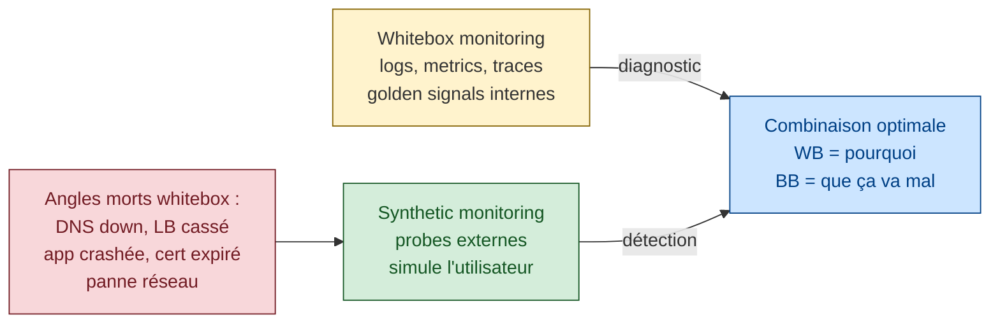
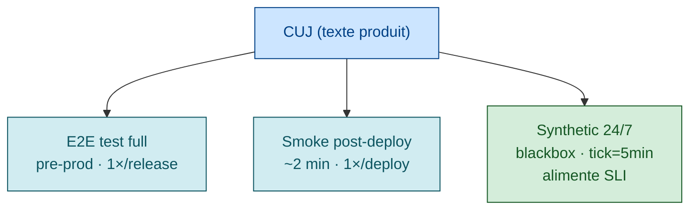

# Synthetic monitoring — détecter avant l'utilisateur

> **Sources primaires** :
> - Google SRE book ch. 10, [*Practical Alerting from Time-Series Data*](https://sre.google/sre-book/practical-alerting/ "Google SRE book ch. 10 — Practical Alerting from Time-Series Data") — sections *Black-Box Monitoring* et *Prober*
> - Google SRE book ch. 6, [*Monitoring Distributed Systems*](https://sre.google/sre-book/monitoring-distributed-systems/ "Google SRE book ch. 6 — Monitoring Distributed Systems")
> - [Datadog Synthetic Monitoring docs](https://docs.datadoghq.com/synthetics/)
> - [AWS CloudWatch Synthetics docs](https://docs.aws.amazon.com/AmazonCloudWatch/latest/monitoring/CloudWatch_Synthetics_Canaries.html "AWS CloudWatch Synthetics — canaries (synthetic monitoring managé)")
> - [Microsoft Azure Monitor — Application Insights Availability tests](https://learn.microsoft.com/en-us/azure/azure-monitor/app/availability-overview "Microsoft Azure Monitor — Application Insights availability tests")
> - [Checkly docs](https://docs.checklyhq.com/)

## Définition

> *"Black-box monitoring is testing externally visible behavior as a user would see it."* [📖¹](https://sre.google/sre-book/monitoring-distributed-systems/#xref_monitoring_white-box "Google SRE book ch. 6 — Monitoring, section Black-Box vs White-Box")
>
> *En français* : le **blackbox monitoring** teste le comportement **visible depuis l'extérieur**, tel qu'un utilisateur le vivrait.



Le **synthetic monitoring** (ou *blackbox monitoring* dans le vocabulaire Google) consiste à exécuter en continu des **scripts qui simulent un utilisateur** depuis un point d'observation **externe** au système, pour mesurer ce qu'il vit en réalité.

### Pourquoi pas seulement du monitoring serveur ?

> *"You only see the queries that arrive at the target; the queries that never make it due to a DNS error are invisible, while queries lost due to a server crash never make a sound."* [📖²](https://sre.google/sre-book/practical-alerting/ "Google SRE book ch. 10 — Practical Alerting from Time-Series Data")
>
> *En français* : vous ne voyez que les requêtes qui **arrivent** au serveur. Celles tuées par un DNS en rade sont invisibles, et celles perdues quand un serveur crashe ne font aucun bruit.

C'est l'argument fondamental :

| Type | Capture | Manque |
|------|---------|--------|
| **Whitebox** (logs, metrics serveur) | Détails internes, traces, golden signals | DNS down, LB cassé, app crashée, panne réseau, certificat expiré, region down |
| **RUM** (Real User Monitoring) | L'expérience réelle des utilisateurs présents | N'agit que **après** que les utilisateurs aient déjà été impactés |
| **Synthetic** | Vue utilisateur **proactive**, depuis n'importe où dans le monde | Ne capture pas les bugs liés à du contenu user-specific |

**La combinaison** : whitebox pour le diagnostic, RUM pour la vérité statistique des utilisateurs réels, synthetic pour la **détection proactive** et la mesure des SLI de disponibilité.

> ⚠️ **Tableau comparatif WB/RUM/Synthetic** — consolidation pédagogique cohérente avec les sources (SRE book ch. 10 + AWS/Datadog best practices). Pas un tableau unique dans une source Google.

## Types de canaries

### 1. HTTP/API canary (single request)

Le plus simple. Une requête HTTP, une assertion sur la réponse.

```js
// Exemple Datadog Synthetic API test (configuration JSON)
{
  "name": "API Health — /health endpoint",
  "type": "api",
  "subtype": "http",
  "config": {
    "request": {
      "method": "GET",
      "url": "https://api.example.com/health",
      "timeout": 30
    },
    "assertions": [
      { "type": "statusCode", "operator": "is", "target": 200 },
      { "type": "responseTime", "operator": "lessThan", "target": 1000 },
      { "type": "body", "operator": "contains", "target": "\"status\":\"UP\"" }
    ]
  },
  "locations": ["aws:eu-west-1", "aws:us-east-1", "aws:ap-southeast-1"],
  "options": {
    "tick_every": 60
  }
}
```

*Format conforme à [Datadog Synthetic API tests — Configuration reference](https://docs.datadoghq.com/synthetics/api_tests/http_tests/).*

**Quand l'utiliser** :
- Endpoints critiques côté API
- Healthcheck blackbox
- Validation de certificat SSL (assertion sur la chaîne)

**Limites** :
- Ne valide pas un parcours multi-step
- Ne valide pas le JS / le rendering frontend

### 2. Multi-step API canary

Une séquence d'appels avec extraction de variables et chaînage.

```js
// Exemple Datadog multi-step
{
  "type": "api",
  "subtype": "multi",
  "steps": [
    {
      "name": "Login",
      "request": {
        "method": "POST",
        "url": "https://api.example.com/login",
        "body": "{\"email\":\"smoke@test.com\",\"password\":\"...\"}"
      },
      "extractedValues": [
        { "name": "TOKEN", "type": "json_path", "field": "$.token" }
      ],
      "assertions": [
        { "type": "statusCode", "operator": "is", "target": 200 }
      ]
    },
    {
      "name": "Get profile",
      "request": {
        "method": "GET",
        "url": "https://api.example.com/me",
        "headers": { "Authorization": "Bearer {{ TOKEN }}" }
      },
      "assertions": [
        { "type": "statusCode", "operator": "is", "target": 200 },
        { "type": "body", "operator": "contains", "target": "\"email\":\"smoke@test.com\"" }
      ]
    }
  ]
}
```

*Structure conforme à [Datadog Multistep API tests](https://docs.datadoghq.com/synthetics/multistep/).*

**Quand l'utiliser** :
- CUJ end-to-end côté API (login → action → vérification)
- Workflows métier (créer panier → checkout → confirmation)
- Validation de la persistence des données entre étapes

### 3. Browser canary / UI canary

Script Playwright/Puppeteer qui pilote un vrai navigateur.

```js
// Exemple AWS CloudWatch Synthetics canary (Puppeteer)
const synthetics = require('Synthetics');
const log = require('SyntheticsLogger');

const flowBuilder = async function () {
  const page = await synthetics.getPage();

  await synthetics.executeStep('navigate', async () => {
    await page.goto('https://app.example.com', { waitUntil: 'networkidle0' });
  });

  await synthetics.executeStep('login', async () => {
    await page.type('#email', 'smoke@test.com');
    await page.type('#password', 'xxx');
    await page.click('button[type=submit]');
    await page.waitForSelector('.dashboard', { timeout: 10000 });
  });

  await synthetics.executeStep('verify-dashboard', async () => {
    const text = await page.$eval('.welcome', el => el.innerText);
    if (!text.includes('Welcome')) {
      throw new Error(`Expected 'Welcome', got '${text}'`);
    }
  });

  await synthetics.executeStep('logout', async () => {
    await page.click('.logout-link');
  });
};

exports.handler = async () => {
  return await synthetics.executeHttpStep('canary', flowBuilder);
};
```

*API Puppeteer conforme à [AWS CloudWatch Synthetics runtime](https://docs.aws.amazon.com/AmazonCloudWatch/latest/monitoring/CloudWatch_Synthetics_Canaries_Library.html).*

**Quand l'utiliser** :
- CUJ qui dépendent du JavaScript / SPA
- Validation visuelle (élément présent, texte affiché)
- Parcours utilisateur complets (login → action → confirmation)

**Limites** :
- Plus lent (~30s par run)
- Plus coûteux (browser headless)
- Plus flaky (CSS qui bouge, rendering async)

### 4. Heartbeat / ping

Le plus minimaliste : un simple `ping` ou `tcp connect` pour vérifier qu'un endpoint répond.

**Quand l'utiliser** :
- Services critiques sans HTTP (DB, cache, message broker)
- Premier niveau de détection (avant un canary plus riche)

### 5. Visual regression / screenshot diff

Capture un screenshot et le compare à une référence baseline.

**Outils** : [Percy](https://percy.io/), [Applitools](https://applitools.com/), [Datadog Synthetic Browser — Image assertions](https://docs.datadoghq.com/synthetics/browser_tests/advanced_options/).

**Quand l'utiliser** :
- Détection de régressions visuelles (CSS cassé, image manquante)
- Validation post-deploy front

### 6. Broken link checker

Crawle un site et vérifie qu'aucun lien ne renvoie de 404/5xx.

**Quand l'utiliser** :
- Sites de contenu (docs, marketing)
- SEO health check

## Fréquence et géographie

### Fréquence

| Service | Tick recommandé |
|---------|-----------------|
| Critique (login, paiement) | 1-5 min |
| Important | 5-15 min |
| Standard | 15-30 min |
| Statique / contenu | 1h |

⚠️ Trop fréquent = coût explosif et bruit. Trop lent = MTTD trop élevé.

> ⚠️ **Tableau de fréquences** — heuristique industrie (cf. [Datadog guidance](https://docs.datadoghq.com/synthetics/guide/synthetic-test-monitors/)) adaptée au coût observé. Pas un standard SRE book.

### Géographie

**Pourquoi multi-région** :
- Une panne CDN n'affecte pas toutes les régions
- Les performances réseau varient (latence Tokyo → Paris vs Paris → Paris)
- Détection précoce de pannes régionales (1 region down sur 3 = alerte)

**Recommandation** :
- Au moins 3 régions géographiquement éloignées (eu-west, us-east, ap-southeast)
- Au moins 1 région **en dehors** de votre cloud principal (pour détecter une panne globale du provider)

## Lien synthetic ↔ SLI

> Un canary qui mesure un CUJ **est** la meilleure source de données pour un SLI de disponibilité.

### Exemple : SLI d'availability via canary

```
SLI availability = (canary checks succeeded) / (canary checks total)
```

Avec un canary toutes les 60s sur 4 semaines :
- Total checks = 4 × 7 × 24 × 60 = **40 320 checks**
- Si 1 minute d'indispo détectée → 1 check raté → SLI = 40 319 / 40 320 = **99.9975%**

C'est beaucoup plus **propre** qu'un SLI sur les logs serveur :
- Le canary capture **toutes** les pannes (DNS, LB, app)
- Pas de bias "les requêtes qui n'arrivent pas ne sont pas comptées"
- La granularité (1 check = 1 minute) est mappée à des minutes d'indispo

*Principe de ratio good/total pour le SLI : cf. [SRE workbook — Implementing SLOs](https://sre.google/workbook/implementing-slos/#what-to-measure-using-slis "Google SRE workbook — Implementing SLOs, section What to Measure Using SLIs").*

### Pattern : burn rate alerts sur canary

```promql
# Exemple PromQL avec metrics Datadog (mode Prometheus)
- alert: SyntheticBurnRateHigh
  expr: |
    1 - (
      sum(increase(synthetics_test_pass_total[1h]))
      / sum(increase(synthetics_test_runs_total[1h]))
    ) > (14.4 * 0.001)  # burn rate 14.4 sur SLO 99.9%
  for: 5m
  labels:
    severity: page
  annotations:
    summary: "Synthetic burn rate > 14.4 — error budget at risk"
    runbook: "https://wiki/runbooks/synthetic-burn-rate"
```

*Multi-window multi-burn-rate conforme à [SRE workbook — Alerting on SLOs, Table 5-8](https://sre.google/workbook/alerting-on-slos/ "Google SRE workbook — Alerting on SLOs (burn rate alerting)").*

## Synthetic monitoring as part of CI/CD

Pattern récent : faire tourner les synthetics comme **gate** dans le pipeline CI/CD, en plus du monitoring 24/7.

### Use case 1 : pre-deploy preflight

Avant de pousser une nouvelle version, on s'assure que **la version actuelle** marche encore (sinon, autant ne rien déployer dessus).

```yaml
- task: synthetic-preflight-prod
  run: |
    curl -X POST https://api.datadoghq.com/api/v1/synthetics/tests/trigger \
      -H "DD-API-KEY: $DATADOG_API_KEY" \
      -d '{"tests":[{"public_id":"abc-123-def"}]}'
    # poll until terminal status, fail if KO
```

*API Datadog conforme à [Trigger Synthetics tests API](https://docs.datadoghq.com/api/latest/synthetics/#trigger-synthetics-tests).*

### Use case 2 : post-deploy verification

Juste après un déploiement, on déclenche tous les canaries pour vérifier que rien n'est cassé (en plus des smoke tests internes).

### Use case 3 : "Continuous testing"

Datadog et Checkly exposent des API qui permettent de lancer le même test depuis :
- Le pipeline CI
- Le monitoring 24/7
- Une vérification ad-hoc depuis un dashboard

C'est exactement le triptyque CUJ → smoke → synthetic décrit dans [`critical-user-journeys.md`](critical-user-journeys.md).

> ⚠️ **Le terme « Continuous testing »** est utilisé par Datadog et d'autres vendors. Concept marketing + pratique cohérente avec les principes CI/CD SRE mais pas une définition SRE book officielle.

## Bonnes pratiques d'écriture

### Idempotent

Le canary doit pouvoir tourner toutes les minutes, **éternellement**, sans accumuler de pollution :
- Utiliser un compte de test isolé
- Tagger les ressources créées
- Cleanup garanti (try/finally)
- Préférer read-only quand possible

### Cleanup garanti

```js
// Exemple browser canary avec cleanup
exports.handler = async () => {
  const page = await synthetics.getPage();
  let resourceId = null;

  try {
    await page.goto('https://app.example.com');
    await page.click('.create-resource');
    resourceId = await page.$eval('.resource-id', el => el.innerText);

    // ... validation ...

  } finally {
    if (resourceId) {
      // Toujours cleanup, même si KO
      await page.goto(`https://app.example.com/resources/${resourceId}/delete`);
    }
  }
};
```

### Assertions strictes

Anti-pattern : `expect(response.status).toBe(200)` seulement.

Pattern : valider **le contenu** :
```js
expect(response.status).toBe(200);
expect(response.body.user.email).toBe('smoke@test.com');
expect(response.body.timestamp).toBeGreaterThan(Date.now() - 60000);  // moins de 1 min ancien
expect(response.headers['cache-control']).toContain('max-age');
```

Sinon, vous loupez les pannes silencieuses (HTTP 200 avec payload erroné — *"implicit errors"* du SRE book ch. 6 [📖³](https://sre.google/sre-book/monitoring-distributed-systems/#xref_monitoring_golden-signals "Google SRE book ch. 6 — Monitoring, section The Four Golden Signals")).

### Timeouts adaptés

- Trop court → faux positifs sous charge
- Trop long → MTTD inutile

Recommandation : **2× le p95** du SLO. Si SLO p95 = 500ms, timeout canary à 1s.

> ⚠️ **Règle 2× p95** — heuristique industrie (pas citation SRE book). Vise un équilibre entre sensibilité et robustesse face aux variations normales de latence.

### Tagging par criticité

```js
{
  "tags": [
    "service:<composant>",
    "cuj:checkout",
    "tier:critical",
    "team:<equipe>",
    "env:prod"
  ]
}
```

Permet de filtrer les alertes (critical → page, others → ticket) et de calculer des SLI par tier.

## Comparatif outils

| Outil | Force | Limite | Coût |
|-------|-------|--------|------|
| **[Datadog Synthetics](https://docs.datadoghq.com/synthetics/)** | Riche, multi-step, browser, intégration alerting Datadog | Cher, vendor lock | $$$ |
| **[AWS CloudWatch Synthetics](https://docs.aws.amazon.com/AmazonCloudWatch/latest/monitoring/CloudWatch_Synthetics_Canaries.html "AWS CloudWatch Synthetics — canaries (synthetic monitoring managé)")** | Intégration AWS native, scripts Lambda | Limité aux POPs AWS | $$ |
| **[Azure Application Insights Availability](https://learn.microsoft.com/en-us/azure/azure-monitor/app/availability-overview "Microsoft Azure Monitor — Application Insights availability tests")** | Intégration Azure native, multi-region | UI moins fluide | $$ |
| **[Checkly](https://docs.checklyhq.com/)** | DX excellente, browser tests Playwright, alerts riches | Plus jeune | $$ |
| **[Pingdom](https://www.pingdom.com/)** | Historique, prix correct | Moins riche fonctionnellement | $ |
| **[Uptime Kuma](https://github.com/louislam/uptime-kuma)** | Open source, self-hosted, gratuit | Moins de POPs, à maintenir soi-même | gratuit |
| **[Prometheus Blackbox Exporter](https://github.com/prometheus/blackbox_exporter)** | Open source, intégré Prometheus | Pas de browser tests, pas de POPs externes | gratuit |
| **[k6 (Grafana Cloud)](https://k6.io/docs/)** | Synthetics + load testing, scriptable | Plus orienté load test | $$ |

> ⚠️ **Comparatif subjectif** — colonnes *Force / Limite / Coût* sont des évaluations pragmatiques (2025). À revoir régulièrement. Prix indicatifs ($ = peu cher, $$$ = cher) à vérifier sur chaque site vendor.

## Le pattern Google Prober (ch. 10)

Google a développé en interne un outil appelé **Prober** [📖²](https://sre.google/sre-book/practical-alerting/ "Google SRE book ch. 10 — Practical Alerting from Time-Series Data") :

> *"Prober, which runs a protocol check against a target and reports success or failure."*
>
> *En français* : **Prober** exécute un check protocolaire sur une cible et reporte **succès ou échec**.

Capacité validation payload [📖²](https://sre.google/sre-book/practical-alerting/ "Google SRE book ch. 10 — Practical Alerting from Time-Series Data") :
> *"Prober can validate the response payload of the protocol (e.g., the HTML contents of an HTTP response) and validate that the contents are expected."*
>
> *En français* : Prober peut **valider le payload** d'une réponse (par exemple le HTML d'une réponse HTTP) et vérifier que son contenu est bien celui attendu.

Capacités principales décrites dans le livre :
1. **Validation de protocole** (pas juste TCP, mais le contenu HTTP)
2. **Validation de payload** (citation ci-dessus)
3. **Mesures de performance** : histogrammes par opération + taille de payload
4. **Multi-niveau** : sondes à plusieurs profondeurs (frontend public, derrière le LB, sur un backend interne) pour **isoler** la couche en panne

> ⚠️ **Les points 3 et 4** sont présentés dans la section Prober du SRE book mais la formulation ci-dessus est une synthèse. Concepts corrects, formulations non verbatim.

C'est le modèle conceptuel du synthetic monitoring moderne. Tous les outils commerciaux (Datadog, AWS, Azure) reproduisent ces capacités.

## Anti-patterns

| Anti-pattern | Conséquence |
|--------------|-------------|
| **Canary sans alerting** | "On voit le rouge sur le dashboard mais personne n'est notifié" |
| **Canary sur 1 seule region** | Une panne globale = un seul symptôme = on doute |
| **Canary qui teste l'infra (`/health`) mais pas le user journey** | Infra OK, mais l'utilisateur ne peut pas se connecter |
| **Canary trop sensible** (timeout 100ms) | Faux positifs, alerte fatigue |
| **Canary qui modifie un user réel** | Pollution prod, problème RH |
| **Pas de cleanup** | Accumulation de ressources de test |
| **Coverage non mappée aux SLO** | Vous monitorez 100 endpoints sauf le critique |
| **Canary KO toléré** | "Il est toujours rouge, on l'ignore" → quand un vrai problème arrive, vous ne le voyez pas |
| **Canary jamais relu** | Diverge du produit, valide une feature qui n'existe plus |
| **Pas de propriétaire** | Quand il casse, personne ne le fixe |
| **Tests en prod sans isolation** | Données de test mêlées aux données business |

> ⚠️ **Liste anti-patterns** — patterns communautaires cohérents avec l'esprit SRE / monitoring. Pas un tableau unique dans une source Google.

## Le triptyque CUJ → smoke → synthetic



**Code partagé** : les 3 colonnes peuvent être le **même fichier de test** avec des tags différents :
- `@cuj` : présent dans toutes les variantes
- `@e2e-only` : que pre-prod (destructeur)
- `@smoke` : post-deploy idempotent
- `@synthetic` : exécutable depuis un canary externe

## Lien avec les autres piliers SRE

- **SLI** : un canary alimente un SLI de disponibilité bien plus propre que les logs serveur
- **SLO** : le canary est le **gold standard** de la mesure SLO
- **Burn rate alerts** : alimentés directement par les résultats canary
- **Smoke tests** : même scénario, contexte d'exécution différent
- **CUJ** : le canary matérialise **un** CUJ
- **Postmortem** : un canary qui a alerté = MTTD bas, à mentionner positivement

## Ressources

Sources primaires vérifiées :

1. [SRE book ch. 6 — Black-Box Versus White-Box](https://sre.google/sre-book/monitoring-distributed-systems/#xref_monitoring_white-box "Google SRE book ch. 6 — Monitoring, section Black-Box vs White-Box") — définition blackbox verbatim
2. [SRE book ch. 10 — Practical Alerting — Prober](https://sre.google/sre-book/practical-alerting/ "Google SRE book ch. 10 — Practical Alerting from Time-Series Data") — citations blackbox DNS, Prober, validation payload
3. [SRE book ch. 6 — Golden Signals — Errors](https://sre.google/sre-book/monitoring-distributed-systems/#xref_monitoring_golden-signals "Google SRE book ch. 6 — Monitoring, section The Four Golden Signals") — implicit errors

Ressources outils :
- [Datadog Synthetic Monitoring](https://docs.datadoghq.com/synthetics/)
- [AWS CloudWatch Synthetics](https://docs.aws.amazon.com/AmazonCloudWatch/latest/monitoring/CloudWatch_Synthetics_Canaries.html "AWS CloudWatch Synthetics — canaries (synthetic monitoring managé)")
- [Azure Application Insights — Availability tests](https://learn.microsoft.com/en-us/azure/azure-monitor/app/availability-overview "Microsoft Azure Monitor — Application Insights availability tests")
- [Checkly](https://docs.checklyhq.com/)
- [Prometheus Blackbox Exporter](https://github.com/prometheus/blackbox_exporter)
- [k6 Docs](https://k6.io/docs/)

Voir aussi [`smoke-tests.md`](smoke-tests.md) et [`critical-user-journeys.md`](critical-user-journeys.md).
