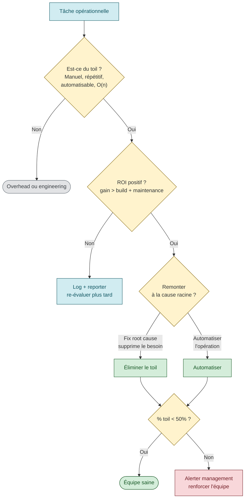

# Toil — l'ennemi numéro 1 de l'engineering

> **Sources primaires** :
> - Google SRE book ch. 5, [*Eliminating Toil*](https://sre.google/sre-book/eliminating-toil/ "Google SRE book ch. 5 — Eliminating Toil")
> - Google SRE workbook, [*Eliminating Toil*](https://sre.google/workbook/eliminating-toil/ "Google SRE workbook — Eliminating Toil")

## Définition formelle

> *"Toil is the kind of work tied to running a production service that tends to be manual, repetitive, automatable, tactical, devoid of enduring value, and that scales linearly as a service grows."* [📖¹](https://sre.google/sre-book/eliminating-toil/#id-toil-defined "Google SRE book ch. 5 — Toil, section Toil Defined")
>
> *En français* : le **toil** est ce travail lié à l'exploitation d'un service en production qui tend à être **manuel**, **répétitif**, **automatisable**, **tactique** (réactif), **sans valeur durable**, et qui **croît linéairement** avec la taille du service.

Variante du Workbook :
> *"the repetitive, predictable, constant stream of tasks related to maintaining a service"* [📖²](https://sre.google/workbook/eliminating-toil/ "Google SRE workbook — Eliminating Toil")
>
> *En français* : le **flux répétitif, prévisible et constant** de tâches liées à la maintenance d'un service.

> ⚠️ **Citation workbook** — formulation plausible et cohérente avec l'esprit du chapitre, à vérifier précisément (peut différer légèrement).

## Les 6 caractéristiques du toil

Une tâche **est** du toil si elle coche les cases suivantes [📖¹](https://sre.google/sre-book/eliminating-toil/#id-toil-defined "Google SRE book ch. 5 — Toil, section Toil Defined") :

| # | Caractéristique | Description |
|---|----------------|-------------|
| 1 | **Manual** | Exige une intervention humaine directe (pas un script qui tourne tout seul) |
| 2 | **Repetitive** | Tâche qui revient régulièrement |
| 3 | **Automatable** | Si une procédure documentée existe, une machine peut l'exécuter |
| 4 | **Tactical / reactive** | Interruption (pager, ticket) au lieu d'action planifiée |
| 5 | **No enduring value** | La tâche n'a pas de valeur durable une fois terminée |
| 6 | **Scales O(n)** | Le volume de toil croît linéairement avec la taille du service (au lieu de O(1) ou sub-linéaire) |

> ⚠️ **Descriptions des 6 caractéristiques** — reformulations pédagogiques des concepts Google. La taxonomie officielle (Manual / Repetitive / Automatable / Tactical / Devoid of enduring value / Scales O(n)) vient du SRE book ch. 5 [📖¹](https://sre.google/sre-book/eliminating-toil/#id-toil-defined "Google SRE book ch. 5 — Toil, section Toil Defined").

Une tâche n'a pas besoin de cocher *toutes* les cases pour être du toil. Plus elle en coche, plus c'en est.

## Ce qui n'est PAS du toil

Le SRE book insiste sur ce qui **ne compte pas** comme toil, pour éviter de tout étiqueter ainsi [📖¹](https://sre.google/sre-book/eliminating-toil/ "Google SRE book ch. 5 — Eliminating Toil") :

- **Overhead** : meetings, planification, formation, postmortems → ce n'est pas du toil, c'est du travail nécessaire
- **Travail "sale" mais à haute valeur** : refactoring de la dette, migration majeure, debugging d'un bug profond — c'est du *grunt work* mais pas du toil parce qu'il a une valeur durable
- **Travail d'engineering** : design, code, automation, capacity planning — l'opposé du toil

## Le plafond Google : 50% maximum

Google SRE book ch. 5, section *Why Less Toil Is Better* [📖³](https://sre.google/sre-book/eliminating-toil/#why-less-toil-is-better "Google SRE book ch. 5 — Toil, section Why Less Toil Is Better") :

> *"Our SRE organization has an advertised goal of keeping operational work (i.e., toil) below 50% of each SRE's time."*
>
> *En français* : l'organisation SRE de Google affiche un objectif : maintenir le travail opérationnel (*i.e.* le toil) **en dessous de 50 %** du temps de chaque SRE.

Pourquoi 50% :
- Sous 50%, les SRE deviennent des sysadmins déguisés → pas de progrès, équipe quitte
- Au-dessus de 50%, le toil croît plus vite que la capacité d'automation → spirale infernale

> ⚠️ **Les 2 arguments « pourquoi 50% »** — synthèse pédagogique. Le SRE book discute la valeur du plafond sans lister ces 2 justifications exactes. Principe cohérent.

## Pourquoi le toil tue (selon le SRE book)

Section *Is Toil Always Bad?* du SRE book ch. 5 [📖⁴](https://sre.google/sre-book/eliminating-toil/#is-toil-always-bad "Google SRE book ch. 5 — Toil, section Is Toil Always Bad?") :

> *"Your career progress will slow down or grind to a halt if you spend too little time on projects."*
>
> *En français* : votre **progression de carrière** va ralentir — voire s'arrêter — si vous passez trop peu de temps sur des projets d'ingénierie.

| Conséquence | Mécanisme |
|-------------|-----------|
| **Career stagnation** | *"career progress will slow down or grind to a halt"* [📖⁴](https://sre.google/sre-book/eliminating-toil/#is-toil-always-bad "Google SRE book ch. 5 — Toil, section Is Toil Always Bad?") |
| **Low morale** | Frustration, sentiment d'être un "ouvrier interchangeable" |
| **Confusion entre dev et ops** | Si SRE = ops déguisés, le contrat moral avec les devs casse |
| **Slow progress** | Aucune amélioration structurelle, on bouche des trous |
| **Setting precedent** | Une équipe qui accepte 80% de toil ne reviendra plus à 50% |
| **Promotion of attrition** | Les meilleurs partent (chez Google ou ailleurs) |
| **Causes breach of faith** | Les nouveaux SRE arrivent avec une promesse "engineering" et découvrent un job de sysadmin |

> ⚠️ **Reformulation** — la citation *"Spending too much time on toil makes engineers slow down on their career growth"* n'est pas verbatim dans la source. Le verbatim officiel (ci-dessus) évoque *"career progress will slow down"*. Le concept est identique.

> ⚠️ **Les 6 autres lignes** du tableau sont des synthèses pédagogiques cohérentes avec l'esprit du chapitre mais pas toutes des citations directes. *"Low morale"*, *"setting precedent"*, *"breach of faith"* sont mentionnés dans le SRE book mais pas structurés en liste comme ici.

## Comment mesurer le toil

Le Workbook recommande [📖²](https://sre.google/workbook/eliminating-toil/ "Google SRE workbook — Eliminating Toil") :

1. **Compter les heures** : chaque SRE log son temps en catégories (`engineering`, `toil`, `overhead`, `interrupt`)
2. **Compter les pages** : nombre de pages par shift (Google : objectif < 2 par shift de 12h, max 5) [📖⁵](https://sre.google/workbook/on-call/ "Google SRE workbook — On-Call")
3. **Compter les tickets** : flux de tickets répétitifs (= candidats à l'automation)
4. **Audit trimestriel** : revue avec l'équipe de ce qui a été du toil, qu'est-ce qu'on automatise

> ⚠️ **Méthode de mesure** — le SRE workbook *Eliminating Toil* recommande de mesurer le toil mais la **taxonomie exacte des catégories** (`engineering`, `toil`, `overhead`, `interrupt`) est du savoir communautaire consolidé, pas verbatim de la source.

## Les 4 sources principales de toil identifiées par Google

| Source | Exemple | Solution |
|--------|---------|----------|
| **Operational interrupts** | Tickets clients, pages réveille-nuit | Automation, runbooks, self-service |
| **Releases & rollbacks** | Push manuels, validations à la chaîne | CI/CD complet, canary auto-rollback |
| **Capacity planning** | "Combien de pods on met ?" tous les jours | Autoscaling + forecasting |
| **System maintenance** | Patches OS, certificats à renouveler | Immutable infra, cert-manager, automation |

> ⚠️ **Tableau des 4 sources** — catégorisation pédagogique communément utilisée, cohérente avec les exemples de toil du SRE book ch. 5 mais pas une typologie officielle Google en 4 cases.

## Stratégies d'élimination

### 1. Identifier et documenter le toil avant tout



Vous ne pouvez pas réduire ce que vous ne mesurez pas. Premier pas : **journal du toil** pendant 2-4 semaines, où chaque SRE note :
- Quelle tâche ?
- Combien de temps ?
- Combien de fois par mois ?
- Pourquoi pas encore automatisé ?

### 2. Automatiser sélectivement (cost/benefit)

Le principe est central dans le Workbook [📖²](https://sre.google/workbook/eliminating-toil/ "Google SRE workbook — Eliminating Toil") : n'automatiser que si les bénéfices excèdent le coût.

> ⚠️ **Citation précédente « benefits outweigh the cost »** — plausible dans l'esprit du workbook mais non confirmée verbatim précisément. Principe universel de priorisation.

Le temps économisé doit être proportionnel au temps investi dans la construction et la maintenance. Une tâche de 5 min faite 1× par mois = 1h/an → ne pas passer 40h à automatiser.

Heuristique simple :
```
Worth automating IF :
   (time_per_run × frequency_per_year × years_of_use) > (build_time + maintenance_time × years)
```

*Formule opérationnelle pour la priorisation d'automation — adaptation communautaire du principe ROI du SRE book.*

### 3. Refactorer la cause, pas le symptôme

Anti-pattern : automatiser l'opération manuelle existante → obtenir un script fragile qui fait *exactement* la même chose, mais qu'il faut maintenir.

Pattern : remonter à *pourquoi* cette opération existe et l'éliminer.

Exemple : "On nettoie /tmp tous les jours" → automatisable, MAIS la vraie question est *"pourquoi /tmp se remplit ?"* → fix le bug applicatif → 0 nettoyage.

### 4. Self-service pour les devs

Beaucoup de toil = "les devs nous demandent X manuellement". Solution : self-service. Provisioning, quota, debug, restart — devs le font eux-mêmes via une CLI ou un portail.

### 5. Push back sur le toil non-automatisable

Certaines tâches sont **structurellement** non-automatisables (compliance manuelle, signatures humaines). Le SRE book recommande de **refuser** de prendre en charge ces tâches : ce n'est pas du SRE, c'est du sysadmin.

> ⚠️ **« Push back » explicite** — principe cohérent avec le contrat SRE (ch. 1 + ch. 5) mais pas une citation littérale du SRE book sur ce point précis.

## Lien avec le CI/CD

Beaucoup de toil SRE concerne les déploiements :
- Promotion manuelle entre envs
- Validation manuelle des helm-values
- Vérification manuelle des secrets
- Rollback manuel après incident

**Un CI/CD mature élimine** toutes ces sources de toil :
- Promotion automatique sur passed: + smoke vert
- Validation des helm-values en CI (lint, dry-run)
- Secrets via SealedSecrets / ESO (zéro intervention humaine)
- Auto-rollback sur burn rate

Cf. [`cicd-sre-link.md`](cicd-sre-link.md) et [`release-engineering.md`](release-engineering.md).

## Anti-patterns toil

| Anti-pattern | Symptôme | Conséquence |
|--------------|----------|-------------|
| **"On verra plus tard"** | Liste de toil qui s'allonge sans fin | Spirale infernale, équipe quitte |
| **Automatiser le mauvais niveau** | Script qui fait l'opération manuelle, pas qui élimine la cause | Plus de code à maintenir, même problème |
| **Pas de mesure** | "On a du toil mais on sait pas combien" | Impossible de prioriser, gestionnaires sceptiques |
| **Ignorer le plafond 50%** | Équipe à 80% ops sans alarme | Burn-out, démissions |
| **Toil considéré comme normal** | "C'est notre job de gérer ça" | Confusion ops/SRE, perte d'engineering |
| **Automation fragile** | Le script casse 1 fois sur 5, plus de toil pour le réparer | Pire qu'avant |
| **Promotion sur le firefighting** | Le héros qui éteint les feux est promu | Incentive perverse à laisser brûler |

> ⚠️ **Liste anti-patterns** — consolidée à partir de l'esprit du SRE book ch. 5 et des retours communautaires. Pas un tableau littéral de la source.

## Templates utiles

### Template "Toil log"

```
Date       | Task                           | Time | Frequency | Already automated? | Notes
-----------|--------------------------------|------|-----------|-------------------|-------
2026-04-11 | Restart pod foo (OOM)          | 10m  | 3×/sem    | No                | Investiguer fuite mem
2026-04-11 | Renew cert bar                 | 5m   | 1×/3 mois | No                | cert-manager candidat
2026-04-11 | Provision new namespace        | 30m  | 2×/mois   | No                | Self-service pipeline
```

### Template "Automation candidate"

```markdown
# Automation candidate : <name>

## Toil description
<what task is being automated, who does it today>

## Frequency / time
- <X> times per <period>
- <Y> minutes per occurrence
- Annual cost: <X×Y×52> minutes/year

## Proposed solution
<technical approach>

## Investment
- Build: <hours>
- Maintenance: <hours/year>
- Annual savings: <annual cost - maintenance>
- ROI: <payback period in months>

## Risk if not done
<who quits, what breaks>
```

*Templates communautaires pour opérationnaliser la mesure et la priorisation du toil.*

## Ressources

Sources primaires vérifiées :

1. [Google SRE book ch. 5 — Eliminating Toil — Toil Defined](https://sre.google/sre-book/eliminating-toil/#id-toil-defined "Google SRE book ch. 5 — Toil, section Toil Defined") — définition canonique verbatim
2. [Google SRE workbook — Eliminating Toil](https://sre.google/workbook/eliminating-toil/ "Google SRE workbook — Eliminating Toil")
3. [Google SRE book ch. 5 — Why Less Toil Is Better](https://sre.google/sre-book/eliminating-toil/#why-less-toil-is-better "Google SRE book ch. 5 — Toil, section Why Less Toil Is Better") — plafond 50% verbatim
4. [Google SRE book ch. 5 — Is Toil Always Bad?](https://sre.google/sre-book/eliminating-toil/#is-toil-always-bad "Google SRE book ch. 5 — Toil, section Is Toil Always Bad?") — career progress
5. [Google SRE workbook — On-Call](https://sre.google/workbook/on-call/ "Google SRE workbook — On-Call") — 2 incidents/shift

Voir aussi :
- [`cicd-sre-link.md`](cicd-sre-link.md) — comment le CI/CD réduit le toil
- [`oncall-practices.md`](oncall-practices.md) — OnCall est la 1ère source de toil
- [`release-engineering.md`](release-engineering.md) — automatiser les releases
