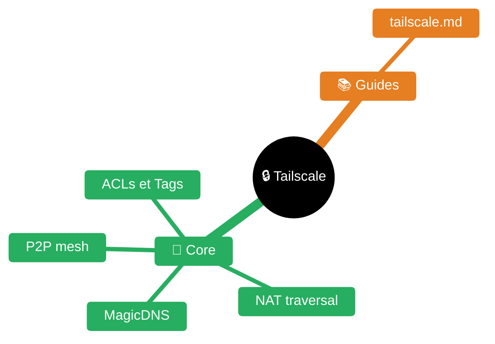

# tailscale — Référence

> Scope : Tailscale, mesh VPN WireGuard zero-config, connaissances publiques.

| Fichier | Description |
|---------|-------------|
| [README.md](README.md) | Point d'entrée Tailscale |
| [guides/tailscale.md](guides/tailscale.md) | Référence Tailscale |

## Point d'entrée

| Fichier | Contenu |
|---------|---------|
| [guides/tailscale.md](guides/tailscale.md) | Référence complète : concepts, adressage CGNAT, MagicDNS, subnet routers, exit nodes, ACLs, auth, SSH, CLI |

## En bref

Tailscale = réseau mesh peer-to-peer basé sur WireGuard. Chaque nœud reçoit une IP stable dans `100.64.0.0/10` (CGNAT). Le trafic transite directement entre pairs (NAT traversal automatique), sans serveur central sur le chemin des données.

## Liens croisés

- Personnel / nœuds personnels → repo de KB perso (cf. votre arbre de souveraineté)
- Proxy corporate interceptant les IPs Tailscale → KB perso (expérience de l'utilisateur, voir arbre de souveraineté)
