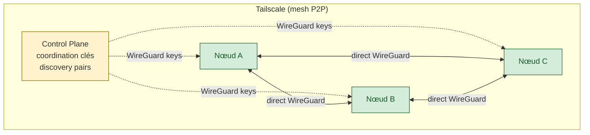
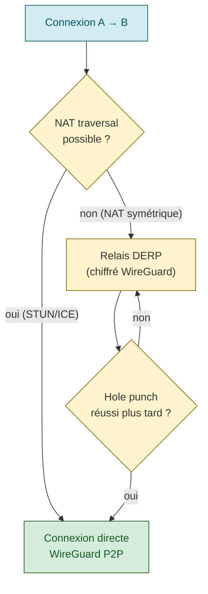

# Tailscale — Référence technique

> Source : documentation officielle tailscale.com. Connaissances publiques.

## Concept fondamental

**Tailscale** est un mesh VPN zero-config construit sur WireGuard qui crée un réseau privé sécurisé entre appareils.

- Architecture **peer-to-peer** (≠ hub-and-spoke des VPN traditionnels) : connexions directes, pas de relais central sur le chemin des données
- **NAT traversal automatique** : fonctionne à travers tout type de NAT/firewall sans configuration
- **Control plane** externalisé (coordination des clés, discovery des pairs) — WireGuard fournit uniquement le transport chiffré (ChaCha20-Poly1305)



## Adressage CGNAT

**Plage IPv4** : `100.64.0.0/10` (standard CGNAT RFC 6598 → évite conflits avec `10.x` et `192.168.x`)

Chaque nœud reçoit une IP **stable et permanente** dans cette plage. L'IP ne change pas tant que le nœud existe.

**IPv6** : `fd7a:115c:a1e0::/48` (ULA — Unique Local Address). Chaque nœud reçoit un `/128`. Fonctionne même sans IPv6 publique.

```bash
tailscale ip        # IPv4 + IPv6 du nœud courant
tailscale ip -4     # IPv4 uniquement
tailscale ip -6     # IPv6 uniquement
```

**Conflit CGNAT avec FAI** : certains opérateurs utilisent aussi `100.64.0.0/10`. Solution : redéfinir le pool IP dans la policy file (`"ipv4": "100.80.0.0/10"`).

## MagicDNS

Résolution automatique des noms de nœuds au sein du tailnet.

- Chaque tailnet reçoit un domaine unique : `tail<hash>.ts.net`
- FQDN d'un nœud : `<hostname>.tail<hash>.ts.net`
- Serveur DNS local Tailscale : `100.100.100.100` (résout `*.ts.net`)

Activé par défaut via `tailscale up`. Configurable depuis la console admin.

## Subnet Routers

Exposer un réseau LAN entier via Tailscale — les machines **sans** client Tailscale deviennent accessibles.

**Prérequis** : IP forwarding activé sur le routeur.

```bash
# Activer IP forwarding
sudo sysctl -w net.ipv4.ip_forward=1

# Annoncer les routes
sudo tailscale up --advertise-routes=192.168.1.0/24

# Ou après connexion
sudo tailscale set --advertise-routes=192.168.1.0/24
```

Les routes doivent ensuite être approuvées dans la console admin (ou via `autoApprovers` dans la policy).

**Haute disponibilité** : plusieurs nœuds peuvent annoncer les mêmes routes — Tailscale choisit le premier disponible.

## Établissement de connexion

Tailscale essaie d'abord une connexion directe, puis bascule sur un relais DERP si nécessaire.



## Exit Nodes

Router **tout le trafic** sortant (`0.0.0.0/0` + `::/0`) via un nœud Tailscale.

```bash
# Sur le nœud exit
sudo tailscale up --advertise-exit-node

# Sur le client
sudo tailscale set --exit-node=<ip-ou-hostname>
sudo tailscale set --exit-node-allow-lan-access=true  # garder accès LAN local
```

Double opt-in : le nœud s'annonce ET l'admin doit autoriser l'utilisation dans la policy.

## ACLs / Policy File

Format **HuJSON** (JSON avec commentaires et virgules finales).

```hjson
{
  "groups": {
    "group:admins": ["user1@example.com"],
    "group:devs":   ["dev1@example.com"],
  },
  "tagOwners": {
    "tag:prod": ["group:admins"],
    "tag:dev":  ["group:devs"],
  },
  "acls": [
    { "action": "accept", "src": ["group:admins"], "dst": ["*:*"] },
    { "action": "accept", "src": ["group:devs"],   "dst": ["tag:dev:*"] },
  ],
  "ssh": [
    {
      "action": "accept",
      "src":    ["group:admins"],
      "dst":    ["tag:prod"],
      "users":  ["root", "ubuntu"]
    },
  ],
}
```

- **Tags** : `tag:prod`, `tag:dev` → RBAC sur les nœuds
- **Grants** : nouvelle syntaxe recommandée (remplace progressivement `acls`)
- Default deny : sans règle `accept`, accès refusé

## Authentification

**Providers SSO** : Google, Microsoft Azure AD, GitHub, Okta, OneLogin, OIDC personnalisé.

**Auth keys** :
- Clé **réutilisable** (permanente) : `tailscale up --auth-key=tskey-api-xxx`
- Clé **éphémère** : nœud auto-supprimé après 48h d'inactivité — idéal CI/CD

**Workload identity** : authentification native pour GitHub Actions, Azure, GCP, AWS — sans auth key.

## Tailscale SSH

Connexion SSH sans clés SSH, authentification gérée par Tailscale/SSO.

```bash
# Activer sur le serveur
sudo tailscale ssh
sudo systemctl restart tailscaled

# Connexion depuis le client
ssh user@hostname.tail-abc123.ts.net
```

Règles dans la policy file (section `ssh`) — voir exemple ci-dessus.

Features : session recording, check mode (force ré-auth pour root), clés éphémères.

## CLI — Commandes principales

```bash
# État et diagnostic
tailscale status              # Pairs connectés, IPs, état
tailscale ip                  # IP du nœud courant
tailscale ping <hostname>     # Ping via Tailscale + détails connexion
tailscale netcheck            # Diagnostic NAT et connectivité

# Connexion
sudo tailscale up                                          # Connecter
sudo tailscale up --auth-key=tskey-api-xxx                 # Avec clé
sudo tailscale up --advertise-routes=192.168.1.0/24        # Subnet router
sudo tailscale up --advertise-exit-node                    # Exit node
sudo tailscale up --accept-routes                          # Accepter routes du tailnet
sudo tailscale down                                        # Déconnecter

# Partage de services
tailscale serve web 3000         # Expose port 3000 au tailnet (HTTPS)
tailscale funnel web on 3000     # Expose sur internet public
tailscale funnel web off 3000    # Désactiver

# Debug
tailscale version
tailscale bugreport
tailscale cert <hostname>        # Certificat HTTPS automatique
```

## Cas d'usage dev

- **Home lab** : accès NAS, serveur perso, Kubernetes depuis partout — zéro port-forwarding
- **Partage env dev** : collègues accèdent directement aux services locaux via `tailscale serve`
- **Bypass proxy corporate** : exit node chez soi → trafic WireGuard chiffré (pas de MITM possible)
- **CI/CD éphémère** : GitHub Actions → workload identity + nœuds ephemeral auto-nettoyés

## Sources

- [tailscale.com/kb/1151/what-is-tailscale](https://tailscale.com/kb/1151/what-is-tailscale)
- [tailscale.com/kb/1019/subnets](https://tailscale.com/kb/1019/subnets)
- [tailscale.com/docs/features/exit-nodes](https://tailscale.com/docs/features/exit-nodes)
- [tailscale.com/docs/reference/syntax/policy-file](https://tailscale.com/docs/reference/syntax/policy-file)
- [tailscale.com/docs/features/tailscale-ssh](https://tailscale.com/docs/features/tailscale-ssh)
- [tailscale.com/kb/1080/cli](https://tailscale.com/kb/1080/cli)
